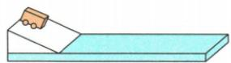
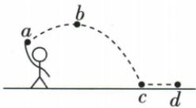

## 讲解

### 判据

同斜面释放、小车在不同水平面滑远近，想到控制水平面入口速度并区分观测与推论。

### 流程

1. 同车同斜面同高度由静止释放，不用手推，控制初速度。
2. 只改水平面粗糙，保持压力及其他条件，观察滑行距离。
3. 阻力小滑更远说明减速慢，不是说无任何受力，重力支持仍在。
4. 实验只能提供有限阻力数据，向零阻力进一步推理恒速。
5. 无力时方向也保持，所以是匀速直线，不能说沿任何原路径继续。

## 例题

### 阻力对运动影响的实验

> 来源ID Q07-02；第七章运动和力；51-100/full.md 第2363–2370行。原答案与解析定位：51-100/full.md 第2382–2384行。

例1（2024 湖南中考）如图所示,探究“阻力对物体运动的影响”实验中,保持同一小车每次从斜面同一高度由静止滑下,只改变水平木板表面的粗糙程度,不计空气阻力。下列说法正确的是()

A. 小车在水平木板上运动过程中只受摩擦力的作用  
B. 小车在粗糙程度不同的水平木板表面滑行的距离相同  
C. 水平木板表面越粗糙, 该小车在水平木板上运动时所受的摩擦力越大  
D.该实验能直接验证当物体受到的阻力为零时,物体将一直做匀速直线运动

**原资料答案与解析：**

例1 解析 小车在水平木板上运动时,受重力、支持力、摩擦力的作用,A 错误;水平木板表面越粗糙,小车在水平木板上运动时受到的摩擦力越大,滑行的距离越短,B 错误,C 正确;“物体受到的阻力为零时,物体将一直做匀速直线运动”不能由该实验直接验证,可以由该实验推理得到,D 错误。

答案 C

**展开解析（依据原详解补足理由与步骤）：**

每次同一小车从同斜面同高度由静止下滑，保证进入水平面的初速度相同，改变表面粗糙程度比较阻力。
A错：除水平摩擦还受竖直重力与支持。B错：表面不同阻力不同，距离不相同。C对：同压力条件更粗糙摩擦更大，小车更快减速。D错：实验中不能得到完全无阻力，只能根据阻力减小而滑行更远进一步推理。选C，观测与理想推论分开。

### 斜抛实心球最高点撤力

> 来源ID Q07-03；第七章运动和力；51-100/full.md 第2374–2376；2398–2401行。原答案与解析定位：51-100/full.md 第2386–2390行。

例2（2024 山东枣庄中考）在体育测试中,小明同学掷实心球的场景如图所示,图中 a 点是球刚离开手的位置,球从 a 点上升到最高点 b 后下落到地面 c 点,然后滚动到 d 点停止。下列说法正确的是（）

A. 球从 a 点上升到 b 点, 是因为球受到手的推力作用  
B. 球在 $b$ 点的速度为零  
C. 若球在 b 点受到的力全部消失, 则球做匀速直线运动  
D. 球从 c 点运动到 d 点停止, 说明物体运动需要力来维持

**原资料答案与解析：**

例2 解析 球从 a 点上升到 b 点, 是因为球具有惯性, A 错误; 球在 b 点水平方向上速度不为零, B 错误; 若球在 b 点受到的力全部消失, 则球做匀速直线运动, C 正确; 球从 c 点运动到 d 点停止, 说明力是改变物体运动状态

的原因，D 错误。

答案 C

**展开解析（依据原详解补足理由与步骤）：**

图中球斜抛，b为最高点。A错：a后已离手，不再受手推，继续上升由于惯性，但重力持续改变状态。B错：最高点竖直速度分量可为零，水平方向速度仍有，整体速度不为零。C对：若b处所有力突然消失，球保持该瞬间水平方向速度做匀速直线运动，不沿原弯曲轨迹。D错：c到d因阻力状态改变而停止，说明力改变运动，不是运动必须靠力维持。选C。

## 易错

- 不同释放高度混入速度差：控制变量失效。
- 光滑木板直接当无阻力：实际仍有。
