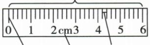
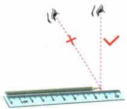
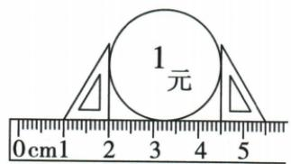
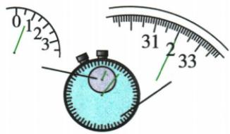
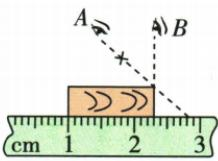

## 讲解

### 是什么

刻度尺利用沿尺均匀标出的长度刻度来测量物体长度。量程表示能测的范围；分度值是相邻最小刻度线之间代表的长度。分度值越小，通常能分辨的长度差别越小。

上图资料标出的范围为 0–6 cm，相邻最小刻度线代表 2 mm。判断分度值应数相邻已知刻度间的等份，不能看到尺上写“cm”就认定分度值为 1 cm。

### 怎么来的

尺上每一个读数表示该位置到零刻度线的距离。物体长度是两个端点之间的距离，所以始终用“末端读数减起点读数”。起点恰好对准 0 时，才可以把末端读数直接当作长度。

测量时，刻度边应靠近物体，与被测边平行；视线正对刻度线。尺与物体间有间隔或视线倾斜，会让读到的位置与实际端点位置不一致。

按本章使用的读数要求，要估读到分度值的下一位。原题尺的分度值为 1 mm，换成 cm 是 0.1 cm，所以记录到 0.01 cm。多保留的一位表达的是估计位置，而不是宣称仪器刻出了这一小格。

### 什么时候能用

能把两个端点对应到尺上、量程够用、分度值符合测量要求时可以直接测。零刻度线磨损可改用其他清晰刻度为起点，但必须作差。

硬币直径等不易直接对准的长度，可以用三角板把两侧位置平移到尺上。纸张厚度等远小于分度值的长度，不宜只测一张，应采用累积测量。不能把数字显示仪器的读数也机械要求成刻度尺的估读方式。

## 例题

### 硬币直径与秒表读数

> 来源ID Q04-07；《初中知识清单·物理》2026版第四章第1节；51–100分段 full.md 第419–441行，原答案与解析第488–490行。题干定位为书内第39页、扫描第55页。

例3 (2023 湖北十堰中考)如图甲所示方法测出的硬币直径是\_\_\_\_cm, 图乙中秒表读数\_\_\_\_s。

甲

乙

**原资料答案：** 2.50 cm；32 s。

**解析（沿原详解展开；缺少原详解时已注明）：**

**图甲先认尺，再读两端**：原尺分度值为 1 mm，按资料要求估读到 0.1 mm，即用 cm 记录到小数点后两位。两块三角板把硬币两侧的间距平移到尺上，左侧读数为 2.00 cm，右侧读数为 4.50 cm。长度是末端减起点：

$$d=4.50\,\mathrm{cm}-2.00\,\mathrm{cm}=2.50\,\mathrm{cm}.$$

**图乙先读小盘，再判大盘用哪圈数字**：小盘的整分钟数为 0，分针已越过这一分钟的半分钟位置，所以大盘应读 30 s 之后的刻度。大盘秒针指向 32 s，合计 $0\times60+32=32\,\mathrm s$。

提供的 full.md 第 301 行“读数：大表盘分钟数＋小表盘秒数”把表盘名称写反；其前面的单位说明、秒表示意图和本题原解析都表明应为“小表盘分钟数＋大表盘秒数”。本题原答案 2.50、32 保留不变。

### 原附录刻度尺读数示例

> 来源ID Q23-01；附录1常考测量仪器；201-233/full.md 第2031–2037行。原答案与解析定位：201-233/full.md 第2031–2037行。

| 仪器 | 读数步骤 | 注意事项 |
| --- | --- | --- |
| 刻度尺 | 确定分度值→确定始末刻度→相减
①确定分度值:0.1 cm
②确定起始刻度:1.00 cm
③确定末端刻度:2.30 cm
④物体长度:2.30 cm-1.00 $cm=1.30$ cm | ①零刻度线或整刻度线对准被测物体的一端
②有刻度线的一边要紧贴被测物体且与被测边保持平行,不能歪斜
③视线要正对刻度线(如视线B),且应估读到分度值的下一位 |

**原资料答案与解析：**

原表给出的读数、步骤与注意事项见上表；未另给独立问答题。

**展开解析（依据原详解补足理由与步骤）：**

先看图刻度每厘米有10小格，分度值$0.1\,\mathrm{cm}$；读数估到$0.01\,\mathrm{cm}$。原图左端$1.00\,\mathrm{cm}$、右端$2.30\,\mathrm{cm}$，长度等于末读数减起读数：$L=2.30-1.00=1.30\,\mathrm{cm}$。视线B垂直尺面，A斜视会形成视差。末刻度不是长度；保留1.30中的末零以表达本次估读精度。

## 易错

- **尺上的末端位置当成物体长度**：起点不为零时要减去起点，本题不是直接读 4.50 cm。
- **忘记估读位的 0**：本题 2.50 cm 的末位 0 表达记录精度，不能随意删成 2.5 cm。
- **测量边歪斜或视线斜看**：测到的长度或观察位置会偏离实际端点，先摆正再读。
