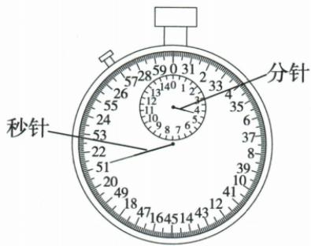
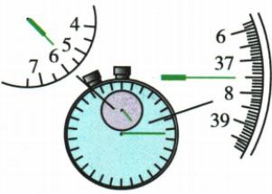

## 讲解

### 是什么

时间长度表示一个过程从开始到结束持续多久。国际单位制的基本单位是秒，符号为 s；常用单位还有分 min 和小时 h。秒表用于测量一个过程经历的时间。

$$1\,\mathrm h=60\,\mathrm{min}=3600\,\mathrm s,\qquad1\,\mathrm{min}=60\,\mathrm s.$$

题目给起止时刻时，要先作差求持续时间；不能把钟面上的结束时刻直接作为过程用时。

### 怎么来的

本章图示的机械秒表由两个表盘共同记录：小表盘记录分钟，大表盘记录秒。同一个小盘整数分钟内，大盘秒针走过前半分钟后，要改读后一组秒数，避免把超过 30 s 的读数当成前半分钟。

图中小盘的整分钟为 4 min，尚未越过这个分钟的半分钟位置；大盘按前半分钟一组读为 21 s。因此是 4 min 21 s；若题目要求 s，再计算 $4\times60+21=261\,\mathrm s$。261 s 是把原图示数换单位的结果，没有另设一道题。

**原资料勘误**：full.md 第 301 行把读数写成“大表盘分钟数＋小表盘秒数”。正确应为“小表盘分钟数＋大表盘秒数”，依据是第 297–299 行的表盘单位、原图指针标注和第 312 行示数说明。保留这个勘误，避免沿用写反的名称。

### 什么时候能用

上述大小盘方法用于本资料这种机械秒表。应先认每个表盘单位、分度值和数字排列，再读数；其他结构或电子秒表按实际标注读取，不能认定所有秒表每小格都相同。

比较或计算用时前要统一单位。4 min 21 s 不是 4.21 min，前者是 4 分又 21 秒，后者的小数部分按 60 进制换算才成为秒。

## 例题

### 时间单位填空

> 来源ID Q04-02；《初中知识清单·物理》2026版第四章第1节；51–100分段 full.md 第328–336行，原答案与解析第338–344行。题干定位为书内第37页、扫描第53页。

填上恰当的单位。

(1)中学生百米赛跑的成绩约为13.2\_\_\_\_；

(2)中学一节作文课的时间约为40\_\_\_\_；

(3)电影院一场电影的时间约为2\_\_\_\_；

(4)校运会上，跑完 1 000 m 所用时间约为 4 \_\_\_\_。

**原资料答案：** (1) s；(2) min；(3) h；(4) min。

**解析（沿原详解展开；缺少原详解时已注明）：**

原资料只给答案，以下理由按时间单位的意义补写。

百米赛跑用十几秒符合常见量级，所以(1)填 s。课堂用几十分钟表示，所以(2)填 min。一场电影约两小时，所以(3)填 h。一千米跑用几分钟表示，所以(4)填 min。四空都表示持续时间；不能把“分”误写成表示长度的 m。

### 硬币直径与秒表读数

> 来源ID Q04-07；《初中知识清单·物理》2026版第四章第1节；51–100分段 full.md 第419–441行，原答案与解析第488–490行。题干定位为书内第39页、扫描第55页。

例3 (2023 湖北十堰中考)如图甲所示方法测出的硬币直径是\_\_\_\_cm, 图乙中秒表读数\_\_\_\_s。

甲

乙

**原资料答案：** 2.50 cm；32 s。

**解析（沿原详解展开；缺少原详解时已注明）：**

**图甲先认尺，再读两端**：原尺分度值为 1 mm，按资料要求估读到 0.1 mm，即用 cm 记录到小数点后两位。两块三角板把硬币两侧的间距平移到尺上，左侧读数为 2.00 cm，右侧读数为 4.50 cm。长度是末端减起点：

$$d=4.50\,\mathrm{cm}-2.00\,\mathrm{cm}=2.50\,\mathrm{cm}.$$

**图乙先读小盘，再判大盘用哪圈数字**：小盘的整分钟数为 0，分针已越过这一分钟的半分钟位置，所以大盘应读 30 s 之后的刻度。大盘秒针指向 32 s，合计 $0\times60+32=32\,\mathrm s$。

提供的 full.md 第 301 行“读数：大表盘分钟数＋小表盘秒数”把表盘名称写反；其前面的单位说明、秒表示意图和本题原解析都表明应为“小表盘分钟数＋大表盘秒数”。本题原答案 2.50、32 保留不变。

### 原附录秒表读数示例

> 来源ID Q23-02；附录1常考测量仪器；201-233/full.md 第2037–2043行。原答案与解析定位：201-233/full.md 第2037–2043行。

| 仪器 | 读数步骤 | 注意事项 |
| --- | --- | --- |
| 秒表 | 确定分度值→确定分针读数→确定秒针读数→相加
①确定小表盘分度值:0.5 min
②确定分针读数:5 min(过半格)
③确定大表盘分度值:0.1 s
④确定秒针读数:37 s+0.1 $s\times 5=37.5$ s
⑤时间:5 min+37.5 $s=337.5$ s | ①大表盘读数时应注意小表盘中分针的指针是否过半格(半分钟),过半格时秒针的读数在30s以上,没有过半格(半分钟)时,秒针的读数在30s以下
②秒表不需要估读 |

**原资料答案与解析：**

原表给出的读数、步骤与注意事项见上表；未另给独立问答题。

**展开解析（依据原详解补足理由与步骤）：**

小盘分度值0.5 min，指针在5与6 min之间并过5.5 min，表示已过5整分钟且秒数超过30；不能把接近6读成6整分钟。大盘每小格0.1 s，秒数$37+5\times0.1=37.5\,\mathrm{s}$。整分钟换秒$5\times60=300\,\mathrm{s}$，总时长$300+37.5=337.5\,\mathrm{s}$；原表盘按其刻度直接读，不另估读一位。

## 易错

- **大小盘的单位写反**：本章机械秒表小盘计分钟、大盘计秒，原文字的一处反写已在正文纠正。
- **不看半分钟位置就读大盘**：会把后一半分钟错读成前一半分钟；本题应读 32 s。
- **分钟与秒的小数拼接**：换成秒应先乘 60 再加秒数，不能把两个表盘读数直接拼成一个小数。
