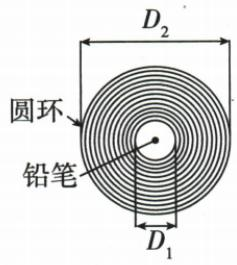

## 讲解

### 判据

长度太小、端点不易对准、路径弯曲时，直接拿尺贴上去可能读不准。先看是哪一种障碍，再选择把它转成“尺能直接测的长度”的方法。

### 流程

| 障碍 | 方法与依据 | 实际操作及适用条件 |
| --- | --- | --- |
| 单个厚度小于尺能清楚分辨的范围 | 累积法：若 n 个相同厚度合计为 L，一份厚度为 $\frac{L}{n}$ | 紧密叠放、缠绕或并排 n 份，测总厚度再除以份数；厚度须相同，不能把空隙算进去 |
| 两端不能直接贴齐尺 | 平移法：两条平行接触线间距等于待测直径或高度 | 用三角板卡住两侧，把接触位置平移到尺上，末端减起点；接触边须平行 |
| 较短曲线路径 | 化曲为直：沿路径贴合的细线长度保持不变 | 用弹性小的细线沿曲线贴合，标两端，再拉直量两标记间长度；不能拉伸细线 |
| 较长曲线路径 | 滚轮法：无滑动滚动一圈前进一个轮周长 | 已知轮周长 L，沿路径记录圈数 n，长度为 nL；须沿所测路线滚动，避免打滑 |

先用题目条件确认“份数”或“周长”对应什么，再列关系。纸带缠铅笔时，图上给的是直径差，左右各有 n 层，不能直接把直径差当成 n 层的总厚度。

本章给出了化曲为直法和滚轮法的说明及示意，但没有这两种方法各自对应的独立数值例题。本条不补造题，下面采用原资料中确实配套的累积法和平移法题组。

## 例题

### 纸带厚度累积测量

> 来源ID Q04-03；《初中知识清单·物理》2026版第四章第1节；51–100分段 full.md 第354–365行，原答案与解析第367–369行。题干定位为书内第38页、扫描第54页。

例1 一条纸带厚薄均匀,小亮把纸带紧密地环绕在圆柱形铅笔上,直至恰好能套进一个圆环中,如图所示,纸带环绕了 n 圈,则纸带的厚度是\_\_\_\_。

**原资料答案：** $\dfrac{D_2-D_1}{2n}$。

**解析（沿原详解展开；缺少原详解时已注明）：**

**看到什么**：纸带等厚、紧密缠绕 n 圈；图中给的是铅笔直径 $D_1$ 和圆环内径 $D_2$。

**想到什么**：每一侧都增加了 n 层纸带，直径增量包含左右两侧，不能全部当作一侧的总厚度。

设一层纸带厚度为 l。左侧增加 nl，右侧也增加 nl，所以从图中直径关系得到 $D_2=D_1+nl+nl$。先从两边减去 $D_1$，再除以 2n：

$$D_2-D_1=2nl,\qquad l=\frac{D_2-D_1}{2n}.$$

这也就是原解析先求一侧 n 层的厚度 $(D_2-D_1)/2$，再除以 n 的依据。直径须用相同单位；结果沿用该长度单位。

### 硬币直径与秒表读数

> 来源ID Q04-07；《初中知识清单·物理》2026版第四章第1节；51–100分段 full.md 第419–441行，原答案与解析第488–490行。题干定位为书内第39页、扫描第55页。

例3 (2023 湖北十堰中考)如图甲所示方法测出的硬币直径是\_\_\_\_cm, 图乙中秒表读数\_\_\_\_s。

甲

乙

**原资料答案：** 2.50 cm；32 s。

**解析（沿原详解展开；缺少原详解时已注明）：**

**图甲先认尺，再读两端**：原尺分度值为 1 mm，按资料要求估读到 0.1 mm，即用 cm 记录到小数点后两位。两块三角板把硬币两侧的间距平移到尺上，左侧读数为 2.00 cm，右侧读数为 4.50 cm。长度是末端减起点：

$$d=4.50\,\mathrm{cm}-2.00\,\mathrm{cm}=2.50\,\mathrm{cm}.$$

**图乙先读小盘，再判大盘用哪圈数字**：小盘的整分钟数为 0，分针已越过这一分钟的半分钟位置，所以大盘应读 30 s 之后的刻度。大盘秒针指向 32 s，合计 $0\times60+32=32\,\mathrm s$。

提供的 full.md 第 301 行“读数：大表盘分钟数＋小表盘秒数”把表盘名称写反；其前面的单位说明、秒表示意图和本题原解析都表明应为“小表盘分钟数＋大表盘秒数”。本题原答案 2.50、32 保留不变。

## 易错

- **不看测量障碍就背方法名**：细小厚度用累积，直径端点难对准用平移，弯曲路径再考虑细线或滚轮。
- **纸带题少除一个 2**：直径差包含两侧各 n 层，总共 2n 层厚度。
- **累积测量混入空隙、细线被拉伸、轮子打滑**：测到的总长度已不等于所需对象的真实长度，不能直接除份数或乘圈数。
