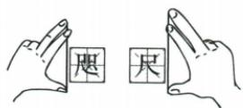

## 讲解

### 判据

题目问“大约”“最接近”“符合实际”，选项往往用不同单位表示相差很大的量级。此时需要日常尺度作为参照，不是从没有比例尺的插图上量出精确值。

资料给出的参考量有一拃约 15 cm、一步约 0.5 m、课桌高约 80 cm；时间方面有百米跑十几秒、一节课几十分钟、电影几小时。这些是比较量级的经验基准，不是人人或每次都相同的常量。

### 流程

1. **先认测的是什么。** 是一个物体本身的长度，还是两个长度之差？是一个动作，还是完成整个活动的时间？范围不同，量级可能不同。
2. **找相近的熟悉基准。** 手掌跨度用厘米，课堂或整套操用分钟；选择和对象同类的尺度，避免用无关数据类比。
3. **把选项换到便于比较的同一单位。** 例如咫尺题的 3 mm、3 cm、3 dm、3 m，可换成 0.3、3、30、300 cm。
4. **排除明显过大或过小的量级，再选最符合实际的一项。** 无标尺的图只帮助理解对象，不提供精确比例。
5. **回看题目是否问差值。** 两个手掌跨度都可能是十几厘米，但差值通常只有几厘米，不能直接把一个手掌总长度当差值。

## 例题

### 咫尺长度估测

> 来源ID Q04-05；《初中知识清单·物理》2026版第四章第1节；51–100分段 full.md 第395–405行，原答案与解析第480–482行。题干定位为书内第39页、扫描第55页。

例1 (2024 湖北中考)我国古代把女子一拃长称为“咫”,男子一拃长称作“尺”,如图。“咫尺之间”用来比喻相距很近,实际“咫”与“尺”的长度相差大约为 ( )

A. $3 \mathrm{~mm}$

B.3 cm

C.3 dm

D.3 m

**原资料答案：** B，3 cm。

**解析（沿原详解展开；缺少原详解时已注明）：**

从图看，两种“一拃”都属于手掌张开后的长度，差值应是厘米量级。原解析给出约 3 cm。

- A 错：3 $mm=0.3$ cm，明显小于图示的手掌跨度差异量级。
- B 对：3 cm 符合日常手掌大小差异的估测。
- C 错：3 $dm=30$ cm，已经大于资料所给常见一拃约 15 cm 的量级，不能作为两者的差值。
- D 错：3 m 远大于人的手掌跨度。

这是估测题，不是从未标比例的插图中量出精确长度；不能把 3 cm 当成对所有人的固定差值。

### 眼保健操时间估测

> 来源ID Q04-06；《初中知识清单·物理》2026版第四章第1节；51–100分段 full.md 第407–415行，原答案与解析第484–486行。题干定位为书内第39页、扫描第55页。

例2 (2024 辽宁中考)为保护视力,应认真做好眼保健操,做一遍眼保健操的时间大约是 ( )

A.5 s

B.5 min

C.50 min

D.5 h

**原资料答案：** B，5 min。

**解析（沿原详解展开；缺少原详解时已注明）：**

原解析采用做一遍眼保健操约 5 min 的生活经验。先判断是几秒、几分钟还是几小时，再比较选项。

- A 错：5 s 过短，不能完成通常的一整套眼保健操。
- B 对：5 min 符合通常一次眼保健操的时间量级。
- C 错：50 min 明显过长。
- D 错：5 h 更不符合一次眼保健操的持续时间。

本题判断量级，不要求给每次眼保健操计时后证明恰好为 5 min。

### 原纸厚与课本尺寸参照

> 来源ID Q27-04；附录5生活数据与估测；201-233/full.md 第2071–2071行。原答案与解析定位：201-233/full.md 第2071–2071行。

| 1张纸厚度约 $10^{-4}$ m |
| --- |
| 初中物理课本的长约25.5cm,宽约18.5cm |

**原资料答案与解析：**

原表给出的近似结果见上表；没有另设题干条件。

**展开解析（依据原详解补足理由与步骤）：**

原纸厚约$10^{-4}\,\mathrm m$；$1\,\mathrm m=10^3\,\mathrm{mm}$，因此$10^{-4}\,\mathrm m=10^{-1}\,\mathrm{mm}=0.1\,\mathrm{mm}$。这是小厚度，不是0.1 m。课本25.5 cm和18.5 cm分别除以100换m，得到0.255 m、0.185 m；长度估值与面积单位不同，不能把厘米到米系数直接用于平方厘米。只将原尺寸作为这类书的参考，不声称所有课本都如此。

## 易错

- **不统一单位就只比较数字 3**：单位不同，表示的长度相差十倍、百倍甚至千倍。
- **把经验数据当成精确定值**：估测只排量级，不保证所有个体的数值都相同。
- **图画多大，实物就多大**：插图未给比例尺时不能直接按印刷尺寸求实物长度。
