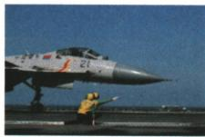

## 错法

看到监测仪显示分贝，就把它归为已减弱噪声。原提醒明确指出监测仪不能直接控制噪声；耳罩原题的错项B也把监测和实际防护混淆。

## 正解

先看有无实际改变声音产生、传播或进入耳朵的措施。显示读数是在获取噪声信息；耳罩在接收处减弱噪声。监测可帮助决定何时采取措施，但监测本身不能代替这些措施，也不是减小声速。

## 例题

### 防噪声耳罩的控制环节

> 来源ID Q01-16；第一章声现象；1-50/full.md 第2255–2262行。原答案与解析定位：1-50/full.md 第2278–2280行。

例（2024 天津中考）如图是我国航空母舰上两位甲板引导员引导飞机起飞的情景。他们工作时要佩戴防噪声耳罩，这种控制噪声的措施属于 （）

A.防止噪声产生  
B. 监测噪声强弱   
C. 防止噪声进入耳朵  
D. 减小噪声传播速度

**原资料答案与解析：**

例 解析 甲板引导员工作时要佩戴防噪声耳罩,是防止噪声进入耳朵,避免对工作人员听力造成损伤。

答案 C

**展开解析（依据原详解补足理由与步骤）：**

佩戴耳罩时飞机仍在产生噪声，声也能继续在周围空气中传播；耳罩直接作用在接收者的耳部。

- A错：耳罩没有使飞机停止发声，不属于防止噪声产生。
- B错：没有测量并显示分贝数，佩戴耳罩不是监测声音强弱。
- C对：在接收处减弱进入耳朵的噪声。
- D错：耳罩不是通过把空气中的声速变小达到目的，而是减弱传入耳部的声音。

答案C。控制环节按措施实际作用的位置判断，而不是只看到“防噪声”三个字就选声源处。
