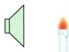

## 讲解

### 是什么

声可以传递信息，也可以传递能量。获取消息或判断物体状态是信息用途；借声让物体振动、破碎、清洗等强调能量作用。二者描述不同用途，不代表同一个传播过程中只能存在一个。

### 怎么来的

声源振动在介质中传播，传递运动变化，也携带能量；变化的规律又可作为消息被识别。发令声告诉人起跑，烛焰晃动展示能量效果。接收者即使为获取信息而听声，也会有振动等变化，所以原资料“没有变化才是信息”的说法应改为看应用的主要目的。

### 什么时候能用

事例问声的利用时使用。听诊、回声定位和判断钟是否破损强调获取信息；清洗、钻孔、烛焰随声晃动强调能量作用。没有具体题干支持时，不根据物体“有无任何变化”硬判，也不把超声只归能量、次声只归信息。

## 例题

### 短跑发令声的作用

> 来源ID Q01-12；第一章声现象；1-50/full.md 第2128–2128行。原答案与解析定位：1-50/full.md 第2130–2130行。

(2024 江西中考) 在 50 m 短跑测试现场, 考生听到发令声立刻起跑, 说明声音能传递 \_\_\_\_ (选填 “信息” 或 “能量”), 发令声是由物体的 \_\_\_\_ 产生的。

**原资料答案与解析：**

答案 信息 振动

**展开解析（依据原详解补足理由与步骤）：**

原资料只列“信息、振动”，下面补出理由。发令声告诉考生何时起跑，应用的主要目的是传递信息；它并不是靠声波把考生推动到终点。发令装置中的物体振动产生声音，填“振动”。

声音传播本身伴有能量，题目选“信息”并不否认这一点；考点是从事例用途辨别主要作用。

### 烛焰随声音晃动

> 来源ID Q01-15；第一章声现象；1-50/full.md 第2198–2200行。原答案与解析定位：1-50/full.md 第2177–2179行。

例2（2024 江苏常州中考）如图所示,将点燃的蜡烛放在发声喇叭前方,可以看到烛焰随着声音晃动。喇叭的纸盆由于\_\_\_\_产生声音,声音通过\_\_\_\_传播到烛焰处,烛焰晃动说明声具有\_\_\_\_。

**原资料答案与解析：**

例2 解析 当喇叭发出较强的声音时, 可以看到烛焰随着音乐的节奏晃动。喇叭的纸盆由于振动发出声音, 声音通过空气传到烛焰处, 烛焰晃动说明声具有能量。

答案 振动 空气 能量

**展开解析（依据原详解补足理由与步骤）：**

三空对应产生、传播和作用三个环节。喇叭的纸盆振动，产生声音；声经空气传播到烛焰附近；烛焰随声晃动，表现出声可传递能量。因此依次填“振动、空气、能量”。

不能把纸盆写成传播介质，也不能因音乐可以传递信息，就忽略题中专门观察烛焰晃动的能量作用。实验观察要与实际所证明的结论对应。

## 易错

- **只要有物理变化就排除信息**：按应用的主要目的区分，两种作用可以并存。
- **超声只传能量、次声只传信息**：频率分类不能替代用途分类。
