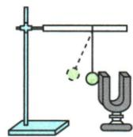
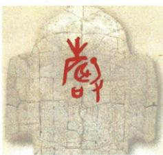

## 讲解

### 判据

发声音叉、小球、水花、纸屑或触摸喉部等现象，问实验作用或结论时，想到把细小振动转化为明显现象；不是把辅助物体当作唯一声源。

### 流程

1. 先标出正在发声的物体与真正振动部位。
2. 找辅助对象的变化，如轻球弹开、纸屑跳动；说明变化由声源振动引起。
3. 解释为什么加它：振动太小不易直接观察，辅助现象更明显。
4. 把结论限于证据：证明发声物体在振动，不用这一实验单独证明真空不能传声。
5. 检查接触、轻重和可运动条件；没看到辅助变化时先排查装置。

## 例题

### 轻质小球显示音叉振动

> 来源ID Q01-02；第一章声现象；1-50/full.md 第1758–1765行。原答案与解析定位：1-50/full.md 第1767–1769行。

例1 如图所示,在“探究声音是由物体振动产生的”实验中,将正在发声的音叉紧靠悬线下的轻质小球,发现小球被多次弹开。这样做是为了 ( )

A.使音叉的振动尽快停下来   
B. 把声音的振动时间延迟  
C. 把音叉的微小振动放大,便于观察  
D.使声波被多次反射形成回声

**原资料答案与解析：**

解析 正在发声的音叉在振动但不易观察,发声的音叉可以将轻质小球弹开,故可以通过小球的振动来反映音叉的振动,C符合题意,A、B、D不符合题意。

答案 C

**展开解析（依据原详解补足理由与步骤）：**

音叉在发声，但音叉叉股的细小往复运动不易直接看到。小球与音叉接触后多次被弹开，是把不可见的细小振动转为较明显的小球运动。

- A错：目的不是使音叉停下来，而是显示音叉正在振动。
- B错：小球不用于延长发声时间；接触还可能影响振动。
- C对：小球的位移让音叉微小振动容易观察，是转换法。
- D错：小球被弹开来自接触，不是用声波反射形成回声。

小球须轻且能自由运动；若球太重或被固定，不能因看不见弹开就断言音叉没有振动。

### 甲骨文中的发声证据

> 来源ID Q01-06；第一章声现象；1-50/full.md 第1834–1836行。原答案与解析定位：1-50/full.md 第1816–1816行。

例2 甲骨文是中华民族珍贵的文化遗产。如图,甲骨文“聲”,意指手持长柄,敲击乐器发声。这说明古人很早便知道声音与碰击有关,蕴含了声音是由物体\_\_\_\_产生的道理。请你写出一个能表明这一道理的现象:\_\_\_\_。

**原资料答案与解析：**

例2 答案 振动 说话时,用手触摸咽喉处,会感觉到振动(或发声的音叉插入水中会溅起水花;或发声的音箱上的轻小物体在跳动)

**展开解析（依据原详解补足理由与步骤）：**

第一空为“振动”。碰击只说明开始施加作用，碰击后乐器表面的振动才是发声原因。第二空采用原答案确实给出的现象：说话时用手摸咽喉，能感觉振动；也可用原答案中的发声音叉入水溅起水花、音箱上的轻小物体跳动。

这些现象把声带、音叉或纸盆的振动变得可感知。不能只写“我听到声音”，因为那没有指出振动证据；也不能把碰击本身等同于声音传播。

## 易错

- 小球只是显示音叉振动，不能把转换法解释成使声波多次反射。
- “振动停止”只表示停止产生新声音，不能推广为已传播声音瞬间消失。
