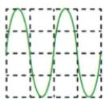
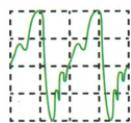
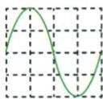
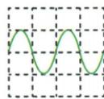

## 讲解

### 判据

多幅波形要求比较声音特性，先检查坐标时间与幅度尺度，再分别看完整周期、离中线高度和重复形状。

### 流程

1. 找平衡中线与相同时间窗口；尺度不同不能仅凭画得疏密或高低比较。
2. 找完整波形的重复间隔，周期短对应频率高、音调高。
3. 看最大偏离中线的高度，比较振幅和相当条件下的响度。
4. 在周期与振幅信息之外观察形状，形状不同可对应音色不同。
5. 把每个选项的两个判断拆开检查，一个判断错即整个选项错；复杂波形的内部小峰不可随意都算一周期。

## 例题

### 四幅声音波形比较

> 来源ID Q01-10；第一章声现象；1-50/full.md 第2052–2069行。原答案与解析定位：1-50/full.md 第2071–2073行。

例2 如图所示,是声音输入到示波器上时显示的波形。以下说法正确的是 ( )

A.甲和乙音调、音色都相同   
B.乙和丙响度相同,音色不同  
C. 甲和丙音调、响度都不同  
D.丙和丁响度不同,音调相同

  
甲

  
乙

  
丙

  
丁

**原资料答案与解析：**

解析 由图可知,甲和乙波形的疏密程度相同,波的形状不同,则音调相同,音色不同,故 A 错误;乙和丙波形的上下高度相同,波的形状不同,则响度相同,音色不同,故 B 正确;甲和丙波形的上下高度相同,波形的疏密程度不同,则响度相同,音调不同,故 C 错误;丙和丁波形的上下高度不同,波形的疏密程度不同,则响度不同,音调不同,故 D 错误。

答案 B

**展开解析（依据原详解补足理由与步骤）：**

先确认原图使用相同的时间尺度和纵向显示尺度，再分别观察重复周期、偏离中线的高度和波形形状。原图甲、乙周期相同而形状不同；乙、丙振幅相同；丙、丁周期不同且振幅不同。

- A错：甲乙疏密相同，所以音调相同；乙的波形有额外弯折，形状与甲不同，音色不同。
- B对：乙丙离中线的最大高度相同，响度相同；一个复杂起伏、一个近似平滑波形，音色不同。
- C错：甲丙频率不同，但振幅相同，不能说音调和响度都不同。
- D错：丙丁振幅不同，所以响度不同；丙在相同时间内的周期更少，音调也不同，不是相同。

判断周期要找完整波形再次重复的间隔，不能把复杂波形内部的小凸起都当作一次完整振动。

## 易错

- 波形密集看的是时间方向的周期，不是纵向高度。
- 同音调可以不同音色，同响度也可以不同音调。
