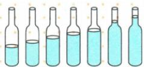
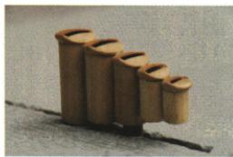

## 讲解

### 判据

吹瓶口、吹管或鸽哨，且给出管长或水位变化时，先认空气柱，再把空气柱长度连接到频率和音调。

### 流程

1. 查是吹奏还是敲击，确定真正振动对象。
2. 从原图读水面上方的空气柱长度，水更多意味着空出的部分更短。
3. 在同类装置和相当条件下，用空气柱更短、频率更高判断音调。
4. 回看左右方向由哪一列实际水位决定；没有图示顺序就不背左右答案。
5. 不把这一规则套到敲瓶或任意不同材料物体，原题限定条件须一起带入。

## 例题

### 吹水瓶琴的音调

> 来源ID Q01-07；第一章声现象；1-50/full.md 第1943–1945行。原答案与解析定位：1-50/full.md 第1947–1949行。

如图所示，小利在7个相同的玻璃瓶中灌入不同高度的水，制成了一个水瓶琴，对着瓶口吹气，越靠\_\_\_\_（选填“左”或“右”）端音调越高。

**原资料答案与解析：**

解析 对着瓶口吹气,声音是由瓶内空气柱振动产生的。空气柱越短,频率越高,音调越高,故越靠右端音调越高。

答案 右

**展开解析（依据原详解补足理由与步骤）：**

先看发声方式：题目是对瓶口吹气，主要振动对象是瓶内空气柱。原图从左向右水位升高，水上方空气柱变短；在这组相同瓶子的吹奏条件下，空气柱越短，振动频率越高，音调越高，所以填“右”。

不可把水柱越高直接理解为频率越低，也不能套用敲击瓶子的判断：敲瓶时参与振动的是瓶体与水，改变了研究对象。左右方向必须来自原图水位，不能只背“右端高”。

### 鸽哨筒长影响哪种特性

> 来源ID Q01-11；第一章声现象；1-50/full.md 第2081–2097行。原答案与解析定位：1-50/full.md 第2103–2104行。

例（2024 北京中考）北京的鸽哨制作精致，图中所示的是用多个管状哨连接成的一个“连筒类”鸽哨。当鸽子携带鸽哨飞行时，哨声既有高音、也有低音，主要是因为各筒的长短会影响发出声音的（）

A. 音调

B. 音色

C. 响度

D.传播速度

**原资料答案与解析：**

例 解析 鸽子携带鸽哨飞行时, 因鸽哨各筒的长短不同, 筒内空气柱长短不同, 空气柱振动的快慢不同, 会发出音调不同的声音。
答案 A

**展开解析（依据原详解补足理由与步骤）：**

长短不同的筒内空气柱长度不同，主要振动频率不同，因此有高音、低音。

- A对：音调正是由频率决定的高低。
- B错：原题强调长短导致高低差，判据指向音调，不能把所有“声音不同”统称音色。
- C错：没有用振幅或声音强弱作为所问条件。
- D错：声传播在同一空气环境中，筒长不等不意味着声速不等。

先认空气柱为声源，再把长度连接到频率，最后连接到音调；不要省掉中间的物理量。

## 易错

- 水柱与空气柱的长度变化相反，先认振动对象。
- “长短不同”说明音调变化，不自动说明传播速度不同。
