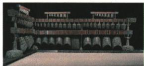

## 讲解

### 判据

题目描述高低、强弱或识别对象，或改变力度、发声体结构等条件，先确定改变的因素，再连接到相应声音特性。

### 流程

1. 问高低时看频率，问强弱时看振幅及接收条件，问辨识时看音色。
2. 对实验先列不变因素：同一编钟、同一位置与相同介质。
3. 再列所改变因素：敲击力度、钟的大小、空气柱长度等；每次只沿实际变量推理。
4. 区分“用不同力敲同一钟”和“同样力敲不同钟”，二者原题的入口不同。
5. 逐项核查，没有介质变化的证据就不把声速跟力度绑定。

## 例题

### 不同力敲击同一编钟

> 来源ID Q01-09；第一章声现象；1-50/full.md 第2030–2040行。原答案与解析定位：1-50/full.md 第2042–2044行。

例1 (2024 湖南中考)考古人员用两千多年前楚国的编钟演奏《茉莉花》时,用大小不同的力敲击如图所示编钟的相同位置,主要改变了声音的 ( )

A.传播速度

B. 响度

C. 音调

D. 音色

**原资料答案与解析：**

解析 考古人员用大小不同的力敲击同一编钟的同一位置, 编钟振动的幅度不同, 发出声音的响度不同, B 正确, A、C、D 错误。

答案 B

**展开解析（依据原详解补足理由与步骤）：**

关键条件是同一编钟、同一位置，只改变用力大小。原题理想化条件下，用力较大使振幅较大，主要改变响度。

- A错：同一空气条件下声速由介质及温度等决定，不能因更响就说传播更快。
- B对：力度改变振幅，主要改变响度。
- C错：原题没有改变决定主要频率的发声体结构，不能用“更用力”推出音调更高。
- D错：没有换材料、结构或主要发声方式，原题主要考查振幅，而非音色。

“主要改变”不能扩大为真实乐器在任何敲击强度下其余声音细节都绝对不变。

### 编钟综合声现象

> 来源ID Q01-14；第一章声现象；1-50/full.md 第2183–2196行。原答案与解析定位：1-50/full.md 第2173–2175行。

例1（2024山东烟台中考）编钟是我国春秋战国时期的一种乐器，关于编钟的说法正确的是 （）

A. 悠扬的钟声是由空气的振动产生的  
B.用相同的力敲击大小不同的钟,发声的音调不同  
C. 敲钟时,用力越大,钟声在空气中的传播速度越大  
D.通过钟声判断钟是否破损,利用了声可以传递能量

**原资料答案与解析：**

例1 解析 钟声是由钟的振动产生的, A 错误; 用相同的力敲击大小不同的钟, 发声的频率不同, 音调不同, B 正确; 敲钟时, 用力越大, 响度越大, 声音传播的速度与响度无关, C 错误; 通过钟声能判断钟是否破损, 利用了声可以传递信息, D 错误。

答案 B

**展开解析（依据原详解补足理由与步骤）：**

逐项先认声源，再分别看频率、声速和用途。

- A错：钟本身振动发声，空气主要传声，不能把传播介质当作钟声声源。
- B对：不同大小的钟主要振动频率不同，用相同力度敲击也能发出不同音调。
- C错：更用力通常更响，不能推出在同一空气中声速更大。
- D错：通过钟声判断是否破损，是获取物体状态的信息，原选项把它写成能量用途。

原答案B。相比“不同力敲同一钟”，本题改变的是钟的大小，改变对象不同，想到的声音特性也不同。

## 易错

- 高音不是大音量；响度大也不意味着音调高。
- 不能把声源的结构变化与敲击力度变化混为一个条件。
