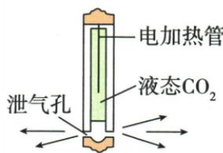

## 讲解

### 是什么

内能是构成物体所有微粒热运动的动能与相互作用势能的总和，单位焦耳。它来自内部微观状态，与物体整体的宏观动能和高度势能区分。

### 怎么来的

同种物质质量状态不变，升温意味着平均热运动更剧烈，内能通常增大；同种同状态同温，更多物质通常有更多微粒、总内能更大。晶体熔化可吸热增内能而不升温，说明微观相互作用和状态也影响内能。

### 什么时候能用

在本章通常物体的中学口径下一切物体都具有内能；不以宏观静止作零内能判断。总内能不能只由温度比较，须核对质量、种类、状态；不使用原资料“任意同温气态最大”等无条件跨物质排序。

## 例题

### 与火煮相同的改变内能方式

> 来源ID Q13-11；第十三章内能；151-200/full.md 第274–284行。原答案与解析定位：151-200/full.md 第286–288行。

例1 (2024 福建中考)“煮”的篆体写法如图,表示用火烧煮食物。下列实例与“煮”在改变物体内能的方式上相同的是 ( )

A.热水暖手

B.钻木取火

C. 搓手取暖

D.擦燃火柴

**原资料答案与解析：**

解析 用火烧煮食物,关键字“烧煮”,内能从火焰传递给食物,能量形式没有发生变化,是通过热传递的方式改变物体内能的。热水暖手,关键字“暖手”,热水的温度高于手的温度,所以内能从热水传递给手,能量形式没有发生变化,是通过热传递的方式改变手的内能,A 正确。钻木取火、搓手取暖、擦燃火柴都是将机械能转化为内能,能量形式发生变化,都是通过做功的方式改变物体内能的,B、C、D 错误。故选 A。

答案 A

**展开解析（依据原详解补足理由与步骤）：**

火煮是较热火焰或器具通过温差向食物传递能量。A热水温度高于手，通过热传递暖手，同类。B钻木、C搓手、D擦火柴的初始摩擦生热是机械能转为内能，属于做功，不同类。D点燃后持续燃烧另有化学变化，原题比较擦燃阶段，不把所有阶段混在一起。

### 温度内能热量与功的多选

> 来源ID Q13-12；第十三章内能；151-200/full.md 第312–320行。原答案与解析定位：151-200/full.md 第322–324行。

例2（多选）关于温度、内能、热量、功的说法正确的是 （）

A.物体温度升高,一定吸收了热量

B.物体温度升高,内能一定增加

C.物体内能增加,一定是外界对它做了功

D. 物体吸收热量, 温度可能不变

**原资料答案与解析：**

解析 物体温度升高,内能增大,可能是从外界吸收了热量,也可能是外界对物体做功,故 A 错误;物体温度升高,分子运动变剧烈,内能一定增加,故 B 正确;物体内能增加,可能是外界对它做了功,也有可能是从外界吸收了热量,故 C 错误;物体吸收热量,温度可能不变,比如晶体在熔化时,吸收热量,内能增大,温度不变,故 D 正确。

答案 BD

**展开解析（依据原详解补足理由与步骤）：**

原答案BD。A错：升温可由热传递也可由做功。C错：内能增加不唯一来自做功，也可吸热。D对：晶体熔化或液体沸腾吸热而温度可不变。B按教材默认同一物体质量和状态不变，升温分子运动更剧烈，内能增大。题干没明写这些条件；若质量、物质种类或状态同时变化，不能只凭升温确定总内能，原B的“一定”需加这一边界。原答案保留，不把省略条件推广为无条件规律。

### 二氧化碳压缩与喷出改变内能

> 来源ID Q13-13；第十三章内能；151-200/full.md 第332–348行。原答案与解析定位：151-200/full.md 第353–355行。

例 (2024 山西中考)二氧化碳( $\mathrm{CO}_{2}$ )爆破技术是现代工程建设中非常环保的技术。起爆前高压泵将 $\mathrm{CO}_{2}$ 压缩成高压气体,液化后输入爆破筒内。如图所示,爆破时电加热管发热,使筒内的液态 $\mathrm{CO}_{2}$ 迅速汽化,形成的高压气体从泄气孔中喷出,实施爆破。下列说法正确的是()

A. 高压泵压缩 $CO_{2}$ ，气体内能增大，温度降低  
B. 高压泵压缩 $CO_{2}$ ，气体内能减小，温度升高  
C. 高压 $CO_{2}$ 气体喷出时，内能增大，温度升高  
D. 高压 $CO_{2}$ 气体喷出时，内能减小，温度降低

**原资料答案与解析：**

例 解析 高压泵压缩 $CO_{2}$ ，对气体做功，气体内能增大，温度升高，A、B 错误；高压 $CO_{2}$ 气体喷出时，气体对外做功，内能减小，温度降低，C 错误，D 正确。

答案D

**展开解析（依据原详解补足理由与步骤）：**

按原题快速压缩、喷出中热交换近似可忽略的模型：压缩时外界对气体做功，内能增大、温度升高，A的降温错，B的内能减小错。喷出膨胀气体对外做功，内能减小、温度降低，C两项都反，D正确。中间电加热管供能汽化是另一阶段，不能用它的吸热来判断快速喷出全过程一定升温。

## 易错

内能属于物体整体；温度不是内能总量。
