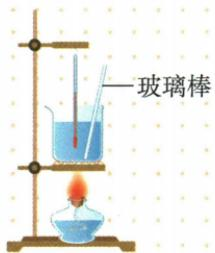
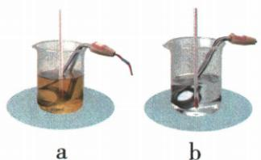
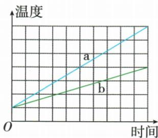
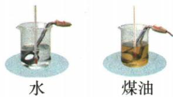
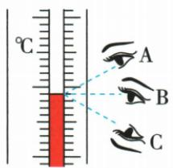
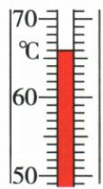

## 讲解

### 判据

相同质量的两液体，可同温差比较热量，也可同吸热比较温差；相同供热功率和近似相同损失时，加热时间可替代热量。

### 流程

1. 先用天平保证质量相同，电加热器规格与供电相同。2. 比同温差时温度计必须在场，不比较不同沸点。3. 比同热量时记录相同加热时间，并分别算末减初。4. 同温差需要更多热量的比热大；同热量升温较少的比热大。5. 初温不同仍可比较温差，但加热损失是否可忽略要说明。

## 例题

### 水煤油等温升比较实验

> 来源ID Q13-01；第十三章内能；101-150/full.md 第3379–3392行。原答案与解析定位：101-150/full.md 第3394–3394行。

用如图所示的装置，先后加热初温、质量均相同的水和煤油，多次实验表明：要让水和煤油升高相同的温度，水需要的加热时间更长，以下关于该实验的操作及分析错误的是 （）

A.组装实验器材时要自下而上  
B.加热时用玻璃棒不断搅拌, 是为了使水和煤油受热均匀  
C. 实验中可以不使用温度计，让水和煤油都沸腾后再比较加热时间  
D. 相同质量的水和煤油，若吸收相同热量，煤油比水升高的温度大

**原资料答案与解析：**

答案 C

**展开解析（依据原详解补足理由与步骤）：**

题问错误。A自下向上安装使酒精灯外焰与器材位置协调，正确。B搅拌让液体受热均匀，正确。C错误：水、煤油沸点不同，让它们都沸腾不等于让它们升高相同温度，需要温度计控制温差，不能免去。D正确：同质量、同吸热，煤油比热较小，升温较多。原资料只给C，逐项理由按给定观察和比热定义补写。

### 同质量两液体图像判断比热容

> 来源ID Q13-02；第十三章内能；101-150/full.md 第3464–3487；3501–3504行。原答案与解析定位：101-150/full.md 第3506–3508行。

例1 (2024 湖北中考)如图甲,利用相同规格的加热器加热等质量的 a、b 两种液体,得到温度随时间变化的图像如图乙,分析可知 ()

甲

乙

A.相同时间内 a 中加热器产生的热量比 b 中的多  
B.a 和 b 的吸热能力都随着温度的升高不断增大  
C. 升高相同温度 a 所用时间比 b 少, a 的吸热能力比 b 弱  
D.相同时间内 a 升高的温度比 b 多,a 的吸热能力比 b 强

**原资料答案与解析：**

解析 实验中使用相同规格的加热器,加热相同时间内产生的热量相同,A 错误;吸热能力是物质的固有属性,不随温度的升高而变化,B 错误;升高相同的温度,a 所用时间比较少,则 a 吸收的热量少,a、b 两种液体的质量相等,由 $c=\frac{Q}{m\Delta t}$ 可知,a 的吸热能力比 b 弱,C 正确;相同时间内两液体吸收的热量相等,a 升高的温度比 b 多,a、b 两种液体的质量相等,由 $c=\frac{Q}{m\Delta t}$ 可知,a 的吸热能力比 b 弱,D 错误。

答案 C

**展开解析（依据原详解补足理由与步骤）：**

A错：相同功率的加热器同时间产生同样能量，不因液体温升不同而产生不同热量。B在本章把比热容近似常量的模型中错；比热容不是加热后就不断变强的“吸热能力”。C对：同质量同温升，a用时少、吸热少，由$c=Q/(m\Delta T)$得a比热较小。D错：同热量a升温更多，意味着较小比热，不是较大。读图比较温差而非单看末温；本题两线起点相同。

### 初温不同的水煤油跨段吸热实验

> 来源ID Q13-05；第十三章内能；101-150/full.md 第3557–3568；另接151-200/full.md 第1–28行行。原答案与解析定位：101-150/full.md 第3545–3549行；151-200/full.md 第30–40行。

例2（2024黑龙江齐齐哈尔中考）小姜利用如图1所示的装置“比较不同物质吸热的情况”。

图1

(1)器材:相同规格的电加热器、烧杯、温度计各两个,以及\_\_\_\_
(填测量工具)、托盘天平(含砝码)、水和煤油。

(2)选取两个相同规格的电加热器进行实验,目的是通过比较\_\_\_\_来比较物质吸收热量的多少。

(3)实验中选取初温不同、\_\_\_\_相同的水和煤油,分别倒入烧杯中,用电加热器加热,当它们吸收相同的热量时,通过比较\_\_\_\_来比较不同物质吸热能力的强弱。

(4)如图2所示,小姜正确使用温度计测量液体的温度,按照图中\_\_\_\_(选填“A”“B”或“C”)方法读数是正确的;实验中某时刻温度计示数如图3所示为\_\_\_\_℃。

图2

  
图3

(5)部分实验数据如下表所示,分析数据可得出结论:\_\_\_\_(选填“水”或“煤油”)的吸热能力更强。

| 加热时间/min | 0 | 1 | 2 | 3 | 4 | ...... | 10 |
| --- | --- | --- | --- | --- | --- | --- | --- |
| 水的温度/°C | 30 | 34 | 38 | 42 | 46 | ...... | 70 |
| 煤油的温度/°C | 10 | 18 | 26 | 34 | 42 | ...... | 90 |

**原资料答案与解析：**

例2 解析（1）比较不同物质吸热的情况实验中需要测量加热时间，故缺少的实验器材是秒表。

(2)实验中选取两个相同的电加热器的目的是通过比较加热时间来比较物质吸收热量的多少。

(3) 根据公式 $c=\frac{Q}{m\Delta t}$ 可知, 要控

制不同物质的质量相等,即实验中应取质量相等的水和煤油,当它们吸收相同的热量时,通过比较升高的温度来判断吸热能力的强弱。

(4) 使用温度计测量液体的温度时, 视线要与液柱的上表面相平, 故 B 正确; 由图 3 可知, 温度计的分度值为 1 ℃, 此时是零上, 因此温度计示数为 66 ℃。  
(5)由表中数据可知,水和煤油加热相同的时间,水升高的温度较低,说明水的吸热能力更强。

答案 (1)秒表

(2) 加热时间  
(3) 质量 升高的温度(温度变化量或温度差)  
(4)B 66   
(5) 水

**展开解析（依据原详解补足理由与步骤）：**

(1)需要测加热时间，缺秒表。(2)同规格电加热器在相同供电、近似同损失条件下，同时间供热近似相同，可用加热时间比较吸热。(3)控制质量相同；即使初温不同，也应比较升高温差，不能只比末温。(4)平视液柱端为B，A俯视、C仰视都有视差；原图每格1摄氏度，液面在60上6格，66。(5)十分钟水从30到70，温升40；煤油从10到90，温升80，同质量同吸热，$c_{\text{水}}/c_{\text{煤油}}=80/40=2$，水吸热能力较强。比热比值按理想条件由表算出，未改变原题。

## 易错

同一末温或沸腾不是同一温差；同加热器同时间供热相同不保证所有真实装置零散热。
