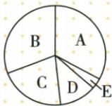
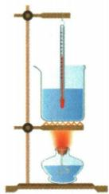

## 讲解

### 是什么

加热效率是目标物体吸热占燃料供能的比例；热机效率是有用机械输出占燃料完全燃烧能量的比例。$\eta_{\text{加热}}=Q_{\text{目标吸}}/Q_{\text{燃料}}$，$\eta_{\text{热机}}=W_{\text{有用}}/Q_{\text{燃料}}$，无单位。

### 怎么来的

燃料能量可流向目标吸热、有用机械输出、散热、废气和其他损失。选择工作目标后，把对应有用部分除全部燃料能量。热机效率反映比例，功率反映每秒做多少功，二者不能互代。

### 什么时候能用

用百分数前先化为小数再代公式。汽油未完全燃烧也按燃料完全燃烧潜能作标准分母，未释放部分是不能利用的去向。提高燃烧充分程度、润滑、回收废气能量等可改进；不据功率大断言效率高。

## 例题

### 热机能量扇形图求效率

> 来源ID Q14-09；第十四章内能的利用；151-200/full.md 第688–700行。原答案与解析定位：151-200/full.md 第702–702行。

如图所示为表示某品牌内燃机工作过程中能量流向的扇形图,则该热机的效率为 ( )

A.有效利用 $38\%$ B.废气带走 $30\%$ C.克服摩擦 $22\%$ D.机器散热 $8\%$ E.未燃烧完全 $2\%$

A.38%

B.30%

C.22%

D. $68\%$

**原资料答案与解析：**

答案 A

**展开解析（依据原详解补足理由与步骤）：**

图中有效利用38%、废气30%、摩擦22%、散热8%、未燃完全2%，合计100%。按有用输出占燃料能量，效率38%，A对；B30%是废气损失，C22%是摩擦去向，D68%把有用和废气相加，没有符合有用功目标。字母A至E是能量扇区标记，不要与四个选项字母混淆。

### 燃料加热水反求热值

> 来源ID Q14-10；第十四章内能的利用；151-200/full.md 第764–775行。原答案与解析定位：151-200/full.md 第777–781行。

例1 (2024 江苏常州中考)中国工程师利用焦炉气中的氢气与工业尾气中的二氧化碳,合成液态燃料,作为第 19 届亚洲运动会主火炬的燃料。工程师在科普馆用如图所示的装置为同学们演示模拟实验,测量该燃料的热值。

①在空酒精灯内加入适量该液态燃料,得到“燃料灯”;   
②在空烧杯内加入 1 kg 水, 测得水的初温为 31 ℃, 点燃“燃料灯”开始加热;  
③当水恰好沸腾时,立即熄灭“燃料灯”,测得“燃料灯”消耗燃料30 g。

已知实验时气压为 1 标准大气压, $c_{\text{水}} = 4.2 \times 10^{3} \, \mathrm{J/(kg\cdot{}^\circ C)}$ , 用该装置加热水的效率为 42%。求:

(1) 此过程中, 烧杯内水吸收的热量;   
(2)该液态燃料的热值。

**原资料答案与解析：**

解析（1）水吸收的热量 $Q_{\text{吸}} = cm(t - t_0) = 4.2 \times 10^3 \, \text{J/(kg} \cdot {}^\circ\text{C)} \times 1 \, \text{kg} \times (100^\circ\text{C} - 31^\circ\text{C}) = 2.898 \times 10^5 \, \text{J}$ 。

(2) 液态燃料燃烧放出的热量 $Q_{\text{放}} = \frac{Q_{\text{吸}}}{\eta} = \frac{2.898 \times 10^{5} \mathrm{~J}}{42\%} = 6.9 \times 10^{5} \mathrm{~J}$ , 该液态燃料的热值 $q = \frac{Q_{\text{放}}}{m_{\text{液}}} = \frac{6.9 \times 10^{5} \mathrm{~J}}{0.03 \mathrm{~kg}} = 2.3 \times 10^{7} \mathrm{~J/kg}$ 。

答案 (1) $2.898 \times 10^{5}$ J (2) $2.3 \times 10^{7}$ $\frac{J}{kg}$

**展开解析（依据原详解补足理由与步骤）：**

标准气压下水恰好沸腾为100摄氏度，温差$100-31=69\,^\circ\mathrm C$。水吸热$4200\times1\times69=289800\,\mathrm J$。42%是水吸热除燃料完全燃烧能量，所以燃料放能$289800/0.42=690000\,\mathrm J$。燃料30克为0.03千克，$q=690000/0.03=2.3\times10^7\,\mathrm{J/kg}$。不能把水吸热直接除燃料质量当热值，那会漏掉58%的其他能量去向。

### 汽车阻力里程与热机效率

> 来源ID Q14-11；第十四章内能的利用；151-200/full.md 第783–787行。原答案与解析定位：151-200/full.md 第789–794行。

例2 一辆小汽车在平直的公路上匀速行驶,所受阻力为 2300 N,前进 2 km 消耗了 0.3 kg 汽油(汽油的热值为 $4.6 \times 10^{7}$ J/kg)。求:

(1)牵引力做的功；  
(2)0.3 kg 汽油完全燃烧放出的热量；  
(3) 小汽车的热机效率(计算结果保留到 0.1%)。

**原资料答案与解析：**

解析（1）小汽车在平直的公路上匀速行驶时，所受牵引力与阻力平衡，大小相等，即 $F = f = 2300\mathrm{N}$ ，牵引力做的功 $W_{\text{有用}} = Fs = 2300\mathrm{N} \times 2000\mathrm{m} = 4.6 \times 10^{6}\mathrm{J}$ 。

(2) $0.3\mathrm{kg}$ 汽油完全燃烧放出的热量 $Q_{\text{放}} = mq = 0.3\mathrm{kg} \times 4.6 \times 10^{7}\mathrm{J/kg} = 1.38 \times 10^{7}\mathrm{J}$ 。  
(3) 小汽车的热机效率 $\eta=\frac{W_{\text{有用}}}{Q_{\text{放}}}=\frac{4.6\times10^{6}J}{1.38\times10^{7}J}\approx33.3\%$

答案 (1) $4.6 \times 10^{6} \mathrm{~J}$ (2) $1.38 \times 10^{7} \mathrm{~J}$ (3) $33.3\%$

**展开解析（依据原详解补足理由与步骤）：**

匀速水平时牵引力等于阻力2300 N；路程2千米为2000米，有用输出$W=2300\times2000=4.6\times10^6\,\mathrm J$。燃料完全燃烧能量$Q=0.3\times4.6\times10^7=1.38\times10^7\,\mathrm J$。效率$W/Q=(4.6\times10^6)/(1.38\times10^7)=1/3\approx33.3\%$，按要求保留到0.1%。有用输出与燃料总放能是分子分母两个不同量。

### 研学汽车燃料体积与平均功率

> 来源ID Q14-13；第十四章内能的利用；151-200/full.md 第816–820行。原答案与解析定位：151-200/full.md 第826–830行。

例2（2024 山西中考）山西拥有丰富的历史文化遗产。暑假期间小明一家从平遥古城自驾前往五台山，进行古建筑研学旅行。平遥古城到五台山全程约 360 km，驾车前往大约需要 4 h。（汽油的热值 q 取 $4.5 \times 10^{7}$ $\frac{J}{kg}$，汽油的密度 $\rho$ 取 $0.8 \times 10^{3}$ $\frac{kg}{m}$ $^{3}$ ）

(1) 求汽车的平均速度。  
(2)汽车全程消耗汽油 25 L, 求汽油完全燃烧放出的热量 Q。  
(3)若汽车发动机全程的平均功率为 25 kW, 求汽车发动机的效率。

**原资料答案与解析：**

例2 解析（1）汽车的平均速度 $v=\frac{s}{t}=\frac{360\ km}{4\ h}=90\ km/h$ 。

(2) 汽油体积 $V = 25 \, L = 2.5 \times 10^{-2} \, m^{3}$ ，由 $\rho = \frac{m}{V}$ 可知，汽油的质量 $m = \rho V = 0.8 \times 10^{3} \, kg/m^{3} \times 2.5 \times 10^{-2} \, m^{3} = 20 \, kg$ ，汽油完全燃烧放出的热量 $Q = mq = 20 \, kg \times 4.5 \times 10^{7} \, J/kg = 9 \times 10^{8} \, J$ 。

(3) 由 $P = \frac{W}{t}$ 可知, 汽车发动机全程所做的功 $W = Pt = 25 \times 10^{3} \mathrm{~W} \times 4 \times 3600 \mathrm{~s} = 3.6 \times 10^{8} \mathrm{~J}$ , 汽车发动机的效率 $\eta = \frac{W}{Q} = \frac{3.6 \times 10^{8} \mathrm{~J}}{9 \times 10^{8} \mathrm{~J}} = 40\%$ 。

**展开解析（依据原详解补足理由与步骤）：**

平均速度$360/4=90\,\mathrm{km/h}$。25升$=0.025\,\mathrm{m^3}$，质量$m=\rho V=800\times0.025=20\,\mathrm{kg}$；燃料能量$Q=mq=20\times4.5\times10^7=9\times10^8\,\mathrm J$。平均功率25千瓦为25000瓦，4小时为14400秒，有用输出$W=Pt=25000\times14400=3.6\times10^8\,\mathrm J$。效率$W/Q=0.4=40\%$。平均速度不代表全程每时刻匀速，第三问用给出的全程平均功率即可。

## 易错

分子目标不同，加热效率不能直接当发动机机械效率。
