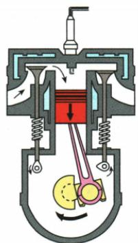
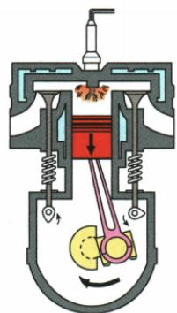
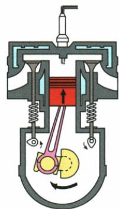
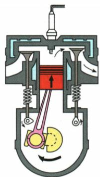

## 讲解

### 是什么

本章四冲程内燃机循环依次吸气、压缩、做功、排气。单缸每循环活塞四次单程移动、往复两次，曲轴转两周，主要对外做功一次。

### 怎么来的

吸气进气门开活塞下行；压缩两门闭活塞上行，把机械能转内能；做功两门闭、高温燃气推活塞下行，把内能转机械能；排气排气门开活塞上行。飞轮储存的机械运动和其他缸作用帮助完成非做功阶段。

### 什么时候能用

四冲程单缸才可用转数除2求做功次数。多缸总次数还须给缸数与相位，本书题未给不能自行加。两气门关闭有两种冲程，必须看活塞方向或点火等信息。

## 例题

### 汽油机四幅冲程图的判断

> 来源ID Q14-05；第十四章内能的利用；151-200/full.md 第528–568行。原答案与解析定位：151-200/full.md 第570–572行。

例 如图所示为汽油机工作过程的示意图,其中表示压缩冲程的是 ( )

A

B

C

D

**原资料答案与解析：**

解析 “一看火花塞”, 火花塞点燃的是做功冲程, B 项表示做功冲程; “二看气门”, 进气门打开、排气门关闭的是吸气冲程, A 项表示吸气冲程; 进气门关闭、排气门打开的是排气冲程, D 项表示排气冲程; “三看活塞”, 活塞向上运动、气门都关闭的是压缩冲程, C 项表示压缩冲程。

答案 C

**展开解析（依据原详解补足理由与步骤）：**

A进气门开、活塞向下，吸气。B气门闭、有点火标志且活塞向下，是做功。C两气门闭、活塞向上，把气体压缩，是要求的压缩冲程。D排气门开、活塞向上，是排气。故选C。闭气门单独不能区分压缩与做功，还须看活塞方向或点火。

### 四冲程飞轮转速与每秒做功次数

> 来源ID Q14-07；第十四章内能的利用；151-200/full.md 第605–605行。原答案与解析定位：151-200/full.md 第611–611行。

例2 (2024 江苏南京中考)一台四冲程汽油机压缩冲程中, \_\_\_\_ 能转化为 \_\_\_\_ 能, 飞轮转速为 1200 $\frac{r}{min}$, 则该汽油机每秒钟做功 \_\_\_\_ 次。

**原资料答案与解析：**

例2 答案 机械 内 10

**展开解析（依据原详解补足理由与步骤）：**

压缩时活塞对气体做功，机械能转内能。1200转每分钟先除60，得每秒20转。四冲程单缸一个循环曲轴转两周、做功一次，所以$20/2=10$次每秒。不要把四个冲程当四转，也不要把每个冲程都算做功。原资料只给三空，逐步换算为补写。

## 易错

四冲程不是飞轮四周；压缩不是气体向外输出功。
