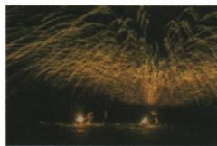

## 讲解

### 是什么

凝固是液态变固态，通常放热。液体凝固形成晶体时，在相应条件下有固定凝固点；同种物质同条件的熔点与凝固点相同。

### 怎么来的

冷却液体先降温，到凝固点后继续把能量传给环境，逐渐成为固体，平台不降温但仍放热。凝固结束后固体继续放热可再降温。

### 什么时候能用

初中曲线按平稳冷却、无明显过冷等现象的模型判断。必须知道实际发生了状态变化，不能仅凭一个水平温度段认定凝固。水结冰体积变大是水的特性，不应推广所有物质。

## 例题

### 凝固图像中的状态与放热

> 来源ID Q12-08；第十二章物态变化；101-150/full.md 第2763–2784行。原答案与解析定位：101-150/full.md 第2786–2788行。

例 如图所示,是某物质温度随时间变化的图像。下列说法正确的是 ( )

A.该图是某晶体的熔化图像

B.该物质在第 4 min 时是固态

C.该物质在第12min时既不吸热也不放热

D.该物质的凝固点为 $80^{\circ}\mathrm{C}$

**原资料答案与解析：**

解析 该图像中温度随时间呈下降趋势,且有一段水平线段,故该图像是某晶体的凝固图像,A 错误;该物质在第 4 min 时是在凝固过程前,为液态,B 错误;8\~18 min 是该物质的凝固过程,不断放热、温度保持不变,C 错误;该图像中水平线段所对应的温度值是凝固点,故该物质的凝固点为 80 ℃,D 正确。

答案 D

**展开解析（依据原详解补足理由与步骤）：**

图整体降温，8到18分钟有80摄氏度平台，是晶体凝固，A误称熔化。4分钟在凝固前仍液态，B错。12分钟在平台内，持续放热而温度不变，C错。平台80给凝固点，D正确。结束后温度再下降表示已凝成固体；平台处可能固液共存，不能只按温度判断全部状态。

### 铸钟工艺中的熔化与凝固

> 来源ID Q12-09；第十二章物态变化；101-150/full.md 第2800–2807行。原答案与解析定位：101-150/full.md 第2815–2817行。

例1（2024 安徽中考）我国古代科技著作《天工开物》里记载了铸造“万钧钟”和“鼎”的方法，先用泥土制作“模骨”，“干燥之后以牛油、黄蜡附其上数寸”，在油蜡上刻上各种图案（如图），然后在油蜡的外面用泥土制成外壳。干燥之后，“外施火力炙化其中油蜡”，油蜡流出形成空腔，在空腔中倒入铜液，待铜液冷却后，“钟鼎成矣”。下列说法正确的是（）

A.“炙化其中油蜡”是升华过程  
B.“炙化其中油蜡”是液化过程  
C.铜液冷却成钟鼎是凝固过程  
D.铜液冷却成钟鼎是凝华过程

**原资料答案与解析：**

例1 解析 “炙化其中油蜡” 是熔化过程, A、B 错误; 铜液冷却成钟鼎是凝固过程, C 正确, D 错误。

答案C

**展开解析（依据原详解补足理由与步骤）：**

油蜡原来固态，加热流出为液态，是熔化，A升华和B液化均错；铜液冷却成为固态钟鼎，是凝固，C对、D凝华错。虽然同一工艺既加热又冷却，每一问要锁定所说物质和初末状态，不能只按“火烤”或“冷却”取名。

### 打铁花液态铁变固态

> 来源ID Q12-20；第十二章物态变化；101-150/full.md 第3313–3331行。原答案与解析定位：101-150/full.md 第3344–3346行。

例1（2024 湖北中考）如图是我国的传统民俗表演“打铁花”。表演者击打高温液态铁，液态铁在四散飞溅的过程中发出耀眼的光芒，最后变成固态铁。

此过程发生的物态变化是 （）

A. 升华

B. 凝华

C. 熔化

D.凝固

**原资料答案与解析：**

例1 解析 高温液态铁遇冷由液态变为固态,属于凝固现象。

答案D

**展开解析（依据原详解补足理由与步骤）：**

初态液体铁，末态固体铁，是凝固D。A升华需固到气，B凝华需气到固，C熔化需固到液，均与题中过程不符。发光或四散飞溅不是物态变化的命名依据。

## 易错

凝固不叫凝华；水平平台不是停止放热。
