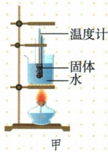
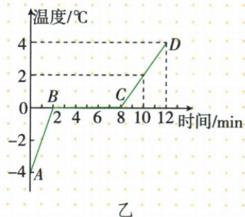
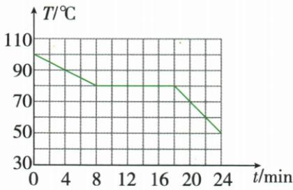
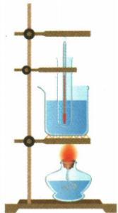
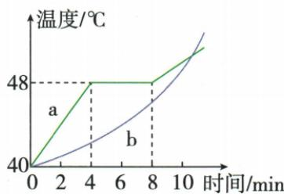
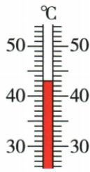

## 讲解

### 是什么

初中根据熔化温度特征区分：晶体在相应条件下有固定熔化温度，非晶体没有固定熔点。冰、海波为常见晶体，石蜡、玻璃为教材中常见非晶体例。

### 怎么来的

持续加热并观察状态，晶体出现熔化平台，平台前固体升温，平台内固液共存，平台后液体升温；非晶体逐渐软化，温度继续变化。比较需把“持续加热、状态改变”与曲线同时结合。

### 什么时候能用

不能说任意温度图有平台就一定是晶体：停止供热、温控装置和沸腾也可能形成平台。判断必须限定熔化实验和供热过程，且注意平台端点与内部阶段不同。

## 例题

### 冰熔化的水浴装置与平台时间

> 来源ID Q12-07；第十二章物态变化；101-150/full.md 第2653–2683行。原答案与解析定位：101-150/full.md 第2685–2689行。

图甲是“探究冰在熔化时温度的变化规律”实验，图乙是根据实验数据画出的图像。

(1)图甲安装实验装置的顺序是\_\_\_\_（选填“自上而下”或“自下而上”），该实验采用水浴加热的目的是\_\_\_\_。  
(2)由图乙可知，冰在熔化过程中\_\_\_\_（选填“吸热”或“放热”），温度\_\_\_\_（选填“升高”“不变”或“降低”）。

(3) 冰从开始熔化到完全熔化大约持续了 \_\_\_\_ min。

**原资料答案与解析：**

答案（1）自下而上 使冰受热均匀

(2) 吸热 不变

(3)6

**展开解析（依据原详解补足理由与步骤）：**

先按酒精灯火焰位置固定下方陶土网和烧杯，再定试管与温度计高度，是自下而上。水浴使冰受热均匀、温度变化较缓便于观察。图中2分钟到8分钟温度为0且加热继续，是熔化平台，持续吸热但温度不变；持续时间$8-2=6\,\mathrm{min}$。8分钟是结束时刻，不能直接作持续时间。

### 凝固图像中的状态与放热

> 来源ID Q12-08；第十二章物态变化；101-150/full.md 第2763–2784行。原答案与解析定位：101-150/full.md 第2786–2788行。

例 如图所示,是某物质温度随时间变化的图像。下列说法正确的是 ( )

A.该图是某晶体的熔化图像

B.该物质在第 4 min 时是固态

C.该物质在第12min时既不吸热也不放热

D.该物质的凝固点为 $80^{\circ}\mathrm{C}$

**原资料答案与解析：**

解析 该图像中温度随时间呈下降趋势,且有一段水平线段,故该图像是某晶体的凝固图像,A 错误;该物质在第 4 min 时是在凝固过程前,为液态,B 错误;8\~18 min 是该物质的凝固过程,不断放热、温度保持不变,C 错误;该图像中水平线段所对应的温度值是凝固点,故该物质的凝固点为 80 ℃,D 正确。

答案 D

**展开解析（依据原详解补足理由与步骤）：**

图整体降温，8到18分钟有80摄氏度平台，是晶体凝固，A误称熔化。4分钟在凝固前仍液态，B错。12分钟在平台内，持续放热而温度不变，C错。平台80给凝固点，D正确。结束后温度再下降表示已凝成固体；平台处可能固液共存，不能只按温度判断全部状态。

### 两种固体熔化图像与温度读数

> 来源ID Q12-11；第十二章物态变化；101-150/full.md 第2850–2883行。原答案与解析定位：101-150/full.md 第2823–2833行。

例3（2024 山东泰安中考）小文同学用如图甲所示装置“探究固体熔化时温度的变化规律”，用温度计分别测量 a、b 两种物质的温度，温度随时间变化的关系图像如图乙所示。

甲

乙

  
丙

(1)由实验可知，\_\_\_\_（选填“a”或“b”）物质是晶体。  
(2)在第6 min时,a物质的状态是\_\_\_\_（选填“固态”“液态”或“固液共存状态”）。  
(3) 某时刻测量 b 物质的温度计示数如图丙所示, 则示数为 \_\_\_\_ ℃。  
(4)在 0\~4 min 加热过程中,a 物质的内能\_\_\_\_（选填“增加”“减少”或“保持不变”）。

**原资料答案与解析：**

例3 解析（1）晶体在熔化过程中，温度不变、持续吸热，据此判断 a 是晶体。

(2) 第 6 min 时, a 物质正在熔化, 此时处于固液共存状态。  
(3) 温度计的分度值为 $1^{\circ}$ C, 示数为 $43^{\circ}$ C。  
(4)0\~4 min, a 物质持续吸热, 故其内能增加。

答案 (1)a

(2) 固液共存状态  
(3)43   
(4) 增加

**展开解析（依据原详解补足理由与步骤）：**

a在4到8分钟48摄氏度处有持续加热平台，是晶体；b在图示熔化过程中无固定温度。第6分钟在a熔化平台，固液共存。丙40到50之间十小格，每格1摄氏度，液面在40上三格，读43。0到4分钟a持续吸热且升温，内能增加；内能的系统解释在下一章补入，此处按原题保留答案，不把它等同机械能。

## 易错

没有看到平台也可能观察区间没有覆盖熔化过程，不自动认定非晶体。
