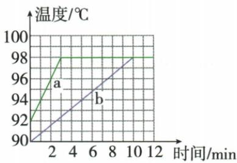
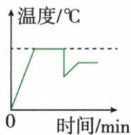
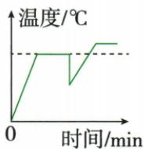
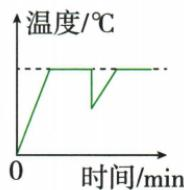

## 讲解

### 是什么

沸腾是液体内部和表面同时剧烈汽化的过程，常见大量气泡从内部升起并破裂。在稳定气压下达到相应沸点并持续吸热才能维持沸腾。

### 怎么来的

沸腾前供热使温度上升；到沸点后新增能量主要用于液态变气态，温度保持相应沸点。水面气压改变会改变沸点，质量改变主要改变升温所需能量和时间。

### 什么时候能用

纯水、气压稳定且测量准确时讨论温度平台。沸腾之前少量气泡并不单独证明沸腾；观察上升气泡变大和稳定温度并结合。撤去供热且无其他更热源时通常不能继续维持沸腾。

## 例题

### 沸腾气泡与温度计差异验证

> 来源ID Q12-12；第十二章物态变化；101-150/full.md 第2977–2977行。原答案与解析定位：101-150/full.md 第2979–2979行。

(2024 江苏连云港中考)在“观察水的沸腾”实验时,当水沸腾时,观察到烧杯内产生大量气泡并不断上升,气泡在上升过程中将\_\_\_\_（选填“逐渐变小”“逐渐变大”或“不变”）。沸腾时继续吸热,水的温度\_\_\_\_。实验中,有三组同学选用同样规格的温度计,测量水的沸点却不同,同学猜想可能是温度计本身的差异引起的。为了验证同学的猜想,你的操作方法是\_\_\_\_。

**原资料答案与解析：**

答案 逐渐变大 不变 将该三支温度计放入同一杯沸水中进行观察

**展开解析（依据原详解补足理由与步骤）：**

沸腾时气泡在上升中逐渐变大，到液面破裂；液体继续吸热，气压稳定时温度不变。验证三支温度计差异，应把它们同时放在同一杯沸水中，玻璃泡位置相近且不碰壁底，待稳定比较；这样温度和气压相同，才把差别归于仪器而非不同地点的沸点。

### 两组水的初温与沸点图

> 来源ID Q12-14；第十二章物态变化；101-150/full.md 第3062–3082行。原答案与解析定位：101-150/full.md 第3084–3089行。

例2 a、b 两个实验小组用相同的酒精灯探究水沸腾前后温度变化的特点,根据实验数据绘制的图像如图所示,分析图像并回答下列问题。

(1)水沸腾前温度不断升高,沸腾后温度;   
(2)分析可知，组所用水的初温较高；  
(3)a、b两组所测水的沸点是 ℃,这是 (选填“实验误差”或“当地气压”)引起的。

**原资料答案与解析：**

解析 (1)由图像可知,水平段表示水沸腾后温度不变;

(2)由图像与纵坐标轴的交点可知，a组所用水的初温较高；  
(3)由图像可知水的沸点是98℃.标准大气压下水的沸点是100℃.这是当地气压低于标准大气压引起的。

答案 (1) 不变 (2)a (3) 98 当地气压

**展开解析（依据原详解补足理由与步骤）：**

图a起始92、b起始90摄氏度，a初温较高。两图后段同在98摄氏度平台，沸腾后温度不变，水沸点98。按原题假定纯水、温度计准确，98低于标准气压下100，选择当地气压低于标准大气压。仅凭一次98读数本身并不能排除仪器误差；原答案基于题目的理想实验条件，应与上一题仪器核验区分。

### 水沸腾实验减水与中途加水

> 来源ID Q12-17；第十二章物态变化；101-150/full.md 第3131–3149；3177–3196行。原答案与解析定位：101-150/full.md 第3163–3175行。

例3（2024 山东枣庄中考）某实验小组用如图甲所示的实验装置探究“水沸腾前后温度变化的特点”。所用实验装置如图甲所示。

  
甲

乙

(1) 安装如图甲所示装置时, 应该先确定铁圈 A 的位置, 确定其高度

时，\_\_\_\_（选填“需要”或“不需要”）点燃酒精灯。

(2)小明记录的数据如表所示,从表格中可以看出,水在沸腾前,吸收热量,温度\_\_\_\_;水在沸腾过程后,吸收热量,温度\_\_\_\_;此时当地的大气压\_\_\_\_(选填“高于”“低于”或“等于”)1个标准大气压。

| 时间/min | 1 | 2 | 3 | 4 | 5 | 6 | 7 | 8 | 9 |
| --- | --- | --- | --- | --- | --- | --- | --- | --- | --- |
| 温度/°C | 90 | 92 | 94 | 96 | 97 | 98 | 98 | 98 | 98 |

(3)小明根据实验数据绘制的水沸腾前后温度随时间变化的图像如图乙中的 a 所示。如果同组的小红减少烧杯中水的质量,水沸腾前后温度随时间变化的图像可能是图乙中的\_\_\_\_(选填“b”“c”或“d”)。
(4) 星期天小明在家烧水煮饺子, 当水烧开准备下饺子时, 妈妈提醒他锅里的水有点少, 于是小明又往锅里迅速加了一大碗水 (水量比锅里少), 用同样大的火直至将水再次烧开。下面能说明其整个烧水过程中温度随时间变化的图像是\_\_\_\_(填字母)。

  
A

  
B

  
C

  
D

**原资料答案与解析：**

例3 解析（1）由于要用酒精灯的外焰加热，所以需先根据酒精灯外焰的高度确定铁圈A的高度，因此组装器材时，需要将酒精灯点燃。（2）由表可知，1\~5 min是水沸腾前，吸收热量，温度升高；水在沸腾时温度保持98℃不变，水的沸点是98℃；水的沸点随气压的降低而降低，此时当地的大气压低于1个标准大气压。

(3) 在相同加热情况下, 减少水的质量, 水升温较快, 沸点不变, 故图像可能是图乙中的 c。

(4) 水沸腾时, 温度保持不变, 当向锅里迅速加了一大碗水后, 锅内水的温度快速下降, 然后在加热过程中, 水吸热温度上升, 达到沸点继续沸腾, 在此过程中, 水面上的气压不变, 所以水的沸点与原来相同, 据此分析可知 D 符合题意。

答案 (1) 需要

(2)升高 不变 低于

(3)c

(4) D

**展开解析（依据原详解补足理由与步骤）：**

(1)自下向上装配，先以酒精灯外焰确定A铁圈高度，按原题“需要”点燃，完成后按实验规范熄灭再调整。(2)表中90、92、94、96、97逐渐升高，之后98保持；在纯水、测量准确假定下，当地气压低于标准。(3)只减水质量、同初温同加热条件，升温更快、沸点仍98，图c符合；b平台更高、d更低改变了沸点。(4)迅速加入较冷水，混合温度先突然下降，再由同样火力加热回同一沸点，D正确。A下降画成较长持续冷却后突然恢复，不符迅速混合与随后连续加热；B恢复到较低沸点、C到较高沸点，均不符同气压。第二段加热斜率在理想同供热、增加水量条件下较缓。

## 易错

沸腾不是液化方式，原表表头误写不能照搬。
