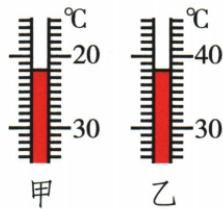
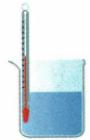
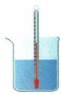
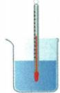
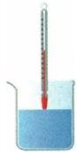
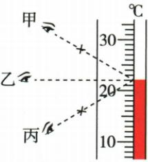

## 讲解

### 是什么

常见实验室液体温度计利用测温液体热胀冷缩，玻璃泡、细管和均匀刻度共同把温度变化表示出来。量程是可测范围，分度值是每小格对应温差。

### 怎么来的

玻璃泡与被测液体充分接触后需要时间达到近似相同温度，液柱才稳定。泡碰容器壁或底会混入其他部位温度；读数离开液体会改测周围环境；视线不平会有视差。

### 什么时候能用

先确认量程涵盖待测温度，不超过范围；泡全浸、不碰壁底，稳定后留在液中平视读数。本条限液体温度计，电子和红外仪器原理不同。玻璃泡大小和细管内径影响灵敏度，不等于量程可以任意扩大。

## 例题

### 没有零刻度的温度计正负读数

> 来源ID Q12-03；第十二章物态变化；101-150/full.md 第2498–2498；2502–2510行。原答案与解析定位：101-150/full.md 第2500–2500行；101-150/full.md 第2511–2511行。

例1 如图所示,温度计甲的示数为 \_\_\_\_ ℃,温度计乙的示数为 \_\_\_\_ ℃。

**原资料答案与解析：**

解析 图示温度计甲、乙上均没有标明零刻度,数字上小下大为“零下”,则温度计甲的示数为-22 ℃;数字上大下小为“零上”,则温度计乙的示数为38 ℃。

答案 -22 38

**展开解析（依据原详解补足理由与步骤）：**

甲标数由上20到下30，温度实际向上升高，所以这些数值是零下温度的绝对值；液面在零下20再向下两格，读负22摄氏度。乙上40下30为零上，每格1摄氏度，液面在40下两格，读38摄氏度。不能把两图都加上正号或只按液柱长度判断冷热。

### 温度计测液温操作四图

> 来源ID Q12-06；第十二章物态变化；101-150/full.md 第2560–2572行。原答案与解析定位：101-150/full.md 第2545–2547行。

例2 (2024 江苏连云港中考)用温度计测量液体的温度,下面四幅图中,操作正确的是()

  
A

  
B

  
C

  
D

**原资料答案与解析：**

例2 解析 用温度计测量液体的温度时, 温度计的玻璃泡应全部浸入被测液体中, 且不能碰到容器底或容器壁, 故 C 正确。

答案 C

**展开解析（依据原详解补足理由与步骤）：**

A玻璃泡贴容器壁，会混入壁温影响，错；B碰容器底，错；C泡全部浸入且不碰壁底，正确；D玻璃泡未全部浸入，错。还要等待示数稳定，读数时泡继续留液中，视线与液柱端相平。原资料只直接说明C，逐图排除按原图与使用规范补写。

### 原附录温度计读数示例

> 来源ID Q23-03；附录1常考测量仪器；201-233/full.md 第2043–2047行。原答案与解析定位：201-233/full.md 第2043–2047行。

| 仪器 | 读数步骤 | 注意事项 |
| --- | --- | --- |
| 温度计 | 确定分度值→确定示数在零上还是零下→确定示数
①确定分度值:1℃
②确定示数位置:零上
③温度计的示数:$20\,\mathrm{{}^\circ C}+1\,\mathrm{{}^\circ C}\times 2=22\,\mathrm{{}^\circ C}$ | ①温度计的玻璃泡应该全部浸入被测液体中,且不能碰到容器底和容器壁
②读数时温度计的玻璃泡要继续留在被测液体中,视线要与液柱的液面相平(如视线乙) |

**原资料答案与解析：**

原表给出的读数、步骤与注意事项见上表；未另给独立问答题。

**展开解析（依据原详解补足理由与步骤）：**

原刻度数值向上增大，液面在零上；20与30之间10格，分度值$1\,^\circ\mathrm C$。液面比20高2格，因此$T=20+2\times1=22\,^\circ\mathrm C$。视线乙与液面相平，甲丙带视差；普通液体温度计的玻璃泡留在液体中读，不套体温计可取出的规则。

## 易错

液柱方向从低温朝高温延伸；零刻度不在图上也要先分正负。
