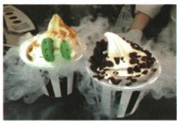
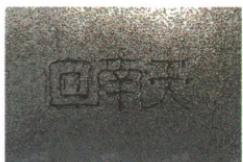

## 讲解

### 是什么

液化是气态变液态，放出热量。日常可见的白气、露或雾是微小液滴；水蒸气本身无色透明，肉眼看不见。

### 怎么来的

较暖湿空气接触低温表面，水蒸气可以凝成液滴；喷出的热水蒸气遇较冷空气也会形成可见小滴。液化放出的热量进入接触物体或环境，不能误说“遇冷”就吸热。

### 什么时候能用

降低温度和在适当温度下压缩体积可促液化；不是任何温度下仅压缩都能液化的无条件结论。识别白气先查是哪种物质，液氮汽化是氮气，与空气水蒸气液化形成的白雾不同。

## 例题

### 液氮冰激凌的白气与凝固

> 来源ID Q12-13；第十二章物态变化；101-150/full.md 第3020–3037行。原答案与解析定位：101-150/full.md 第3038–3040行。

例1 如图所示是液氮冰激凌,其制作方法是将沸点为 $-196^{\circ} \mathrm{C}$ (标准大气压下)的液氮倒入新鲜的奶液中,通过搅拌奶液,使奶液迅速固化,且会产生很多的“白气”。下列选项中说法正确的是

A.“白气”是水蒸气

B.液氮汽化成“白气”

C. 空气中的水蒸气液化成“白气”

D.奶液吸热凝固成冰激凌

**原资料答案与解析：**

解析“白气”是空气中的水蒸气遇冷放热液化成的小水滴,不是水蒸气,A 错误,C 正确;液氮吸热汽化成气态的氮气,“白气”是液态的小水珠,B 错误;奶液遇冷放热凝固成冰激凌,D 错误。

答案 C

**展开解析（依据原详解补足理由与步骤）：**

A错：可见白气是微小液滴，不是无色透明水蒸气。B错：液氮汽化得到氮气，不直接变成水滴白气。C对：空气中的水蒸气受冷液化形成白色雾状液滴。D错：奶液变固态凝固需放热，热量被液氮吸收；液氮则吸热汽化。不同物质的吸热、放热可以同时发生，不能把奶液的变化与液氮的变化混为一件。

### 回南天玻璃出水的状态变化

> 来源ID Q12-15；第十二章物态变化；101-150/full.md 第3101–3117行。原答案与解析定位：101-150/full.md 第3155–3157行。

例1 (2024 广东广州中考)广州春季“回南天”到来时,课室的黑板、墙壁和玻璃都容易“出水”,如图是在“出水”玻璃上写的字。这些“水”是由于水蒸气()

A.遇热汽化吸热形成的

B.遇热汽化放热形成的

C.遇冷液化放热形成的

D.遇冷液化吸热形成的

**原资料答案与解析：**

例1 解析 温度突然升高,空气中含有大量温度较高的水蒸气,这些水蒸气遇到温度较低的黑板、墙壁和玻璃,会液化形成小水滴,液化过程放热,故选C。

答案 C

**展开解析（依据原详解补足理由与步骤）：**

研究空气中的水蒸气从气态变为玻璃表面液滴，是遇冷液化并放热，C正确。A、B都把气变液误称汽化，B还把汽化说成放热；D虽说液化却误说吸热。水并非玻璃内部凭空产生，而是周围较暖湿空气遇到较冷表面形成。

### 厨房白霜白气与汤冷却

> 来源ID Q12-21；第十二章物态变化；101-150/full.md 第3335–3340行。原答案与解析定位：101-150/full.md 第3348–3350行。

例2（2024 四川成都中考）小李同学在爸爸指导下,走进厨房进行劳动实践,他发现厨房里涉及很多物理知识,下列说法不正确的是()

A. 冷冻室取出的排骨表面有“白霜”，“白霜”是固态  
B. 在排骨的“解冻”过程中, 排骨中的冰吸热熔化成水  
C. 排骨汤煮沸后冒出大量的“白气”, “白气”是液态   
D. 排骨汤盛出后不容易凉, 是因为汤能够不断吸热

**原资料答案与解析：**

例2 解析 “白霜” 是水蒸气凝华形成的固态小冰晶, A 正确; 排骨解冻时, 冰吸热熔化成水, B 正确; “白气” 是水蒸气液化形成的液态小水珠, C 正确; 排骨汤不容易凉是由于其表面有许多油, 不易散热, D 错误。

答案 D

**展开解析（依据原详解补足理由与步骤）：**

题问不正确项。A白霜是固态小冰晶，正确；B排骨解冻中冰吸热熔化，正确；C汤上可见白气是小液滴，液态，正确。D错误：热汤总体向较冷环境放热，不能因为“不断吸热”而不凉；表面油层可以减少蒸发等散热，使冷却较慢。这里不把有油概括为完全不传热。

## 易错

看得见白气不是水的气态；“白霜”固态不能误认成液滴。
