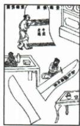

## 讲解

### 是什么

熔化是固态变液态，通常要吸热。晶体在一定压强下有固定熔点，达到熔点且继续吸热才逐渐熔化，过程中温度可以不变。

### 怎么来的

加热低温冰先使其温度上升；到熔点后输入能量用于状态改变，而非继续使温度升高。冰水共存直到冰全部变水，之后继续供热才使液态水升温。温度和物态要同时观察。

### 什么时候能用

同一种晶体的熔点需在相同压强等条件下讨论；混合物或非晶体不能直接套固定平台。刚达熔点的固体、熔化中的固液混合物、刚熔完的液体可有同温，温度本身不能确定状态。

## 例题

### 冰熔化的水浴装置与平台时间

> 来源ID Q12-07；第十二章物态变化；101-150/full.md 第2653–2683行。原答案与解析定位：101-150/full.md 第2685–2689行。

图甲是“探究冰在熔化时温度的变化规律”实验，图乙是根据实验数据画出的图像。

(1)图甲安装实验装置的顺序是\_\_\_\_（选填“自上而下”或“自下而上”），该实验采用水浴加热的目的是\_\_\_\_。  
(2)由图乙可知，冰在熔化过程中\_\_\_\_（选填“吸热”或“放热”），温度\_\_\_\_（选填“升高”“不变”或“降低”）。

(3) 冰从开始熔化到完全熔化大约持续了 \_\_\_\_ min。

**原资料答案与解析：**

答案（1）自下而上 使冰受热均匀

(2) 吸热 不变

(3)6

**展开解析（依据原详解补足理由与步骤）：**

先按酒精灯火焰位置固定下方陶土网和烧杯，再定试管与温度计高度，是自下而上。水浴使冰受热均匀、温度变化较缓便于观察。图中2分钟到8分钟温度为0且加热继续，是熔化平台，持续吸热但温度不变；持续时间$8-2=6\,\mathrm{min}$。8分钟是结束时刻，不能直接作持续时间。

### 铸钟工艺中的熔化与凝固

> 来源ID Q12-09；第十二章物态变化；101-150/full.md 第2800–2807行。原答案与解析定位：101-150/full.md 第2815–2817行。

例1（2024 安徽中考）我国古代科技著作《天工开物》里记载了铸造“万钧钟”和“鼎”的方法，先用泥土制作“模骨”，“干燥之后以牛油、黄蜡附其上数寸”，在油蜡上刻上各种图案（如图），然后在油蜡的外面用泥土制成外壳。干燥之后，“外施火力炙化其中油蜡”，油蜡流出形成空腔，在空腔中倒入铜液，待铜液冷却后，“钟鼎成矣”。下列说法正确的是（）

A.“炙化其中油蜡”是升华过程  
B.“炙化其中油蜡”是液化过程  
C.铜液冷却成钟鼎是凝固过程  
D.铜液冷却成钟鼎是凝华过程

**原资料答案与解析：**

例1 解析 “炙化其中油蜡” 是熔化过程, A、B 错误; 铜液冷却成钟鼎是凝固过程, C 正确, D 错误。

答案C

**展开解析（依据原详解补足理由与步骤）：**

油蜡原来固态，加热流出为液态，是熔化，A升华和B液化均错；铜液冷却成为固态钟鼎，是凝固，C对、D凝华错。虽然同一工艺既加热又冷却，每一问要锁定所说物质和初末状态，不能只按“火烤”或“冷却”取名。

### 冰挂吸热与结冰体积变化

> 来源ID Q12-10；第十二章物态变化；101-150/full.md 第2809–2811；2843–2846行。原答案与解析定位：101-150/full.md 第2819–2821行。

例2 (2024 湖南中考)2024 年初,几场寒流来袭,让湖南人在家门口也能看到北方常见的冰挂(如图)。下列说法正确的是 ( )

A. 冰挂熔化时, 需要吸热  
B.冰是水蒸气液化形成的  
C. 冰是非晶体, 有固定的熔点  
D.一定质量的水结冰时,体积变小

**原资料答案与解析：**

例2 解析 冰挂是屋顶的积雪吸热熔化成水后,在滴落的过程中又遇冷凝固形成的冰，A 正确，B 错误；水凝固成冰，质量不变，密度变小，体积变大，D 错误；冰是晶体，有固定的熔点，C 错误。

答案A

**展开解析（依据原详解补足理由与步骤）：**

冰挂熔化由固体变液体，要吸热，A对。积雪先熔化成水、滴落再凝固成冰，不是水蒸气液化直接形成冰，B错。冰是晶体且有固定熔点，C把它说成非晶体，错。相同质量水结冰密度变小，由$V=m/\rho$知体积变大，D错。不是所有物质凝固都体积增大，这里特指水。

## 易错

吸热不一定升温；到熔点不等于已经全部熔化。
