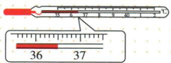

## 讲解

### 是什么

原资料玻璃水银体温计玻璃泡与直管间有狭道，常见量程35至42摄氏度、分度值0.1摄氏度。这个狭道使其能够保留最高测量示数。

### 怎么来的

升温时水银能被推出狭道进入细管；离开人体冷却时水银收缩，在狭道处断开，直管内水银不自动退回，所以可以取出读数。重新测量之前需要按仪器使用要求使液柱回落。

### 什么时候能用

此机制限图示玻璃体温计，不用于普通实验室温度计或所有电子体温计。观察图的刻度可读数；本条不提供疾病诊断，也不将旧示数自动当新测量结果。

## 例题

### 玻璃体温计的结构和读数

> 来源ID Q12-02；第十二章物态变化；101-150/full.md 第2450–2491行。原答案与解析定位：101-150/full.md 第2492–2492行。

体温计离开人体后，直管内的水银\_\_\_\_（选填“能”或“不能”）自动退回玻璃泡，所以体温计能离开人体读数。图中的体温计示数是\_\_\_\_℃。

**原资料答案与解析：**

答案 不能 36.5

**展开解析（依据原详解补足理由与步骤）：**

狭道使冷却后水银柱断开，直管内水银不能自动退回，因此可离开人体读数。原图36与37之间十等份，一格0.1摄氏度，液柱到36之后第五小格，读36.5摄氏度。此结构解释限图示玻璃水银体温计，不能推广所有电子、红外或普通实验室温度计。

## 易错

没重置的最高示数可能来自上一次测量；普通实验室温度计不能因此取出读。
