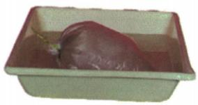

## 讲解

### 判据

物态题先明确同一物质变化前后是固、液还是气，再核对吸热放热，不能只凭景象名称。

### 流程

1. 确认物质和初态末态。2. 固到液熔化、液到固凝固，液到气汽化、气到液液化，固直接到气升华、气直接到固凝华。3. 熔化汽化升华吸热，逆向三种放热。4. 遇到白气先识别小液滴，遇到白霜识别小冰晶。5. 选择题每项名称与热量方向均检查，题问错误项时最后再反选。

## 例题

### 铸钟工艺中的熔化与凝固

> 来源ID Q12-09；第十二章物态变化；101-150/full.md 第2800–2807行。原答案与解析定位：101-150/full.md 第2815–2817行。

例1（2024 安徽中考）我国古代科技著作《天工开物》里记载了铸造“万钧钟”和“鼎”的方法，先用泥土制作“模骨”，“干燥之后以牛油、黄蜡附其上数寸”，在油蜡上刻上各种图案（如图），然后在油蜡的外面用泥土制成外壳。干燥之后，“外施火力炙化其中油蜡”，油蜡流出形成空腔，在空腔中倒入铜液，待铜液冷却后，“钟鼎成矣”。下列说法正确的是（）

A.“炙化其中油蜡”是升华过程  
B.“炙化其中油蜡”是液化过程  
C.铜液冷却成钟鼎是凝固过程  
D.铜液冷却成钟鼎是凝华过程

**原资料答案与解析：**

例1 解析 “炙化其中油蜡” 是熔化过程, A、B 错误; 铜液冷却成钟鼎是凝固过程, C 正确, D 错误。

答案C

**展开解析（依据原详解补足理由与步骤）：**

油蜡原来固态，加热流出为液态，是熔化，A升华和B液化均错；铜液冷却成为固态钟鼎，是凝固，C对、D凝华错。虽然同一工艺既加热又冷却，每一问要锁定所说物质和初末状态，不能只按“火烤”或“冷却”取名。

### 冰挂吸热与结冰体积变化

> 来源ID Q12-10；第十二章物态变化；101-150/full.md 第2809–2811；2843–2846行。原答案与解析定位：101-150/full.md 第2819–2821行。

例2 (2024 湖南中考)2024 年初,几场寒流来袭,让湖南人在家门口也能看到北方常见的冰挂(如图)。下列说法正确的是 ( )

A. 冰挂熔化时, 需要吸热  
B.冰是水蒸气液化形成的  
C. 冰是非晶体, 有固定的熔点  
D.一定质量的水结冰时,体积变小

**原资料答案与解析：**

例2 解析 冰挂是屋顶的积雪吸热熔化成水后,在滴落的过程中又遇冷凝固形成的冰，A 正确，B 错误；水凝固成冰，质量不变，密度变小，体积变大，D 错误；冰是晶体，有固定的熔点，C 错误。

答案A

**展开解析（依据原详解补足理由与步骤）：**

冰挂熔化由固体变液体，要吸热，A对。积雪先熔化成水、滴落再凝固成冰，不是水蒸气液化直接形成冰，B错。冰是晶体且有固定熔点，C把它说成非晶体，错。相同质量水结冰密度变小，由$V=m/\rho$知体积变大，D错。不是所有物质凝固都体积增大，这里特指水。

### 液氮冰激凌的白气与凝固

> 来源ID Q12-13；第十二章物态变化；101-150/full.md 第3020–3037行。原答案与解析定位：101-150/full.md 第3038–3040行。

例1 如图所示是液氮冰激凌,其制作方法是将沸点为 $-196^{\circ} \mathrm{C}$ (标准大气压下)的液氮倒入新鲜的奶液中,通过搅拌奶液,使奶液迅速固化,且会产生很多的“白气”。下列选项中说法正确的是

A.“白气”是水蒸气

B.液氮汽化成“白气”

C. 空气中的水蒸气液化成“白气”

D.奶液吸热凝固成冰激凌

**原资料答案与解析：**

解析“白气”是空气中的水蒸气遇冷放热液化成的小水滴,不是水蒸气,A 错误,C 正确;液氮吸热汽化成气态的氮气,“白气”是液态的小水珠,B 错误;奶液遇冷放热凝固成冰激凌,D 错误。

答案 C

**展开解析（依据原详解补足理由与步骤）：**

A错：可见白气是微小液滴，不是无色透明水蒸气。B错：液氮汽化得到氮气，不直接变成水滴白气。C对：空气中的水蒸气受冷液化形成白色雾状液滴。D错：奶液变固态凝固需放热，热量被液氮吸收；液氮则吸热汽化。不同物质的吸热、放热可以同时发生，不能把奶液的变化与液氮的变化混为一件。

### 回南天玻璃出水的状态变化

> 来源ID Q12-15；第十二章物态变化；101-150/full.md 第3101–3117行。原答案与解析定位：101-150/full.md 第3155–3157行。

例1 (2024 广东广州中考)广州春季“回南天”到来时,课室的黑板、墙壁和玻璃都容易“出水”,如图是在“出水”玻璃上写的字。这些“水”是由于水蒸气()

A.遇热汽化吸热形成的

B.遇热汽化放热形成的

C.遇冷液化放热形成的

D.遇冷液化吸热形成的

**原资料答案与解析：**

例1 解析 温度突然升高,空气中含有大量温度较高的水蒸气,这些水蒸气遇到温度较低的黑板、墙壁和玻璃,会液化形成小水滴,液化过程放热,故选C。

答案 C

**展开解析（依据原详解补足理由与步骤）：**

研究空气中的水蒸气从气态变为玻璃表面液滴，是遇冷液化并放热，C正确。A、B都把气变液误称汽化，B还把汽化说成放热；D虽说液化却误说吸热。水并非玻璃内部凭空产生，而是周围较暖湿空气遇到较冷表面形成。

### 酒精袋在热水中鼓起

> 来源ID Q12-16；第十二章物态变化；101-150/full.md 第3119–3128行。原答案与解析定位：101-150/full.md 第3159–3161行。

例2 (2024 河南中考) 如图, 在塑料袋中滴入几滴酒精, 将袋挤瘪, 排出空气后把袋口扎紧, 放入热水中, 塑料袋鼓起, 该过程中酒精发生的物态变化是\_\_\_\_, 此过程中酒精\_\_\_\_热量。

**原资料答案与解析：**

例2 解析 液态的酒精从热水中吸收热量汽化成酒精蒸气,充满密闭的塑料袋,使塑料袋鼓起。

答案 汽化 吸收

**展开解析（依据原详解补足理由与步骤）：**

排出原空气并扎紧袋口后，液态酒精从热水吸收热量，汽化为酒精蒸气，占据更多空间使袋鼓起。答案“汽化、吸收”。观察鼓起并不说明一定达到沸腾；汽化也可通过蒸发发生。袋口封闭减少了外部空气进入的干扰。

### 水循环中不正确的过程名称

> 来源ID Q12-18；第十二章物态变化；101-150/full.md 第3218–3223行。原答案与解析定位：101-150/full.md 第3225–3225行。

人类的生存和生活离不开地球上的水循环,关于水循环的物态变化,下列说法不正确的是()

A. 海水吸热, 蒸发成水蒸气上升到空中  
B. 空气中的水蒸气遇冷, 液化成云中的小水滴  
C.云中的小水滴遇冷,凝固形成冰雹  
D. 云中的小冰晶吸热, 升华形成雨

**原资料答案与解析：**

答案 D

**展开解析（依据原详解补足理由与步骤）：**

A海水液态到水蒸气气态，是吸热蒸发，正确。B水蒸气遇冷成液滴，是液化，正确。C小水滴遇冷成固态冰雹，题中概括为凝固，正确。D小冰晶变雨滴是固态到液态，应为吸热熔化；升华得到的是水蒸气而非雨滴，所以D为不正确项。原资料只给D，逐项理由为规范补写。

### 谚语中的四种物态与吸放热

> 来源ID Q12-19；第十二章物态变化；101-150/full.md 第3292–3297行。原答案与解析定位：101-150/full.md 第3299–3301行。

例（2024 山东德州中考）“谚语”是中华民族智慧的结晶,下列说法正确的是 ( )

A. 霜降有霜, 米谷满仓——霜的形成是凝华现象, 需要吸热  
B. 白露种高山, 秋分种平川——露的形成是液化现象, 需要放热  
C. 大雾不过晌, 过晌听雨响——雾的形成是汽化现象, 需要吸热  
D.立春雪水化一丈,打得麦子无处放——冰雪消融是熔化现象,需要放热

**原资料答案与解析：**

解析 霜的形成是气态的水蒸气直接变为固态的小冰晶的过程, 是凝华现象, 需要放热, A 错误; 露、雾的形成是气态的水蒸气变为液态的小水滴的过程, 是液化现象, 需要放热, B 正确, C 错误; 冰雪消融是固态的冰、雪变为液态的水的过程, 是熔化现象, 需要吸热, D 错误。

答案 B

**展开解析（依据原详解补足理由与步骤）：**

A霜由水蒸气直接成小冰晶，凝华没错，但应放热，故整项错。B露气变液为液化放热，正确。C雾也是气变液，而非汽化，且放热，错。D冰雪消融固变液为熔化没错，但需吸热，故错。每项把名称和热量方向分别验一次，不能看到前半正确就选。

### 打铁花液态铁变固态

> 来源ID Q12-20；第十二章物态变化；101-150/full.md 第3313–3331行。原答案与解析定位：101-150/full.md 第3344–3346行。

例1（2024 湖北中考）如图是我国的传统民俗表演“打铁花”。表演者击打高温液态铁，液态铁在四散飞溅的过程中发出耀眼的光芒，最后变成固态铁。

此过程发生的物态变化是 （）

A. 升华

B. 凝华

C. 熔化

D.凝固

**原资料答案与解析：**

例1 解析 高温液态铁遇冷由液态变为固态,属于凝固现象。

答案D

**展开解析（依据原详解补足理由与步骤）：**

初态液体铁，末态固体铁，是凝固D。A升华需固到气，B凝华需气到固，C熔化需固到液，均与题中过程不符。发光或四散飞溅不是物态变化的命名依据。

### 厨房白霜白气与汤冷却

> 来源ID Q12-21；第十二章物态变化；101-150/full.md 第3335–3340行。原答案与解析定位：101-150/full.md 第3348–3350行。

例2（2024 四川成都中考）小李同学在爸爸指导下,走进厨房进行劳动实践,他发现厨房里涉及很多物理知识,下列说法不正确的是()

A. 冷冻室取出的排骨表面有“白霜”，“白霜”是固态  
B. 在排骨的“解冻”过程中, 排骨中的冰吸热熔化成水  
C. 排骨汤煮沸后冒出大量的“白气”, “白气”是液态   
D. 排骨汤盛出后不容易凉, 是因为汤能够不断吸热

**原资料答案与解析：**

例2 解析 “白霜” 是水蒸气凝华形成的固态小冰晶, A 正确; 排骨解冻时, 冰吸热熔化成水, B 正确; “白气” 是水蒸气液化形成的液态小水珠, C 正确; 排骨汤不容易凉是由于其表面有许多油, 不易散热, D 错误。

答案 D

**展开解析（依据原详解补足理由与步骤）：**

题问不正确项。A白霜是固态小冰晶，正确；B排骨解冻中冰吸热熔化，正确；C汤上可见白气是小液滴，液态，正确。D错误：热汤总体向较冷环境放热，不能因为“不断吸热”而不凉；表面油层可以减少蒸发等散热，使冷却较慢。这里不把有油概括为完全不传热。

## 易错

不同物质同时变化不能互换吸放热对象；油蜡流出是熔化不是升华。
