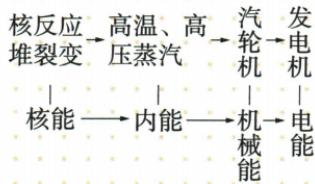

## 讲解

### 是什么

能源是能提供可利用能量的物质或自然过程，例如燃料、水流、风和太阳辐射。能量描述物体或系统的做功等能力，不能把“能源用掉”理解为能量消失。

### 怎么来的

燃料的化学能经过燃烧、做功等转移到其他物体，常有很大一部分散入周围成为不便集中使用的内能。总量守恒与可供人利用的来源减少可以同时成立；守恒没有保证散失的能量都能按原方式收集回来。

### 什么时候能用

分析能源短缺应看储量、补充速度、取得和使用条件。可用程度与总能量不是同一指标；节能减少取得能源、转换损失和环境负担，不违背守恒。

## 例题

### 原核电站流程示例

> 来源ID Q22-05；第二十二章能源与可持续发展；201-233/full.md 第1909–1917行。原答案与解析定位：201-233/full.md 第1921–1925行。

核电站的能量转化过程（原流程图）

**原资料答案与解析：**

原流程：核反应堆→高温高压蒸汽→汽轮机→发电机。能量：核能→内能→机械能→电能。

**展开解析（依据原详解补足理由与步骤）：**

沿原流程图逐设备追踪：核反应堆发生受控裂变，释放的核能用于提高工质内能；高温高压蒸汽推动汽轮机，部分内能转成转动的机械能；汽轮机带动发电机，通过电磁感应将机械能转为电能。总体主要链是核能→内能→机械能→电能。每一箭头表示能量形式改变，不表示能量凭空生成；冷却、摩擦等支路使电能不是全部核能。

## 易错

把总能量守恒当成煤石油永远用不完；把发电机说成创造能量。
