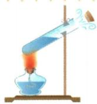
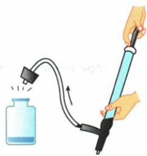

## 讲解

### 判据

遇到燃烧、加热、气体推动、电动机等连续动作，按每个阶段识别输入和输出，不跳成一句“能量消失”。

### 流程

1. 定对象和阶段。2. 写输入能量形式。3. 按可见变化写目标输出形式，同时保留内能等其他去向。4. 同形式跨对象叫转移，形式改变叫转化，两者可共存。5. 判断守恒时把全部相关能量或跨系统输入输出计入。

## 例题

### 火箭燃料的两级能量转化

> 来源ID Q14-01；第十四章内能的利用；151-200/full.md 第375–375行。原答案与解析定位：151-200/full.md 第377–377行。

2024 年 9 月 19 日,我国在西昌卫星发射中心用长征三号乙运载火箭与远征一号上面级,成功发射第 59、60 颗北斗导航卫星。在卫星发射过程的点火加速上升阶段,燃料的\_\_\_\_能转化为内能,然后再转化为卫星的\_\_\_\_能。

**原资料答案与解析：**

答案 化学 机械

**展开解析（依据原详解补足理由与步骤）：**

燃料燃烧把化学能转为高温燃气的内能，燃气做功又把部分内能转成卫星的机械能，答案化学、机械。加速与升高分别对应动能和重力势能增长；不能把每一份燃料能量都说成全部转给卫星，燃气排出、散热等也带走能量。

### 喷泉电动机能量来源与总量

> 来源ID Q14-02；第十四章内能的利用；151-200/full.md 第413–413行。原答案与解析定位：151-200/full.md 第407–409行。

例（2024 山东济南中考）自然界中,能量不但可以从一个物体转移到其他物体,而且可以从一种形式转化为其他形式。例如泉城广场荷花音乐喷泉利用电动机把水喷向空中时,电动机将\_\_\_\_转化为机械能和内能,此过程中能的总量\_\_\_\_(选填“逐渐增大”“保持不变”或“逐渐减小”)。

**原资料答案与解析：**

例 解析 电动机工作时消耗电能, 将电能转化为机械能和内能, 此过程中能的总量保持不变。

答案 电能 保持不变

**展开解析（依据原详解补足理由与步骤）：**

输入是电能，电动机把它转为水和设备的机械能，同时有内能增加。把输入及各去向一起计，能量总量保持不变，两个空“电能、保持不变”。只看水获得的机械能不等于全部输入；电动机也不是以内能为直接动力的热机。

### 水蒸气顶塞的能量变化

> 来源ID Q14-03；第十四章内能的利用；151-200/full.md 第479–486行。原答案与解析定位：151-200/full.md 第488–490行。

如图所示,用酒精灯对试管加热,等水沸腾后,可以观察到水蒸气把软木塞顶出去。下列说法正确的是()

A.用酒精灯加热试管，水内能的增加是通过做功的方式实现的  
B. 水蒸气把软木塞顶出去的过程，实现了内能向机械能的转化  
C. 水蒸气把软木塞顶出去的过程，相当于汽油机的排气冲程  
D.试管口出现的白雾是水汽化后形成的水蒸气

**原资料答案与解析：**

解析 用酒精灯加热试管,水吸收热量,水的内能增加,是通过热传递的方式实现的,A 错误;水蒸气把软木塞顶出去,水蒸气的部分内能转化为软木塞的机械能,这一过程相当于汽油机的做功冲程,B 正确,C 错误;试管口出现的白雾,是水蒸气液化形成的小水滴,D 错误。

答案 B

**展开解析（依据原详解补足理由与步骤）：**

A错：火焰加热使水吸热增内能，是热传递。B对：水蒸气推动塞子，把部分内能转为塞子机械能。C错：与发动机做功冲程对应，排气冲程主要排出废气。D错：白雾是蒸汽遇冷液化的小液滴，可见白雾不是无色透明水蒸气。

### 打气后瓶塞跳起与白雾

> 来源ID Q14-06；第十四章内能的利用；151-200/full.md 第588–602行。原答案与解析定位：151-200/full.md 第584–584行；151-200/full.md 第607–609行。

例1（2024山东淄博中考）如图，玻璃瓶内有少量水，用橡胶塞塞住瓶口，向瓶内打气，瓶塞跳起。下列说法正确的是 （）

A. 向瓶内打气, 通过热传递的方式改变瓶内空气的内能  
B.瓶塞跳起时,瓶内空气温度降低,内能减少   
C.瓶塞跳起时,瓶内出现“白雾”是汽化现象  
D.瓶塞跳起过程与热机压缩冲程的能量转化相同

**原资料答案与解析：**

例1 解析 向瓶内打气, 是通过做功的方式改变瓶内空气的内

能,A 错误;瓶塞跳起时,瓶内气体对瓶塞做功,使气体自身的内能减少,温度降低,与热机做功冲程的能量转化相同,B 正确,D 错误;瓶塞跳起时,瓶内出现“白雾”是液化现象,C 错误。

答案B

**展开解析（依据原详解补足理由与步骤）：**

A错：打气压缩空气主要通过做功增加内能，不是温差传递。B对：快速喷出膨胀并推塞，气体对外做功、内能减少、温度下降。C错：降温使瓶内水蒸气液化成雾，而非汽化成可见水蒸气。D错：内能转机械能对应做功冲程，压缩是机械转内能。原解析被跨栏分开，已接回。

## 易错

压缩与推塞能量方向相反；白雾属于液化，与所问机械能输出分开。
