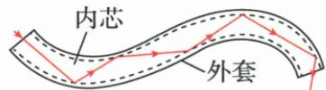

## 讲解

### 是什么

光纤把光信号沿透明导光纤维传送；原资料用光在内壁多次反射的入门图说明路径。

### 怎么来的

发送端将信息转换成光的变化，经光纤传到另一端，接收端再转成电信号处理。纤维中传的是光，电子电路通常在端点完成信号转换。

读原光路图时，先沿箭头找光的前进方向，再看光在边界处怎样改变方向。边界把满足导光条件的光限制在纤维内部，使光能够沿纤维到达远端；它不是铜导线中电荷定向移动的示意。信号的光强等变化可以承载信息，光纤并不直接把空气振动从一端送到另一端。

### 什么时候能用

在适合光纤和入射条件下才能有效导光；光纤需良好连接和合适弯曲，不是任意光任意角度都无损传。它对电磁干扰不敏感，但系统端点及其他部件不因此绝对防雷或不可窃听。

## 例题

本章没有与本条匹配的独立例题；以下内容依据原资料讲解，配套例题缺口已登记。

## 易错

没有独立光纤例题，原光路讲解图保留作必要示意，未自编计算。
