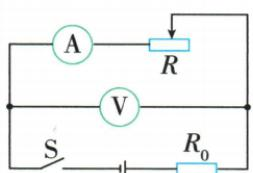
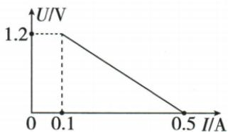

## 错法

见U-I直线用任一坐标$\frac{U}{I}$算R0，没认出表跨变阻器。

## 正解

纵轴是变阻压，源压等于定阻$I R_0$加该压。用恒定源压把两点列为$0.1R_0+1.2=0.5R_0$，差式才求R0。

## 例题

### 变阻器电压电流直线求源压

> 来源ID Q17-12；第十七章欧姆定律；151-200/full.md 第3592–3619行。原答案与解析定位：151-200/full.md 第3627–3629行。

例2 (2024 山东临沂中考)闭合如图甲所示电路的开关,将滑动变阻器的滑片由最右端移到最左端的过程中,电压表与电流表的示数变化的图像如图乙所示。则定值电阻的阻值 $R_{0}=$ \_\_\_\_ Ω,电源电压为 \_\_\_\_ V。

甲

乙

**原资料答案与解析：**

例2 解析 滑动变阻器的滑片由最右端移到最左端的过程中,滑动变阻器连入电路的阻值变小,两端的电压变小,直到为0。由图像可知,当电路中的电流为0.1 A时,电压表的示数为1.2 V,电源电压 $U=U_{0}+U_{\text{滑}}=0.1\ \mathrm{A}\times R_{0}+1.2\ \mathrm{V}$ ①,当电路中的电流为0.5 A时,电压表的示数为0,电源电压 $U=0.5\ \mathrm{A}\times R_{0}$ ②,由①②解得 $R_{0}=3\ \Omega,U=1.5\ V$ 。

答案3 1.5

**展开解析（依据原详解补足理由与步骤）：**

V跨变阻器，A读共同电流。最左接入R为0时，图给$I=0.5\,\mathrm A$且$U_\text{滑}=0$，源压$U=0.5R_0$。另一端$I=0.1\,\mathrm A$、变阻压1.2 V，总压$U=0.1R_0+1.2$。同一源压相等，$0.5R_0-0.1R_0=1.2$，$0.4R_0=1.2$，$R_0=3\,\Omega$，再代$U=0.5\times3=1.5\,\mathrm V$。纵轴不是R0两端压，不能直接用1.2/0.1求R0。
