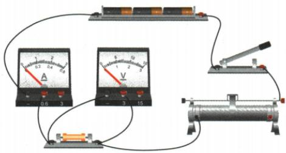
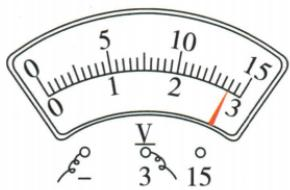
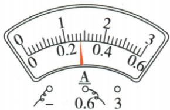
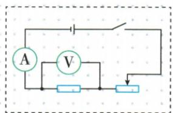
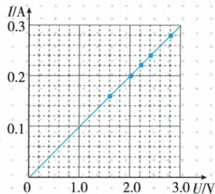

## 错法

以为电源没变电压表就没变，换大电阻后直接记录电流。

## 正解

串联分压比例已变，定阻压变大。要增加有效串联变阻使定阻压回目标；先算所需阻值是否超过范围，超过时不可能靠继续移动完成。

## 例题

### 电流关系实验及变阻器范围不足

> 来源ID Q17-01；第十七章欧姆定律；151-200/full.md 第2636–2650；2658–2704；2760–2766行。原答案与解析定位：151-200/full.md 第2722–2758行。

例（2024 河南中考）小华用图甲所示的电路探究电流与电压、电阻的关系。电源电压恒为 4.5 V，滑动变阻器最大阻值为 20 Ω。

(1) 她先用阻值为 $10 \Omega$ 的定值电阻探究电流与电压的关系。

甲

①如图甲是根据设计的电路图连接的实物电路,请在虚线框中画出该电路图。  
②闭合开关前,应将滑动变阻器的滑片移到最右端,否则,闭合开关时\_\_\_\_(填“电流表”或“电压表”)指针的偏转可能超出所用测量范围。  
③闭合开关,移动滑片,记录了如下数据。第5次的电压表和电流表的示数如图乙、丙所示,请将示数填入表中。

| 实验次数 | 1 | 2 | 3 | 4 | 5 |
| --- | --- | --- | --- | --- | --- |
| 电压$\frac{U}{V}$ | 1.6 | 2.0 | 2.2 | 2.4 | a._ |
| 电流$\frac{I}{A}$ | 0.16 | 0.20 | 0.22 | 0.24 | b._ |

乙

丙

④请在图丁中描出表中各组数据对应的点,并根据描出的点画出 I-U 图像。  
⑤分析表中数据或图像的特点,可得出:电阻一定时,电流与电压成正比。得出此结论的理由是\_\_\_\_。  
(2)接下来,她用原电路探究电压一定时,电流与电阻的关系。先调节滑片,使电压表示数为2 V,记录电流表示数;然后断开开关,将阻值为10 Ω的定值电阻依次换成阻值为5 Ω、15 Ω的定值电阻,闭合开关,移动滑片,使电压表示数仍为2 V,记录电流表示数。当换成阻值为20 Ω的定值电阻后,发现电压表示数始终不能为2 V,为了完成实验,下列方案可行的是\_\_\_\_(填字母代号)。

A. 换用电压为 $6 \, V$ 的电源  
B. 把电压表改接为 0\~15 V 的测量范围  
C. 在开关与滑动变阻器之间串联一个阻值为 $10 \Omega$ 的定值电阻

**原资料答案与解析：**

例 解析（1）②滑动变阻器连入电路的阻值为零时，电源电压 $U = 4.5\mathrm{V}$ ，定值电阻的阻值 $R = 10\Omega$ 则电流表的最大示数 $I = \frac{U}{R} = \frac{4.5\mathrm{V}}{10\Omega} = 0.45\mathrm{A} < 0.6\mathrm{A}$ ，电流表示数不会超出所用测量范围，电压表示数会超出所用测量范围。③a.电压表的测量范围是 $0\sim 3\mathrm{V}$ ，分度值是 $0.1\mathrm{V}$ ，则示数为 $2.8\mathrm{V}$ ；b.电流表的测量范围是 $0\sim 0.6\mathrm{A}$ ，分度值是 $0.02\mathrm{A}$ ，则示数为 $0.28\mathrm{A}$ 。⑤ $I - U$ 图像是一条经过坐标原点的倾斜直线，是正比例函数图像。

(2)换成阻值为 $20\Omega$ 的定值电阻后，移动滑片，滑动变阻器连入电路的最大阻值为 $20\Omega$ ，电压表示数大于 $2\mathrm{V}$ 。若想通过改变电源电压完成实验，由串联分压原理 $\frac{U_R}{R} = \frac{U_\text{滑}}{R_\text{滑}}$ 即 $\frac{2\mathrm{V}}{20\Omega} = \frac{U' - 2\mathrm{V}}{20\Omega}$ 解得电源电压 $U^{\prime} = 4\mathrm{V}$ ，即应换用电压为 $4\mathrm{V}$ 的电源，A错误；换电压表的测量范围只能改变电压表指针偏转角度，不能改变电压大小，B错误；若想通过改变电路中电阻完成实验，由串联分压原理得 $\frac{2\mathrm{V}}{20\Omega} = \frac{4.5\mathrm{V} - 2\mathrm{V}}{R_{\text{滑}}'}$ 解得需要滑动变阻器的最小阻值 $R_{\text{滑}}^{\prime} = 25\Omega$ 所以串联一个阻值为 $10\Omega$ 的定值电阻，再调节滑动变阻器，使其接入电路的阻值为 $15\Omega$ ，能使电压表示数为 $2\mathrm{V},\mathrm{C}$ 正确。

答案 (1)①如图 1 所示

图1

②电压表 ③a.2.8 b.0.28  
④如图2所示

图 2

⑤每次电压与电流的比值相等（或 I-U 图像是过坐标原点的一条倾斜直线）

(2) C

**展开解析（依据原详解补足理由与步骤）：**

(1)①图按原连线转成电源、开关、电流表、10 Ω电阻、变阻器串联，电压表并在10 Ω上，原答案图保留。②变阻器为零时$I=4.5/10=0.45\,\mathrm A$，未超过0.6 A；定阻两端达4.5 V超过3 V，故可能超量程的是电压表。③按接线分别读3 V和0.6 A范围，得2.8 V、0.28 A。④描点(1.6,0.16)、(2.0,0.20)、(2.2,0.22)、(2.4,0.24)、(2.8,0.28)，原连线图见下。⑤每组$U/I=10\,\Omega$且线过原点，说明固定R时I与U成正比。(2)换20 Ω，需保持2 V，则$I=2/20=0.1\,\mathrm A$；变阻器需分担$4.5-2=2.5\,\mathrm V$，需$R_\text{滑}=2.5/0.1=25\,\Omega$，超过20 Ω。A换6 V需分担4 V，需40 Ω，更不行；B换量程只换可测范围，不改变实际电压，不行；C串10 Ω后变阻器只需$25-10=15\,\Omega$，在范围内，可行。
