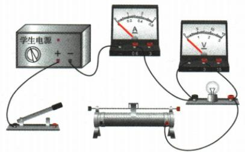
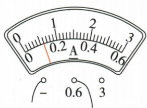
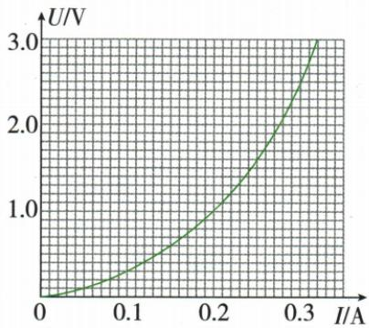
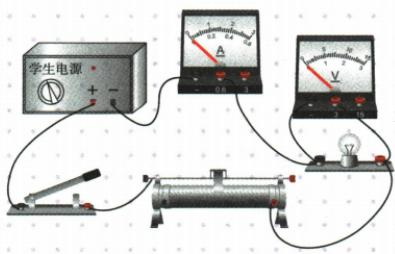

## 讲解

### 是什么

横轴U纵轴I的定阻图为过原点直线，点的$U/I$相同；灯丝曲线各点比值可不同，表示温度等状态改变。

### 怎么来的

定值关系$I=U/R$使斜率$I/U=1/R$，越陡电阻越小。灯发热时丝温升阻增，I仍可随U增大但增幅不同，不能把“电流增”推成“电阻减”。

### 什么时候能用

先核对轴，有的灯图横轴I纵轴U，斜率含义倒过来。曲线电阻取同点$\frac{U}{I}$，不能用两个点的差商当该点电阻；差商公式适用稳定定值直线。

## 例题

### 灯与定阻图像逐项判断

> 来源ID Q17-02；第十七章欧姆定律；151-200/full.md 第2858–2880行。原答案与解析定位：151-200/full.md 第2882–2884行。

例 如图所示,是小灯泡和定值电阻的 I-U 图像,下列说法正确的是 ( )

A.定值电阻的电阻是 $10\Omega$

B. 小灯泡的电阻随着电压的增大而减小

C. 仅把小灯泡和定值电阻并联在电压是 $2 \mathrm{~V}$ 的电路中, 干路中的电流是 $0.4 \mathrm{~A}$

D.仅把小灯泡和定值电阻串联在电路中,当电路中的电流是0.2 A时,它们两端的总电压是4 V

**原资料答案与解析：**

解析 图线 b 是过原点的一条倾斜直线, 所以其为定值电阻的 I-U 图像, 则定值电阻的电阻 $R=\frac{U}{I}=\frac{4\ V}{0.2\ A}=20\ \Omega$ , A 错误; 由灯泡的 I-U 图像可知, 随着电压的增大, U 与 I 的比值变大, 即电阻变大, B 错误; 小灯泡和定值电阻并联在电压是 2 V 的电路中, 两端电压均为 2 V, 小灯泡和定值电阻中的电流分别是 0.3 A 和 0.1 A, 并联电路干路中的电流等于各支路中的电流之和, 则干路中的电流为 0.4 A, C 正确; 串联电路中的电流处处相等, 当电流 $I=0.2$ A 时, 小灯泡和定值电阻两端的电压分别是 1 V 和 4 V, 串联电路中总电压等于各部分电路两端电压之和, 则总电压等于 5 V, D 错误。

答案 C

**展开解析（依据原详解补足理由与步骤）：**

b直线在4 V时0.2 A，所以$R_b=4/0.2=20\,\Omega$，A的10 Ω错。a曲线在1 V时0.2 A、2 V时0.3 A，$R=U/I$由5 Ω增加到约6.67 Ω，B减阻错。并联2 V时，两支流分别0.3 A和0.1 A，$I=0.3+0.1=0.4\,\mathrm A$，C对。串联0.2 A时，两电压1 V和4 V，$U=1+4=5\,\mathrm V$，D的4 V错。

### 灯定阻图像并联再串联

> 来源ID Q17-04；第十七章欧姆定律；151-200/full.md 第2915–2931；2935–2935行。原答案与解析定位：151-200/full.md 第2894–2896行。

第2题图

例2 (2024 黑龙江鸡西中考) 如图为灯泡 L 和阻值为 R 的定值电阻的 I-U 图像, 若将灯泡和定值电阻并联在电源电压为 3 V 的电路中, 干路电流为 \_\_\_\_ A; 若将其串联在电源电压为 4 V 的电路中, 灯泡和定值电阻的阻值之比为 \_\_\_\_ 。

**原资料答案与解析：**

例2 解析 由图像可知,灯泡和定值电阻并联在电源电压为3 V的电路中时,干路电流 $I=0.4\ A+0.2\ A=0.6\ A$ ,它们串联在电源电压为4 V的电路中时,阻值之比为 $R_{L}:R=U_{L}:U_{R}=1:3$ 。

答案 0.6 1:3

**展开解析（依据原详解补足理由与步骤）：**

并联3 V时竖线读灯0.4 A、定阻0.2 A，干流0.6 A。串联总4 V要找共同电流下两横坐标之和为4，图中0.2 A对应灯1 V、定阻3 V；同流使$R_L:R=U_L:U_R=1:3$。这时灯电阻与并联3 V状态不同，不能用前一状态比值。

### 灯丝未亮阻值与整体动态

> 来源ID Q17-08；第十七章欧姆定律；151-200/full.md 第3237–3355行。原答案与解析定位：151-200/full.md 第3088–3094行；151-200/full.md 第3205–3209行。

例2（2024 湖北中考）某小组想测量标有“2.5 V 0.3 A”的小灯泡在不同工作状态下的电阻,设计了如图甲所示实验电路,电源电压不变。

甲

乙

丙

(1)请用笔画线表示导线将图甲中实物电路连接完整。
(2)移动滑动变阻器的滑片至最\_\_\_\_端后闭合开关,使电路中的电流在开始测量时最小。向另一端移动滑片,观察到小灯泡在电压达到0.42 V时开始发光,此时电流表示数如图乙,读数为\_\_\_\_A。

(3)根据实验数据绘制 U-I 图像如图丙,小灯泡未发光时电阻可能为 \_\_\_\_。

A.0 $\Omega$

B.3.1 $\Omega$

C.3.5 $\Omega$

D.8.3 $\Omega$

(4)随着电流增大,滑动变阻器两端的电压\_\_\_\_,小灯泡的电阻\_\_\_\_,整个电路中的电阻\_\_\_\_。(填“增大”“减小”或“不变”)

**原资料答案与解析：**

例2 解析（3）由题意可知，当小灯泡两端的电压为0.42 V时，通过小灯泡的电流为0.12 A，由 $I=\frac{U}{R}$ 可得，开始发光时小灯泡的电阻 $R=\frac{U}{I}=\frac{0.42\ V}{0.12\ A}=3.5\ \Omega$ ；由图丙可知，小灯泡电阻随电压增大而增大，小灯泡未发光时的电阻要比3.5 Ω小，故B符合题意。

(4)由欧姆定律可知,电源电压不变,电路中的电流增大,是因为电路中的总电阻减小;随着小灯泡两端的电压增大,小灯泡的电阻增大,根据串联电路的分压原理可知,滑动变阻器两端的电压减小。

答案 (1) 如图所示

(2) 左 0.12

(3)B

(4) 减小 增大 减小

**展开解析（依据原详解补足理由与步骤）：**

(1)按原连线答案接电压表跨灯，电流表及变阻器串联。(2)原图接右下丝端，最左端为有效全长，起始电流最小；乙0.6 A档读0.12 A。(3)刚开始亮时$R=0.42/0.12=3.5\,\Omega$，未亮时图示温度较低且阻值更小；B 3.1 Ω可能，A的0 Ω不符合灯丝有限电阻，C 3.5 Ω对应开始亮，D 8.3 Ω为更高温工作状态不符。(4)恒压下I增大意味着$R_\text{总}=U/I$减小；灯丝温度升，R灯增大且灯两端电压升，剩余变阻器压$U_\text{滑}=U-U_L$减小。按问空顺序为减小、增大、减小。

## 易错

原“非定值一般过原点曲线”不能推广所有电子器件；本条围绕给定灯丝图。
