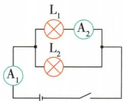
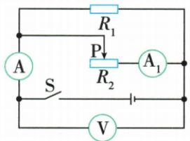

## 讲解

### 是什么

并联同压，各支流相加；$1/R=1/R_1+1/R_2$，两支路时$R=R_1R_2/(R_1+R_2)$；$I_1/I_2=R_2/R_1$。

### 怎么来的

代支流$I_1=U/R_1$、$I_2=U/R_2$到$I=I_1+I_2$，得到$U/R=U/R_1+U/R_2$；U非零时各项除U得倒数和。通分得$1/R=(R_1+R_2)/(R_1R_2)$再取倒数。支流式相除约掉共同U得反比。

### 什么时候能用

正阻并联总阻小于任一支阻，增加导电支路会减小总阻。支路互不影响须电源保持恒压和其他接线条件不变，原文不能脱离此条件使用。

## 例题

### 并联总表与支表求灯电阻

> 来源ID Q17-03；第十七章欧姆定律；151-200/full.md 第2900–2913行。原答案与解析定位：151-200/full.md 第2890–2892行。

例1 (2024 山东滨州中考)如图所示,电源电压为 3 V,闭合开关后,电流表 A $_{1}$ 的示数为 0.6 A,电流表 A $_{2}$ 的示数为 0.2 A,则通过灯泡 L $_{2}$ 的电流为 \_\_\_\_ A,灯泡 L $_{1}$ 的阻值为 \_\_\_\_ Ω。

第1题图

**原资料答案与解析：**

例1 解析 该电路为并联电路， $\mathrm{A}_{1}$ 测干路电流， $\mathrm{A}_{2}$ 测通过 $\mathrm{L}_{1}$ 的电流，则通过 $\mathrm{L}_{2}$ 的电流 $I = I_{1} - I_{2} = 0.6 \mathrm{~A} - 0.2 \mathrm{~A} = 0.4 \mathrm{~A}, \mathrm{L}_{1}$ 的阻值 $R_{1} = \frac{U}{I_{2}} = \frac{3 \mathrm{~V}}{0.2 \mathrm{~A}} = 15 \Omega$ 。

答案0.4 15

**展开解析（依据原详解补足理由与步骤）：**

A1在干路读0.6 A，A2在L1支路读0.2 A；通过L2为$I_{L2}=0.6-0.2=0.4\,\mathrm A$。并联使L1两端为3 V，$R_{L1}=3/0.2=15\,\Omega$。不能把A1总流直接代L1电阻，也不要把两表名称下标当灯的下标。

### 灯定阻图像并联再串联

> 来源ID Q17-04；第十七章欧姆定律；151-200/full.md 第2915–2931；2935–2935行。原答案与解析定位：151-200/full.md 第2894–2896行。

第2题图

例2 (2024 黑龙江鸡西中考) 如图为灯泡 L 和阻值为 R 的定值电阻的 I-U 图像, 若将灯泡和定值电阻并联在电源电压为 3 V 的电路中, 干路电流为 \_\_\_\_ A; 若将其串联在电源电压为 4 V 的电路中, 灯泡和定值电阻的阻值之比为 \_\_\_\_ 。

**原资料答案与解析：**

例2 解析 由图像可知,灯泡和定值电阻并联在电源电压为3 V的电路中时,干路电流 $I=0.4\ A+0.2\ A=0.6\ A$ ,它们串联在电源电压为4 V的电路中时,阻值之比为 $R_{L}:R=U_{L}:U_{R}=1:3$ 。

答案 0.6 1:3

**展开解析（依据原详解补足理由与步骤）：**

并联3 V时竖线读灯0.4 A、定阻0.2 A，干流0.6 A。串联总4 V要找共同电流下两横坐标之和为4，图中0.2 A对应灯1 V、定阻3 V；同流使$R_L:R=U_L:U_R=1:3$。这时灯电阻与并联3 V状态不同，不能用前一状态比值。

### 并联变阻支路与表示数比

> 来源ID Q17-09；第十七章欧姆定律；151-200/full.md 第3517–3535行。原答案与解析定位：151-200/full.md 第3537–3539行。

例1 如图所示,电源电压保持不变,闭合开关 S,当滑动变阻器的滑片 P 向右滑动过程中,下列说法正确的是 ( )

A.电流表 A 的示数不变  
B.电流表 $\mathrm{A}_{1}$ 的示数变小  
C. 电压表 V 的示数变大  
D. 电压表 V 的示数与电流表 A 的示数的比值变小

**原资料答案与解析：**

解析 由电路图可知,滑动变阻器与定值电阻并联,电压表 V 测电源电压,电流表 A $_{1}$ 测通过滑动变阻器的电流,电流表 A 测干路电流。由于电源电压不变,所以滑片 P 向右滑动时电压表 V 的示数不变,C 错误;当滑动变阻器的滑片 P 向右滑动过程中,滑动变阻器接入电路的阻值变小,电源电压不变,由 $I=\frac{U}{R}$ 知通过滑动变阻器的电流变大,电流表 A $_{1}$ 的示数变大,B 错误;由于并联电路各个支路互不影响,所以通过定值电阻的电流不变,根据并联电路干路电流等于各支路电流之和可知,干路电流变大,所以电流表 A 的示数变大,A 错误;由于电压表 V 的示数不变,电流表 A 的示数变大,所以电压表 V 的示数与电流表 A 的示数的比值变小,D 正确。

答案 D

**展开解析（依据原详解补足理由与步骤）：**

接右丝端，滑片右移减阻，A1测该支流增大；定阻支流在恒压下不变，干路A增大。V跨恒压电源，保持不变。A“总流不变”错；B“支流变小”错；C“电压变大”错；D$U/I_\text{总}$为整个并联电路等效阻值，因U不变总流增大而减小，对。

## 易错

总流不能代任意一个支阻求阻值；恒压时一支阻改变只直接改变该支流。
