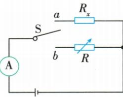

## 讲解

### 是什么

用已知可读电阻箱替代未知电阻，保持同电源和其余电路条件，使相同位置电流相同，则电阻箱读值等于未知阻值。

### 怎么来的

同一电源下$I=U/(R_\text{其余}+R)$，两状态U和I相同，所以两总阻相同；其余串联部分又相同，扣去后两被替代阻相同。不是只看亮度“差不多”就等阻。

### 什么时候能用

原图开关在a、b选一条支路，不能两条同时接入后还用同电流法。定值对象温度稳定，电阻箱读数按倍率。

## 例题

### 等效替代法原电路与操作示例

> 来源ID Q17-19；第十七章欧姆定律；151-200/full.md 第3006–3006行。原答案与解析定位：151-200/full.md 第3006–3006行。

原资料方法示例：等效替代法

原操作：将S拨至a,读出电流表示数 $I_x$ ,将S拨至b,调节电阻箱,使电流表的示数仍为 $I_x$ ,读出电阻箱示数R

**原资料答案与解析：**

原表表达式： $R_x = R$

**展开解析（依据原详解补足理由与步骤）：**

拨a时Rx支路；拨b时电阻箱支路。恒定电源及其余串联部分相同，调箱使电流相同；由$U=I(R_\text{固定}+R)$可知两次总阻相同，去除共同固定阻得到$R_x=R$。等效替代要求电源及其余电路条件保持，表仅用于比较无需另测压。

## 易错

原资料仅给方法图及完整步骤，没有另附数值题；这里保留原方法示例而未造数字。
