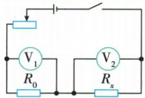

## 讲解

### 判据

已知R0与未知Rx串联，两表分别测各段。

### 流程

1. 确认两阻确实串联且两表跨各自元件。2. 由已知段求共同流$I=U_1/R_0$。3. 未知阻用$R_x=U_2/I=U_2R_0/U_1$。4. 若一表测总压，先减去已知段压才求未知压。

## 例题

### 伏伏法原电路与操作示例

> 来源ID Q17-13；第十七章欧姆定律；151-200/full.md 第3006–3006行。原答案与解析定位：151-200/full.md 第3006–3006行。

原资料方法示例：伏伏法

原操作：闭合开关后,由电压表 $V_1$ 、 $V_2$ 测出电阻器两端的电压分别为 $U_1$ 、 $U_2$

**原资料答案与解析：**

原表表达式： $R_x = \frac{U_2}{U_1} R_0$ ( $R_0$ 已知)

**展开解析（依据原详解补足理由与步骤）：**

R0与Rx串联，同流$I=U_1/R_0=U_2/R_x$，将右侧等式两边乘Rx，再除U1，得$R_x=U_2R_0/U_1$。U1必须是R0电压，U2是Rx电压。

## 易错

不要把两表编号当固定公式；原方法示例没有额外数字题。
