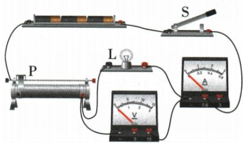
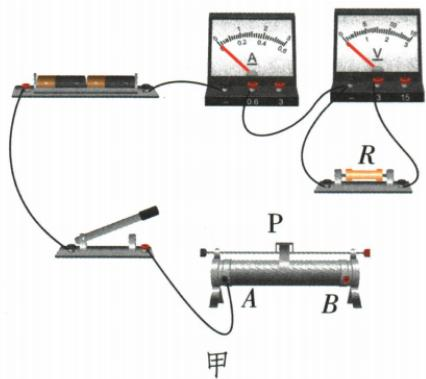
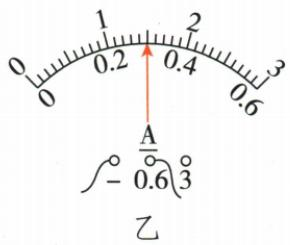
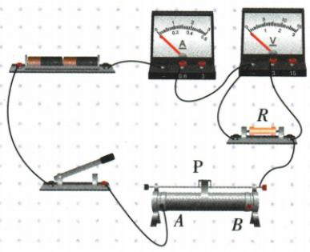

## 讲解

### 判据

问实物补线、起始滑片、灯不亮、定阻或灯阻计算。

### 流程

1. 明确表A串、表V跨待测物，变阻器串且一上一下。2. 沿接入丝端确定最远位置为最大，开关断开接线。3. 读量程分度值后取同状态U、I。4. 两灯灭且无流看断路，表非零检查跨对象是否断；有小流可先在允许范围调小变阻。5. 计算阻值并按对象决定平均或逐状态保留。

## 例题

### 灯不亮但有小电流的下一步

> 来源ID Q17-05；第十七章欧姆定律；151-200/full.md 第2980–2980；2987–2998行。原答案与解析定位：151-200/full.md 第3000–3002行。

例1 在如图所示的伏安法测电阻实验中，闭合开关S，小明发现电流表有示数，但示数较小，小灯泡不亮。接下来应进行的操作是（ ）

A.更换一个同样规格的小灯泡
B.更换电压表所使用的测量范围
C.检查电路中是否存在断路故障
D.减小变阻器接入电路的阻值

**原资料答案与解析：**

解析 闭合开关后,电流表有示数,说明电路是通路,小灯泡没坏,也不是断路,可能是电路中电阻太大,电流太小,小灯泡两端电压太小,所以灯泡不亮,下一步操作是移动滑动变阻器的滑片,减小变阻器接入电路的阻值,使电路中的电流变大,小灯泡两端电压变大,看小灯泡能否发光。

答案 D

**展开解析（依据原详解补足理由与步骤）：**

在原图正常接线及单一操作调整情境中，有小电流说明未整体断路，初始最大变阻器可能使灯电压及电流过小。D适当减小变阻器，看灯是否正常发光，正确。A没证据证明灯丝断了且同规格替换不改善分压；B仅改表范围，不改变灯电压；C与已有小电流不符合完整断路假设。不能推广成一切有小电流都无任何故障，也应保持额定范围。

### 伏安法定值电阻接线与误差

> 来源ID Q17-07；第十七章欧姆定律；151-200/full.md 第3062–3072；3211–3233行。原答案与解析定位：151-200/full.md 第3076–3086行。

例1 (2024 山西中考)实验室里有一个标识不清的定值电阻,小亮设计实验进行测量(电源为两节干电池)。

(1)根据公式\_\_\_\_可知,通过对电流和电压的测量来间接测出导体

的电阻。请用笔画线代替导线将图甲的电路连接完整(导线不得交叉)。

(2) 连接电路时, 开关应\_\_\_\_, 滑动变阻器的滑片 P 应放在\_\_\_\_ (选填“A”或“B”) 端。闭合开关, 电压表示数接近电源电压, 电流表无示数。经检查电流表及各接线处均完好, 则电路的故障可能是\_\_\_\_。

(3) 排除故障后闭合开关, 移动滑片使电压表示数为 2.4 V, 电流表示数如图乙所示为 \_\_\_\_ A, 则电阻为 \_\_\_\_ Ω。小亮把该数据作为本实验的最终结果, 请你做出评价或建议: \_\_\_\_。

**原资料答案与解析：**

例1 解析（2）为了保护电路，连接电路时，开关应处于断开状态；闭合开关前，滑动变阻器的滑片应处于接入电路的最大阻值处，由图甲可知，滑片应放在 B 端；闭合开关，电流表无示数，说明电路可能断路，电压表示数接近电源电压，说明与电压表并联的定值电阻断路。

答案（1） $R = \frac{U}{I}$ 如图所示(2)断开 $B$ 定值电阻断路(3)0.3 8 应该多次测量求平均值减小误差

原页核对：OCR把第(3)问相邻的“0.3”和“8”粘连成“0.38”。151-200分段PDF实际第42页（印刷第176页）的答案分别为0.3 A和8 Ω，图乙指针也位于0.6 A量程的中间。本条按原页恢复分隔；原OCR提取记录保留。

**展开解析（依据原详解补足理由与步骤）：**

(1)依据$R=U/I$，电流表串联、表V跨R、变阻器一上一下串联，原连线答案保留。(2)接线断开；原图接左下A，滑片在B端有效丝段最长。电流零、表V接近源压且表A和接线完好，定位R断路。(3)图乙接0.6 A档，每小格0.02 A，指针位于量程中间，读数为0.30 A。由同一状态的电压2.4 V与电流0.30 A，$R=U/I=2.4/0.30\,\Omega=8\,\Omega$，与原页答案一致。单组易受读数等误差影响，定值电阻温度稳定时多组各算阻值再平均，作为更可靠估计。

### 灯丝未亮阻值与整体动态

> 来源ID Q17-08；第十七章欧姆定律；151-200/full.md 第3237–3355行。原答案与解析定位：151-200/full.md 第3088–3094行；151-200/full.md 第3205–3209行。

例2（2024 湖北中考）某小组想测量标有“2.5 V 0.3 A”的小灯泡在不同工作状态下的电阻,设计了如图甲所示实验电路,电源电压不变。

甲

乙

丙

(1)请用笔画线表示导线将图甲中实物电路连接完整。
(2)移动滑动变阻器的滑片至最\_\_\_\_端后闭合开关,使电路中的电流在开始测量时最小。向另一端移动滑片,观察到小灯泡在电压达到0.42 V时开始发光,此时电流表示数如图乙,读数为\_\_\_\_A。

(3)根据实验数据绘制 U-I 图像如图丙,小灯泡未发光时电阻可能为 \_\_\_\_。

A.0 $\Omega$

B.3.1 $\Omega$

C.3.5 $\Omega$

D.8.3 $\Omega$

(4)随着电流增大,滑动变阻器两端的电压\_\_\_\_,小灯泡的电阻\_\_\_\_,整个电路中的电阻\_\_\_\_。(填“增大”“减小”或“不变”)

**原资料答案与解析：**

例2 解析（3）由题意可知，当小灯泡两端的电压为0.42 V时，通过小灯泡的电流为0.12 A，由 $I=\frac{U}{R}$ 可得，开始发光时小灯泡的电阻 $R=\frac{U}{I}=\frac{0.42\ V}{0.12\ A}=3.5\ \Omega$ ；由图丙可知，小灯泡电阻随电压增大而增大，小灯泡未发光时的电阻要比3.5 Ω小，故B符合题意。

(4)由欧姆定律可知,电源电压不变,电路中的电流增大,是因为电路中的总电阻减小;随着小灯泡两端的电压增大,小灯泡的电阻增大,根据串联电路的分压原理可知,滑动变阻器两端的电压减小。

答案 (1) 如图所示

(2) 左 0.12

(3)B

(4) 减小 增大 减小

**展开解析（依据原详解补足理由与步骤）：**

(1)按原连线答案接电压表跨灯，电流表及变阻器串联。(2)原图接右下丝端，最左端为有效全长，起始电流最小；乙0.6 A档读0.12 A。(3)刚开始亮时$R=0.42/0.12=3.5\,\Omega$，未亮时图示温度较低且阻值更小；B 3.1 Ω可能，A的0 Ω不符合灯丝有限电阻，C 3.5 Ω对应开始亮，D 8.3 Ω为更高温工作状态不符。(4)恒压下I增大意味着$R_\text{总}=U/I$减小；灯丝温度升，R灯增大且灯两端电压升，剩余变阻器压$U_\text{滑}=U-U_L$减小。按问空顺序为减小、增大、减小。

## 易错

异常表值先核接线；灯未发光不代表电阻为零。
