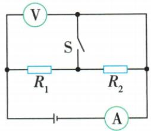
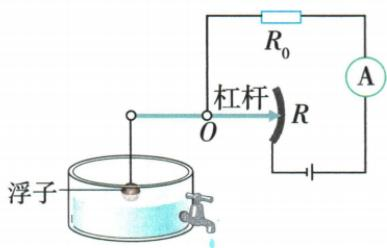

## 讲解

### 判据

开关、滑片或浮子变化，问表示数及比值。

### 流程

1. 先核题设恒压、固定电阻等不变量。2. 开关改变时重画有效结构；滑片改变时找实际接入段。3. 总阻增减决定恒压总流反向变。4. 串联固定阻压随共同流变化，剩余变阻压用总压减；并联定支流在恒压下保持。5. 比值先辨测量对象：源压/总流才是总阻，局部压/共同流才是局部阻。

## 例题

### 并联变阻支路与表示数比

> 来源ID Q17-09；第十七章欧姆定律；151-200/full.md 第3517–3535行。原答案与解析定位：151-200/full.md 第3537–3539行。

例1 如图所示,电源电压保持不变,闭合开关 S,当滑动变阻器的滑片 P 向右滑动过程中,下列说法正确的是 ( )

A.电流表 A 的示数不变  
B.电流表 $\mathrm{A}_{1}$ 的示数变小  
C. 电压表 V 的示数变大  
D. 电压表 V 的示数与电流表 A 的示数的比值变小

**原资料答案与解析：**

解析 由电路图可知,滑动变阻器与定值电阻并联,电压表 V 测电源电压,电流表 A $_{1}$ 测通过滑动变阻器的电流,电流表 A 测干路电流。由于电源电压不变,所以滑片 P 向右滑动时电压表 V 的示数不变,C 错误;当滑动变阻器的滑片 P 向右滑动过程中,滑动变阻器接入电路的阻值变小,电源电压不变,由 $I=\frac{U}{R}$ 知通过滑动变阻器的电流变大,电流表 A $_{1}$ 的示数变大,B 错误;由于并联电路各个支路互不影响,所以通过定值电阻的电流不变,根据并联电路干路电流等于各支路电流之和可知,干路电流变大,所以电流表 A 的示数变大,A 错误;由于电压表 V 的示数不变,电流表 A 的示数变大,所以电压表 V 的示数与电流表 A 的示数的比值变小,D 正确。

答案 D

**展开解析（依据原详解补足理由与步骤）：**

接右丝端，滑片右移减阻，A1测该支流增大；定阻支流在恒压下不变，干路A增大。V跨恒压电源，保持不变。A“总流不变”错；B“支流变小”错；C“电压变大”错；D$U/I_\text{总}$为整个并联电路等效阻值，因U不变总流增大而减小，对。

### 开关闭合旁路一个电阻

> 来源ID Q17-10；第十七章欧姆定律；151-200/full.md 第3541–3560行。原答案与解析定位：151-200/full.md 第3562–3564行。

例2 在如图所示的电路中,电源电压保持不变,当开关 S 由断开到闭合时 ( )

A.电流表A示数不变

B.电压表V示数变小

C.电流表与电压表示数之比变小

D.电路的总电阻变小

**原资料答案与解析：**

解析 当开关 S 断开时, 两定值电阻串联, 电压表测电源电压, 电流表测电路中的电流; 当开关 S 闭合时, 电阻为 $R_{2}$ 的定值电阻被短路, 电路为只有电阻为 $R_{1}$ 的定值电阻的简单电路, 电压表测电源电压, 电流表测电路中的电流。当开关 S 由断开到闭合时, 电路中的总电阻减小, 因为电源电压不变, 电压表示数不变; 根据欧姆定律可知电路中的电流增大, 故电流表示数变大, 电流表与电压表示数之比变大, D 正确。

答案 D

**展开解析（依据原详解补足理由与步骤）：**

S断开，两阻串联总$R_1+R_2$；S合上使R2被理想导线旁路，剩R1，总阻减小。V右端沿上方线接右公共节点，两个状态都测源压，不变；A测总流，恒压减阻则增流。A、B均错，C$I/U$是总阻倒数，应变大而非小，D对。

### 油量表空箱是否零电流

> 来源ID Q17-11；第十七章欧姆定律；151-200/full.md 第3572–3590行。原答案与解析定位：151-200/full.md 第3623–3625行。

例1（2024 湖北武汉中考）如图所示是一种测定油箱内油量的装置。其中滑动变阻器电阻片的阻值为 R，杠杆的右端是滑动变阻器的滑片，杠杆左端固定着一个浮子，油箱内油量变化时，滑片就在电阻片两端之间滑动。下列说法错误的是（）

A.定值电阻和滑动变阻器是串联的   
B. 油量减少时, 滑动变阻器接入电路的电阻变大  
C. 油量增加时, 电流表示数变大  
D. 油箱中没有油时, 电流表示数为零

**原资料答案与解析：**

例1 解析 定值电阻与滑动变阻器顺次连接, 是串联的, A 正确; 油量减少时, 浮子下移, 滑片上移, 滑动变阻器接入电路的电阻变大, B 正确; 油量增加时, 浮子上移, 滑片下移, 滑动变阻器接入电路的电阻变小, 电路中总电阻变小, 由 $I=\frac{U}{R_{\text{总}}}$ 得电流变大, C 正确; 油箱中没有油时, 滑动变阻器接入电路的阻值最大, 电流表的示数最小, 但不为零, D 错误。

答案 D

**展开解析（依据原详解补足理由与步骤）：**

图中R0和有效R段串联，A对。浮子在杠杆左，油少左端下右端上，滑片远离下方接入丝端，阻值增大，B对；油多反向运动，阻减总流增，C对。空箱在滑片可达范围内使有效阻最大，但电源仍经有限电阻成通路，电流最小而非零，D错。题目问错误项。

### 变阻器电压电流直线求源压

> 来源ID Q17-12；第十七章欧姆定律；151-200/full.md 第3592–3619行。原答案与解析定位：151-200/full.md 第3627–3629行。

例2 (2024 山东临沂中考)闭合如图甲所示电路的开关,将滑动变阻器的滑片由最右端移到最左端的过程中,电压表与电流表的示数变化的图像如图乙所示。则定值电阻的阻值 $R_{0}=$ \_\_\_\_ Ω,电源电压为 \_\_\_\_ V。

甲

乙

**原资料答案与解析：**

例2 解析 滑动变阻器的滑片由最右端移到最左端的过程中,滑动变阻器连入电路的阻值变小,两端的电压变小,直到为0。由图像可知,当电路中的电流为0.1 A时,电压表的示数为1.2 V,电源电压 $U=U_{0}+U_{\text{滑}}=0.1\ \mathrm{A}\times R_{0}+1.2\ \mathrm{V}$ ①,当电路中的电流为0.5 A时,电压表的示数为0,电源电压 $U=0.5\ \mathrm{A}\times R_{0}$ ②,由①②解得 $R_{0}=3\ \Omega,U=1.5\ V$ 。

答案3 1.5

**展开解析（依据原详解补足理由与步骤）：**

V跨变阻器，A读共同电流。最左接入R为0时，图给$I=0.5\,\mathrm A$且$U_\text{滑}=0$，源压$U=0.5R_0$。另一端$I=0.1\,\mathrm A$、变阻压1.2 V，总压$U=0.1R_0+1.2$。同一源压相等，$0.5R_0-0.1R_0=1.2$，$0.4R_0=1.2$，$R_0=3\,\Omega$，再代$U=0.5\times3=1.5\,\mathrm V$。纵轴不是R0两端压，不能直接用1.2/0.1求R0。

## 易错

原“总压不变”不是所有动态题自带事实，必须有恒压题设或理想源模型。
