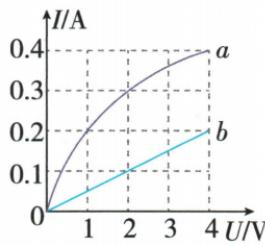
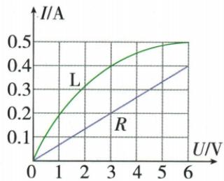

## 讲解

### 判据

题给两元件曲线，分别问并联总流或串联总压、阻比。

### 流程

1. 核对坐标轴。2. 并联固定U，分别在同U竖线或相应同压线读流并求和。3. 串联固定I，分别在同I线读压并求和；若给总压，寻找两分压和符合的共同I。4. 阻值只用该状态同一点$U/I$，电压相加与电流相加不可混用。

## 例题

### 灯与定阻图像逐项判断

> 来源ID Q17-02；第十七章欧姆定律；151-200/full.md 第2858–2880行。原答案与解析定位：151-200/full.md 第2882–2884行。

例 如图所示,是小灯泡和定值电阻的 I-U 图像,下列说法正确的是 ( )

A.定值电阻的电阻是 $10\Omega$

B. 小灯泡的电阻随着电压的增大而减小

C. 仅把小灯泡和定值电阻并联在电压是 $2 \mathrm{~V}$ 的电路中, 干路中的电流是 $0.4 \mathrm{~A}$

D.仅把小灯泡和定值电阻串联在电路中,当电路中的电流是0.2 A时,它们两端的总电压是4 V

**原资料答案与解析：**

解析 图线 b 是过原点的一条倾斜直线, 所以其为定值电阻的 I-U 图像, 则定值电阻的电阻 $R=\frac{U}{I}=\frac{4\ V}{0.2\ A}=20\ \Omega$ , A 错误; 由灯泡的 I-U 图像可知, 随着电压的增大, U 与 I 的比值变大, 即电阻变大, B 错误; 小灯泡和定值电阻并联在电压是 2 V 的电路中, 两端电压均为 2 V, 小灯泡和定值电阻中的电流分别是 0.3 A 和 0.1 A, 并联电路干路中的电流等于各支路中的电流之和, 则干路中的电流为 0.4 A, C 正确; 串联电路中的电流处处相等, 当电流 $I=0.2$ A 时, 小灯泡和定值电阻两端的电压分别是 1 V 和 4 V, 串联电路中总电压等于各部分电路两端电压之和, 则总电压等于 5 V, D 错误。

答案 C

**展开解析（依据原详解补足理由与步骤）：**

b直线在4 V时0.2 A，所以$R_b=4/0.2=20\,\Omega$，A的10 Ω错。a曲线在1 V时0.2 A、2 V时0.3 A，$R=U/I$由5 Ω增加到约6.67 Ω，B减阻错。并联2 V时，两支流分别0.3 A和0.1 A，$I=0.3+0.1=0.4\,\mathrm A$，C对。串联0.2 A时，两电压1 V和4 V，$U=1+4=5\,\mathrm V$，D的4 V错。

### 灯定阻图像并联再串联

> 来源ID Q17-04；第十七章欧姆定律；151-200/full.md 第2915–2931；2935–2935行。原答案与解析定位：151-200/full.md 第2894–2896行。

第2题图

例2 (2024 黑龙江鸡西中考) 如图为灯泡 L 和阻值为 R 的定值电阻的 I-U 图像, 若将灯泡和定值电阻并联在电源电压为 3 V 的电路中, 干路电流为 \_\_\_\_ A; 若将其串联在电源电压为 4 V 的电路中, 灯泡和定值电阻的阻值之比为 \_\_\_\_ 。

**原资料答案与解析：**

例2 解析 由图像可知,灯泡和定值电阻并联在电源电压为3 V的电路中时,干路电流 $I=0.4\ A+0.2\ A=0.6\ A$ ,它们串联在电源电压为4 V的电路中时,阻值之比为 $R_{L}:R=U_{L}:U_{R}=1:3$ 。

答案 0.6 1:3

**展开解析（依据原详解补足理由与步骤）：**

并联3 V时竖线读灯0.4 A、定阻0.2 A，干流0.6 A。串联总4 V要找共同电流下两横坐标之和为4，图中0.2 A对应灯1 V、定阻3 V；同流使$R_L:R=U_L:U_R=1:3$。这时灯电阻与并联3 V状态不同，不能用前一状态比值。

## 易错

灯曲线各状态电阻不同，不能跨过程混用。
