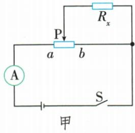
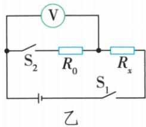
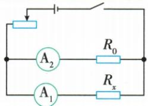

## 讲解

### 判据

有总流、已知支流或可短接未知支路得到已知阻电流。

### 流程

1. 图上标并联公共节点及表在干路还是支路。2. 保持源压相同，测已知R0流取得$U=I_0R_0$。3. 另一状态总流减已知流求未知支流，再$R_x=U/I_x$。4. 双安表时不用改状态，直接用同压比值。5. 特殊三端滑片原图必须实际追踪接通哪段，不能当普通串联调阻。

## 例题

### 特殊滑片并联法与双开关伏测法

> 来源ID Q17-06；第十七章欧姆定律；151-200/full.md 第3008–3046行。原答案与解析定位：151-200/full.md 第3048–3052行。

例2 小萌在“用电压表和电流表测量电阻”实验中。

(1) 若电压表损坏, 利用其他的原有器材也能测出待测电阻器的电阻, 实验电路如图甲所示 (已知滑动变阻器最大阻值为 $R_{0}$ , 电源电压未知且不变), 请将下列相关实验步骤补充完整。

①闭合开关 S, 将滑动变阻器的滑片 P 移到 a 端, 记录电流表示数 $I_{1}$ ;  
② , 记录电流表示数 $I_{2}$ ;  
③待测电阻器的电阻 $R_{x}=$ \_\_\_\_。（用已知量和测得的物理量表示）

(2) 小萌又对实验进行了拓展, 利用电源 (电压未知且恒定不变)、阻值为 $R_{0}$ 的定值电阻、电压表 (理想

电表)、开关等器材,设计了如图乙所示的电路,也测出了待测电阻器的电阻。请将下列相关实验步骤补充完整。

①闭合开关 $S_{1}$ ，断开 $S_{2}$ ，读出电压表的示数为 $U_{1}$ ;  
②\_\_\_\_，读出电压表的示数为 $U_{2}$ ;  
③待测电阻器的电阻 $R_{x} =$ \_\_\_\_。（用已知量和测得的物理量表示）

**原资料答案与解析：**

解析（1）滑片P移到a端时，滑动变阻器接入电路的阻值最大，且与待测电阻器并联，电流表示数 $I_{1}$ 是总电流。滑片P移到b端时，待测电阻器被短路，滑动变阻器接入电路的阻值最大，则可求出电源电压 $U=I_{2}R_{0}$ ，滑片P移到a端与滑片P移到b端，滑动变阻器两端的电压均为电源电压，所以滑片P移到a端时，通过滑动变阻器的电流也为 $I_{2}$ ，则滑片P移到a端时，通过待测电阻器的电流 $I_{x}=I_{1}-I_{2}$ ，则 $R_{x}=\frac{U}{I_{x}}=\frac{I_{2}R_{0}}{I_{1}-I_{2}}$ 。

(2)闭合 $\mathbf{S}_1$ ，断开 $\mathbf{S}_2$ ，电压表串联在电路中，测量的是电源电压 $U_{1}$ ；再闭合 $\mathbf{S}_2$ ，定值电阻与待测电阻器串联在电路中，电压表测量的是定值电阻两端的电压 $U_{2}$ ，待测电阻器两端的电压 $U_{x} = U_{1} - U_{2}$ ；此时电路中的电流 $I_{x} = \frac{U_{2}}{R_{0}}, R_{x} = \frac{U_{x}}{I_{x}} = \frac{U_{1} - U_{2}}{\frac{U_{2}}{R_{0}}} = \frac{(U_{1} - U_{2})R_{0}}{U_{2}}$ 。

答案 (1)②将滑片 P 移到 b 端 ③ $\frac{I_{2}R_{0}}{I_{1}-I_{2}}$ (2)②闭合开关 $S_{1}, S_{2}$ $\frac{(U_{1}-U_{2})R_{0}}{U_{2}}$

**展开解析（依据原详解补足理由与步骤）：**

(1)原图滑片接待测支路，这不是普通两个端子串联调阻。P在a时，$R_0$与$R_x$并联，总流为$I_1$。P在b时$R_x$被旁路，但全长$R_0$仍接在电源两端，读$I_2$；由欧姆定律得$U=I_2R_0$。恒压使第一状态经$R_0$的流也为$I_2$，故$I_x=I_1-I_2$，代$R_x=U/I_x$得$R_x=I_2R_0/(I_1-I_2)$。(2)只合S1时表经Rx接电源，理想表无流，Rx无压降，表读电源$U_1$。再合S2，R0与Rx串联，表跨R0读$U_2$，电流$I_x=U_2/R_0$；串联剩余压$U_x=U_1-U_2$；除以同流得到$R_x=(U_1-U_2)R_0/U_2$。两个过程分别明确测量对象，不能颠倒U1、U2。

### 安安法原电路与操作示例

> 来源ID Q17-14；第十七章欧姆定律；151-200/full.md 第3006–3006行。原答案与解析定位：151-200/full.md 第3006–3006行。

原资料方法示例：安安法

原操作：闭合开关后,用电流表 $A_1$ 、 $A_2$ 测出经过电阻器的电流分别为 $I_1$ 、 $I_2$

**原资料答案与解析：**

原表表达式： $R_x = \frac{I_2}{I_1} R_0$ ( $R_0$ 已知)

**展开解析（依据原详解补足理由与步骤）：**

两阻并联同压，原图I1经过Rx、I2经过R0；$U=I_2R_0$，再用$R_x=U/I_1$得到$R_x=I_2R_0/I_1$。不要只凭编号猜支路。

## 易错

若源压改变或已知支路状态改变，原差流公式失效。
