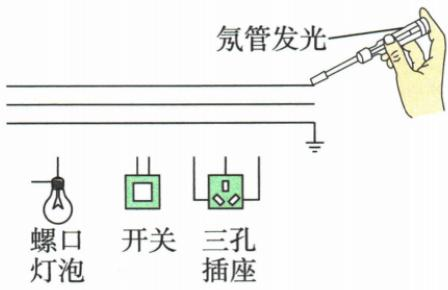
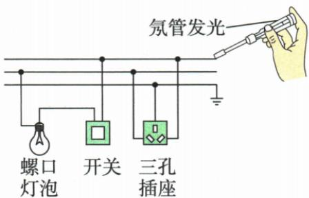
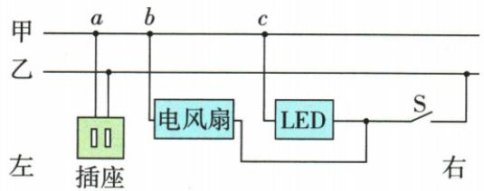
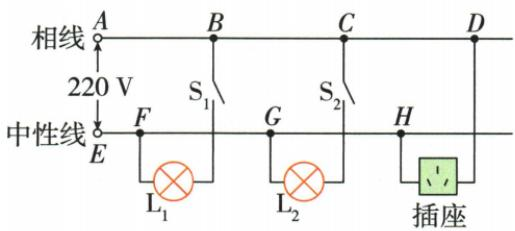

## 讲解

### 是什么

相线L俗称火线，中性线N俗称零线，PE为保护线。本章正常单相家庭模型L与N约220 V，各用电器并联在同一对供电线间。

### 怎么来的

并联让各电器独立开关且各承受规定源压；正常模型中N在供电系统接地而近地电势，PE提供外壳保护路径，正常不承担用电器工作电流。

### 什么时候能用

这是简化正常模型，不能从名称零线推出在断线、接错或异常时绝对无对地电压；PE与N用途不同，不能随意互换。这里是学习电路原理，实际布线请合格电工。

## 例题

### 相线识别及开关灯插座连线

> 来源ID Q19-03；第十九章生活用电；201-233/full.md 第573–586行。原答案与解析定位：201-233/full.md 第588–604行。

例1 (2024 四川南充中考)如图,根据安全用电知识,将图中元器件用笔画线代替导线连起来(开关仅控制灯泡)。

**原资料答案与解析：**

解析 用测电笔辨别相线和中性线时,能使氖管发光的是相线;螺口灯泡接入电路时,相线通过开关连接灯泡顶端的金属点,中性线直接接入灯泡的螺旋套;三孔插座并联在电路中,上孔连接保护线,左孔连接中性线,右孔连接相线。

答案 如图所示

**展开解析（依据原详解补足理由与步骤）：**

能使传统测电笔氖管亮的是上方相线；中间为中性线，下方图示接地保护线。相线先串灯的专用开关，再接灯顶端金属点；螺口外套接中性线，使开关断开时灯与相线断开。插座独立并联：面对插座左孔中性、右孔相线、上孔保护；开关只控制灯，不能把插座也串入开关。原连线图保留。此为纸面连线题，实际家用线路由合格专业人员施工。

### 右端进户风扇停而LED仍亮

> 来源ID Q19-04；第十九章生活用电；201-233/full.md 第633–659行。原答案与解析定位：201-233/full.md 第661–663行。

例2 (2024 广东广州中考)如图,某家庭电路的输电线甲、乙从右端进户。闭合开关 S,LED 灯发光、电风扇正常工作,用试电笔检测插座,只有检测右孔时氖管发光。由于出现故障,电风扇停止工作,LED 灯仍发光,用试电笔检测插座两孔,氖管均发光。该故障是 ( )

A.电风扇短路

B. 插座两孔短路

C. 输电线甲 a、b 两点之间断路

D. 输电线甲 b、c 两点之间断路

**原资料答案与解析：**

解析 出现故障前,闭合开关 S 时,只有检测右孔时氖管发光,说明输电线乙是相线。若电风扇短路,LED 灯与电风扇并联,LED 灯不能发光,电路处于短路状态,A 错误;若插座两孔短路,电路处于短路状态,电风扇和 LED 灯均不能正常工作,B 错误;闭合开关 S 时,若输电线甲 a、b 两点之间断路,电风扇和 LED 灯均能正常工作,C 错误;若输电线甲 b、c 两点之间断路,则 LED 灯能正常工作,电风扇停止工作,用试电笔检测插座两孔,插座左孔通过 ab 连接到相线,氖管均发光,D 正确。

答案 D

**展开解析（依据原详解补足理由与步骤）：**

初始只右孔测亮，确定乙相线、甲中性线，进户从右，不能按左进户习惯判断。A风扇短路、B插孔短路都会直接连接相线中性线，不能保持LED正常，排除。C甲ab断只隔开更左插座，风扇在b点仍经bc接进户中性，风扇和LED应正常，排除。D甲bc断，LED接c仍有零线回路；风扇及插座左孔在断点左侧无正常中性回路，风扇不转；左孔通过ab及风扇绕组接乙相线，传统笔电流很小，绕组压降很小，能测亮。D符合全部现象。原解“通过ab连接相线”省略了风扇这段，展开补明而不说火零硬短。

### 缺地线及FG断点联合判断

> 来源ID Q19-05；第十九章生活用电；201-233/full.md 第680–703行。原答案与解析定位：201-233/full.md 第673–676行。

例（2024 山东日照中考）如图是小明家新房中的部分电路，存在的问题是\_\_\_\_。问题解决后，闭合开关 $S_{1}$ 、 $S_{2}$ ，电灯 $L_{1}$ 正常发光，但 $L_{2}$ 仍然不亮。将一把新买的电热水壶插入三孔插座，电热水壶也不能工作。把试电笔分别插入三孔插座的左、右孔，氖管均能发光，则可以判断出电路的故障是\_\_\_\_。

**原资料答案与解析：**

例 解析 三孔插座的连接应是“左中右相上保护”，故该电路中存在的问题是三孔插座没有接保护线。 $L_{1}$ 正常工作，说明 $L_{1}$ 所在支路是通路； $L_{2}$ 和三孔插座不能工作，说明出现断路，而三孔插座左孔能使氖管发光，说明左孔通过 $L_{2}$ 和相线连通，所以故障是 FG 之间断路。

答案 三孔插座没有接保护线
FG 之间断路

**展开解析（依据原详解补足理由与步骤）：**

(1)原三孔插座上孔无保护线，首先补可靠PE；不能把PE接到图中普通中性线作为随意代用。(2)L1在F仍正常，说明其相线与F中性回路正常；L2在G、插座在H均不能工作，故障须切断它们而保持F。FG断使G、H脱离供电中性线；但经完好L2和合S2接到相线，插座左孔可测亮，右孔本就接相线，两孔都亮。故原答案FG断。单独L2断不能使插座同样停，单独插座问题不能使L2同样停。

## 易错

原“中性线与大地无电压”需正常理想条件，故障题恰能使零线浮高。
