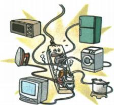

## 讲解

### 是什么

过载指同时工作负载使工作电流超允许值；短路指相线与中性线绕过正常负载形成极低阻通路，两者都可过流。

### 怎么来的

恒压下$I=P_\text{总}/U$，并联多负载总功率增导致总流增。短路极低阻导致大电流；导线焦耳热$Q=I^2R_\text{线}t$随流平方增长，所以过流会过热。

### 什么时候能用

判题先区分图中是新增正常负载还是直接短接。实际总回路与各支路分别有额定承载限制，不能只看电能表最大值；负载接触不良也可能局部过热，不必整个总流超限。

## 例题

### 多用电器接入线路为何过热

> 来源ID Q19-01；第十九章生活用电；201-233/full.md 第323–331行。原答案与解析定位：201-233/full.md 第333–333行。

家庭电路中总电流如果超过安全值，会由于电流的\_\_\_\_效应，导致线路温度过高，容易引发火灾。图中所示电路中电流过大的原因是\_\_\_\_。

**原资料答案与解析：**

答案 热 用电器总功率过大

**展开解析（依据原详解补足理由与步骤）：**

图中多个用电器接同一供电线路，题意为用电器总功率过大而非直接连通火零。恒压时总$I=P_\text{总}/U$，功率大则电流大；导线仍有小电阻，同样时间$Q=I^2R_\text{线}t$随电流平方增，线路温升可能引发火灾，第一空热、第二空总功率过大。图未画火零直接相接，不能答短路。

## 易错

电器并联本身是正常接法，不等于短路；必须看是否绕开负载直接通火零。
