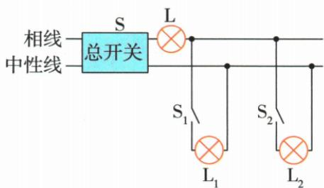

## 讲解

### 是什么

原资料用检验灯替代原保险位置串在相线上，支路状态改变可由检验灯与原灯的亮灭、分压分析。

### 怎么来的

短路支路使检验灯承担主要源压而正常亮；正常支路与检验灯串联分压而都低于额定；无通路时无足够电流而灯灭。具体判断仍要结合开关、额定规格和故障假设。

### 什么时候能用

原法是专业检修情境的纸面模型，不是学生搭建家庭市电的步骤。检验灯不能替代正常保险装置长期使用；全灭不一定唯一干路断。

## 例题

### 检验灯原例：闭合S

> 来源ID Q19-07；第十九章生活用电；201-233/full.md 第629–631行。原答案与解析定位：201-233/full.md 第631–631行。

原资料检验灯示例：闭合S
现象：灯泡L正常发光

**原资料答案与解析：**

原表结论：相线与中性线之间存在短路故障

**展开解析（依据原详解补足理由与步骤）：**

所有支路开关断而合总S，正常没有完整负载通路，检验灯不亮；若L能正常亮，相线后的某处直接接中性线，相当于检验灯独占额定电压，所以依此理想模型判火零短路。

### 检验灯原例：先闭合S,再闭合S1

> 来源ID Q19-08；第十九章生活用电；201-233/full.md 第629–631行。原答案与解析定位：201-233/full.md 第631–631行。

原资料检验灯示例：先闭合S,再闭合S1
现象：闭合S时,灯泡L不发光,再闭合S1时,灯泡L正常发光,灯泡L1不发光

**原资料答案与解析：**

原表结论：L1所在的支路一定存在短路,可能是L1灯座短路

**展开解析（依据原详解补足理由与步骤）：**

先只合S时L灭，再合S1后L正常而L1灭，新增支路旁路了L1；L承担大部分源压，说明L1支路存在短路。须定位整条支路，不能仅凭此现象唯一断言一定是灯丝或灯座某一具体点。

### 检验灯原例：闭合S、S1、S2

> 来源ID Q19-09；第十九章生活用电；201-233/full.md 第629–631行。原答案与解析定位：201-233/full.md 第631–631行。

原资料检验灯示例：闭合S、S1、S2
现象：灯泡L、L1、L2都不发光

**原资料答案与解析：**

原表结论：电路断路,很可能是干路断路

**展开解析（依据原详解补足理由与步骤）：**

合总及两支开关全不亮，理想模型中没有可供灯电流的通路，可能干路断。原文“很可能”是合理候选；若两支分别都断或电源无供电也可能全灭，不能在未给单故障和源完好条件下唯一判干路。

### 检验灯原例：闭合S、S1

> 来源ID Q19-10；第十九章生活用电；201-233/full.md 第629–631行。原答案与解析定位：201-233/full.md 第631–631行。

原资料检验灯示例：闭合S、S1
现象：灯泡L、L1发光但比较暗

**原资料答案与解析：**

原表结论：该支路正常。由于灯泡L、L1串联,根据串联分压规律可知,灯泡L、L1两端的电压都低于额定电压,故发光较暗

**展开解析（依据原详解补足理由与步骤）：**

L与L1串联正常导电，共同流有限，各自分压低于额定，能发光但较暗，原模型判支路正常。实际亮度依灯额定规格，微弱不可见不等于严格零电流；检验灯法只作纸面电路原理，学生不搭市电试验。

## 易错

灯不亮可能电流过小不是严格零；正常亮判断依原匹配规格。
