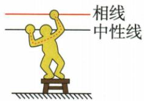
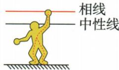
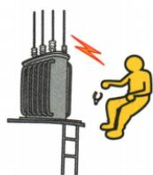
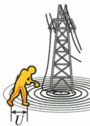

## 讲解

### 是什么

触电危险由人体有电流及其大小、路径、时间等决定；单线、双线、高压电弧和跨步电压都是原资料列举的路径。

### 怎么来的

两点电压推动电流。人体进入有电压差的导电路径就可能有电流；湿润皮肤降低阻碍，风险增加。高压还能通过空气放电，地面电势不一也能让双脚承受电压差。

### 什么时候能用

初中常用“不高于36 V”的一般教学值，不能当任何环境绝对安全界限，更不能用身体验证。高压危险区保持远离；本条按原示意解释原理，具体故障交专业人员。[官方关于环境改变允许电压的说明](https://yjt.hunan.gov.cn/tszt/aqzs/202007/t20200728_13103073.html)。

## 例题

### 原资料四类触电示意

> 来源ID Q19-06；第十九章生活用电；201-233/full.md 第315–376行。原答案与解析定位：201-233/full.md 第311–313行。

原资料示意（不是自行设计实验）：

甲：双线触电。

乙：单线触电。

丙：高压电弧触电。

丁：跨步电压触电。

**原资料答案与解析：**

1. 触电的实质: 人体是导体, 当成为闭合电路的一部分时, 人体就会有电流通过, 如果电流达到一定值, 就会发生触电事故。电流对人体造成伤害的程度与通过人体电流的大小及持续时间有关。②

2.电压越高越危险：对人体安全的电压一般为不高于36 V。我国家庭电路的电压是220 V,工厂动力电路的电压是380 V,输电线路的电压为10\~1 100 kV,这些都超出了安全范围,人一旦触电,会有生命危险。

**展开解析（依据原详解补足理由与步骤）：**

甲人体同时跨相线与中性线，形成双线电流路径，即使脚下绝缘也不能排除危险。乙人体接相线且通过大地回供电系统，单线也形成通路。丙高压可击穿空气形成电弧，无直接手碰仍有危险；丁落地处地面电势分布不同，两脚跨不同点可承受跨步电压。共同判据是人体处在有电压差的路径并有电流，不能一律要求直接碰相线。原“不高于36 V”是一般教学口径，潮湿等场所允许电压可更低，不是人体试验界限。[湖南省应急管理厅关于特殊潮湿场所12 V限制](https://yjt.hunan.gov.cn/tszt/aqzs/202007/t20200728_13103073.html)。

## 易错

原“触电一定接触相线”不成立：高压电弧、跨步、漏电外壳都可能无直接相线接触。鸟在同一导线两脚电压差小的模型，不是人可接相线的依据。
