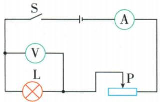

## 错法

把0.84 W、1.14 W、1.344 W平均当标3.8 V灯额定功率。

## 正解

额定只取3.8 V对应的0.30 A，结果1.14 W。另两组用于说明实际功率随电压和亮度变化，混平均会失去对应状态。

## 例题

### 灯额定功率与三状态亮度

> 来源ID Q18-07；第十八章电功率；201-233/full.md 第22–36行。原答案与解析定位：201-233/full.md 第48–50行。

例3（2024 江苏无锡中考）用如图所示的电路测量小灯泡的功率,实验原理是\_\_\_\_。闭合开关,调节滑动变阻器滑片 P,分别使电压表的示数小于、等于和略大于小灯泡的额定电压 3.8 V,观察小灯泡的亮度,读出电压表、电流表的示数记录在下表中。则小灯泡 L 的额定功率为\_\_\_\_ W,小灯泡的亮度由\_\_\_\_决定。

| 实验序号 | 电压$\frac{U}{V}$ | 电流$\frac{I}{A}$ | 小灯泡的亮度 |
| --- | --- | --- | --- |
| 1 | 3.0 | 0.28 | 较亮 |
| 2 | 3.8 | 0.30 | 正常发光 |
| 3 | 4.2 | 0.32 | 过亮 |

**原资料答案与解析：**

例3 解析 根据题中电路用电压表测出小灯泡两端的电压,用电流表测出通过小灯泡的电流,根据公式 $P=UI$,计算功率的大小;由表中数据可知,当小灯泡两端电压为额定电压 3.8 V 时,通过小灯泡的电流为 0.30 A,则小灯泡的额定功率 $P_{L}=U_{L}I_{L}=3.8V\times0.30A=1.14W$ ;分析表中数据可以得出:小灯泡的实际功率增大,小灯泡变亮,即小灯泡的亮度由其实际功率决定。

答案 $P = UI$ 1.14 实际功率

**展开解析（依据原详解补足理由与步骤）：**

实验原理$P=UI$。额定电压3.8 V对应表第2组0.30 A，$P_\text{额}=3.8\times0.30=1.14\,\mathrm W$。第1组实际$P=3.0\times0.28=0.84\,\mathrm W$；第3组$P=4.2\times0.32=1.344\,\mathrm W$，同灯实际功率升则变亮。三状态功率不同，不能求平均冒作额定功率。原“略大于”在教师限定实验内，不能无限提高电压。
