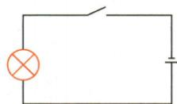
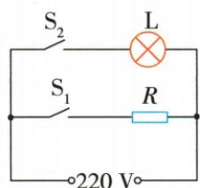

## 讲解

### 是什么

电功率P表示电能转化快慢，$P=W/t$，单位W或kW；本章稳态模型$P=UI$。对纯电阻或题设电阻负载，$P=I^2R=U^2/R$。

### 怎么来的

将$W=UIt$代定义$P=W/t$约去t得到UI。再用$U=IR$代U得$I^2R$；用$I=U/R$代I得$U^2/R$。后两式额外依赖该对象适用欧姆模型，不能无条件代整台电动机。

### 什么时候能用

功率大说明同时间耗能多；实际耗能还看t。恒定负载才可$W=Pt$；J配s得W，kW·h配h得kW。

## 例题

### 应急手电阻值与一分钟电能

> 来源ID Q18-01；第十八章电功率；151-200/full.md 第3685–3690行。原答案与解析定位：151-200/full.md 第3679–3681行。

例 (2024 江苏扬州中考)家中应急手电筒的电路图如图所示,电源电压为 3 V,闭合开关,通过灯泡的电流为 0.6 A,忽略灯泡电阻的变化。求:

(1)灯泡电阻R;   
(2)电路工作 $1\mathrm{min}$ 消耗的电能 $W$ 。

**原资料答案与解析：**

例 解析（1）灯泡电阻 $R=\frac{U}{I}=$ $\frac{3\ V}{0.6\ A}=5\ \Omega;$

(2) 电路工作 1 min 消耗的电能 $W = UIt = 3 \, V \times 0.6 \, A \times 60 \, s = 108 \, J$ 。

**展开解析（依据原详解补足理由与步骤）：**

题设忽略灯阻变化。同一灯$R=U/I=3/0.6=5\,\Omega$。一分钟换$60\,\mathrm s$，恒定电压电流下$W=UIt=3\times0.6\times60=108\,\mathrm J$。3 V、0.6 A与60 s均对应同一电路同一过程，不把分钟直接当秒。

### 电能表读数限额与闪烁测速

> 来源ID Q18-02；第十八章电功率；151-200/full.md 第3853–3866行。原答案与解析定位：151-200/full.md 第3868–3870行。

例1 (2024 江苏盐城中考)在“对家庭用电的调查研究”综合实践活动中,小明发现家中电能表表盘如图所示,该电能表的示数为\_\_\_\_kW·h,他家同时工作的用电器总功率不能超过\_\_\_\_W。小明想测家中电水壶的功率,只让电水壶在电路中工作,当指示灯闪烁了48次,用时1min,则该电水壶的功率为\_\_\_\_W。

**原资料答案与解析：**

解析 由图可知,该电能表的示数为 $326.6 \, kW \cdot h$ ; 该电能表允许通过的最大电流为 $40 \, A$ , 则他家同时工作的用电器总功率不能超过 $P = UI = 220 \, V \times 40 \, A = 8800 \, W$ ; 该电水壶的功率 $P = \frac{W}{t} = \frac{n}{Nt} \times 3.6 \times 10^{6} \, J = \frac{48}{1600 \times 60 \, s} \times 3.6 \times 10^{6} \, J = 1800 \, W$ 。

答案 326.6 8800 1800

**展开解析（依据原详解补足理由与步骤）：**

末位为十分位，表读326.6 kW·h；10(40) A括号内40 A是最大电流，以原题220 V及初中功率模型$P_\text{限}=220\times40=8800\,\mathrm W$。这只表示该表给定额定限制，实际家庭还受导线、保护器、支路限制，不能据此任意加载。常数1600 imp/(kW·h)意味着1600次对应1度；48次电能$W=48/1600=0.03\,\mathrm{kW\cdot h}$，换焦$0.03\times3.6\times10^6=108000\,\mathrm J$；时间60 s，$P=108000/60=1800\,\mathrm W$。仅电水壶工作才能把总表这段能量全归它。

### 消毒柜两功能并联电功率

> 来源ID Q18-05；第十八章电功率；151-200/full.md 第3970–3986行。原答案与解析定位：151-200/full.md 第3956–3959行。

例1 (2024 广东中考) 某消毒柜具有高温消毒和紫外线杀菌功能, 其简化电路如图所示。发热电阻的阻值 $R = 110 \Omega$ , 紫外线灯 L 规格为 “220 V 50 W”。闭合开关 $S_{1}$ 和 $S_{2}$ , 消毒柜正常工作, 求:

(1)通过发热电阻的电流；  
(2)发热电阻的电功率;   
(3)L工作100 s消耗的电能。

**原资料答案与解析：**

例1 解析（1）通过发热电阻的电流 $I_{R}=\frac{U}{R}=\frac{220\ V}{110\ \Omega}=2\ A$ ;

(2) 发热电阻的电功率 $P_{R} = UI_{R} =$ 220 $V\times 2$ $A=440$ W;  
(3) 紫外线灯正常工作时两端电压 $U_{L}=220\ V$ ，功率 $P_{L}=50\ W$ ，工作 100 s 消耗的电能 $W_{L}=P_{L}t=50\ W\times100\ s=5\times10^{3}\ J$ 。

**展开解析（依据原详解补足理由与步骤）：**

合S1、S2，两支路各承受220 V。(1)发热阻$I_R=220/110=2\,\mathrm A$。(2)$P_R=220\times2=440\,\mathrm W$。(3)紫外灯正常工作，可用额定50 W，$W_L=P_Lt=50\times100=5000\,\mathrm J$。110 Ω只属于发热支路，不能代入紫外灯；两个功率不同不是串联分压，源压未被二者均分。

## 易错

源总功率、某支路功率与某个电阻功率需要分清。
