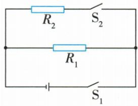

## 讲解

### 是什么

电流通过具有电阻的导体使电能转成内能，称热效应。本章恒定电流、稳定电阻时$Q=I^2Rt$，Q为J、I为A、R为Ω、t为s。

### 怎么来的

电阻与电流及通电时间共同影响热量。受控实验分别固定另两项，观察电阻、电流和时间的影响；同I同R时t成倍热成倍，同R同t时I成倍热成四倍。

### 什么时候能用

这里Q指该导体电阻发出的热，不是整个电路全部输入电能。纯电阻$W=Q$，可写$Q=UIt=U^2t/R$；电动机转动时W还转成机械能，仍可用线圈$I^2Rt$算电阻热，却不能认作总输入。

## 例题

### 电热实验两装置控制量

> 来源ID Q18-09；第十八章电功率；201-233/full.md 第227–250行。原答案与解析定位：201-233/full.md 第194–196行。

例1（2024 山东日照中考节选）为了探究电流通过导体产生的热量跟哪些因素有关,设计了如图所示的实验装置(电源、开关未画出)。图甲是控制通过导体的电流和通电时间相同,探究\_\_\_\_对产生热量多少的影响;图乙是控制导体电阻和通电时间相同,探究\_\_\_\_对产生热量多少的影响。这两套装置进行实验的过程中都采用的研究方法是\_\_\_\_。

甲

乙

**原资料答案与解析：**

例1 解析 图甲、乙均用 U 形管中液面高度的变化反映密闭空气温度的变化,运用了转换法;图甲是控制通过导体的电流和通电时间相同,探究电流产生的热量与电阻大小的关系;图乙是控制导体电阻和通电时间相同,研究电流产生的热量与电流的关系;因此这两套装置进行实验的过程中都采用了控制变量法、转换法。

答案 电阻 电流 控制变量法、转换法

**展开解析（依据原详解补足理由与步骤）：**

甲内丝5 Ω与10 Ω串联，I相同且同时通电t相同，比较R对热量的影响。乙两容器内均5 Ω，右内丝与外部5 Ω并联，右内丝流小于左内丝，但同时通电，比较I影响。两装置用U管液面差反映内部空气受热膨胀，属转换法；只变一个被研究因素，其余固定，属控制变量法。外部电阻在容器之外，它发出的热不能算进右容器空气。

### 防寒服换电源后的电热

> 来源ID Q18-10；第十八章电功率；201-233/full.md 第254–270行。原答案与解析定位：201-233/full.md 第198–223行。

例2（2024 湖南长沙中考）小明为爷爷设计了一款有“速热”和“保温”两挡的防寒服，内部电路简化如图所示。电源两端电压为 6 V，电热丝的阻值分别为 $R_{1}$ 、 $R_{2}$ 且恒定， $R_{1}=4\ \Omega$ 。

(1) 只闭合开关 $S_{1}$ 时, 通过阻值为 $R_{1}$ 的电热丝的电流是多大?  
(2) 只闭合开关 $S_{1}$ 时, 阻值为 $R_{1}$ 的电热丝的电功率是多少?  
(3)电源两端电压为6 V时,“速热”挡的电功率为36 W。若更换成电压为5 V的电源,则使用“速热”挡通电10 s产生的热量是多少?

**原资料答案与解析：**

原详解：$(1)I1=6$ V/4 $Ω=1.5$ A；$(2)P1=6$ $V\times 1.5$ $A=9$ W；(3)速热6 V总流36 W/6 $V=6$ A，$I2=6-1.5=4.5$ A，$R2=6$ V/4.5 $A=\frac{4}{3}$ Ω；换5 V总流为5 V/4 Ω+5 V/(4/3 Ω)=5 A，10 s热量$Q=W=5$ $V\times 5$ $A\times 10$ $s=250$ J。

**展开解析（依据原详解补足理由与步骤）：**

(1)只合S1，仅4 Ω的R1接6 V，$I_1=6/4=1.5\,\mathrm A$。(2)$P_1=6\times1.5=9\,\mathrm W$。(3)6 V速热两丝并联，总P36 W故$I=36/6=6\,\mathrm A$；R2支流$I_2=6-1.5=4.5\,\mathrm A$，$R_2=6/4.5=4/3\,\Omega$。换5 V，题设丝阻恒定，$I_{1新}=5/4=1.25\,\mathrm A$，$I_{2新}=5/(4/3)=3.75\,\mathrm A$，总5 A；10 s热$Q=W=U_新 I_新 t=5\times5\times10=250\,\mathrm J$。36 W只适用原6 V状态，不能换压后继续拿$36\times 10$。

## 易错

“任何电路”指各电阻的焦耳热，不包含无条件恒I恒R。发热可利用，也可通过散热设计减少温升影响。
