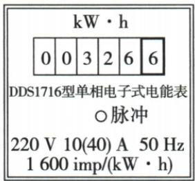
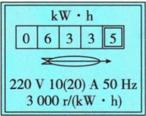

## 讲解

### 是什么

电能表记录用电电能累计值，实际某段用电是末读减初读。机械数字栏末位按所示表制是十分位。常数N表示每1 kW·h的转数或脉冲次数。

### 怎么来的

累计记录相减去掉此前能量；数到n次事件，占每度N次的$n/N$，所以$W=(n/N)\,\mathrm{kW\cdot h}$。转数、脉冲标志不同但都要读实际N。

### 什么时候能用

短时测功率须只让目标设备工作，否则测的是所有负载总能量。以题给铭牌额定最大电流判断该表限制，不能把它当整栋房屋的唯一允许功率。

## 例题

### 电能表读数限额与闪烁测速

> 来源ID Q18-02；第十八章电功率；151-200/full.md 第3853–3866行。原答案与解析定位：151-200/full.md 第3868–3870行。

例1 (2024 江苏盐城中考)在“对家庭用电的调查研究”综合实践活动中,小明发现家中电能表表盘如图所示,该电能表的示数为\_\_\_\_kW·h,他家同时工作的用电器总功率不能超过\_\_\_\_W。小明想测家中电水壶的功率,只让电水壶在电路中工作,当指示灯闪烁了48次,用时1min,则该电水壶的功率为\_\_\_\_W。

**原资料答案与解析：**

解析 由图可知,该电能表的示数为 $326.6 \, kW \cdot h$ ; 该电能表允许通过的最大电流为 $40 \, A$ , 则他家同时工作的用电器总功率不能超过 $P = UI = 220 \, V \times 40 \, A = 8800 \, W$ ; 该电水壶的功率 $P = \frac{W}{t} = \frac{n}{Nt} \times 3.6 \times 10^{6} \, J = \frac{48}{1600 \times 60 \, s} \times 3.6 \times 10^{6} \, J = 1800 \, W$ 。

答案 326.6 8800 1800

**展开解析（依据原详解补足理由与步骤）：**

末位为十分位，表读326.6 kW·h；10(40) A括号内40 A是最大电流，以原题220 V及初中功率模型$P_\text{限}=220\times40=8800\,\mathrm W$。这只表示该表给定额定限制，实际家庭还受导线、保护器、支路限制，不能据此任意加载。常数1600 imp/(kW·h)意味着1600次对应1度；48次电能$W=48/1600=0.03\,\mathrm{kW\cdot h}$，换焦$0.03\times3.6\times10^6=108000\,\mathrm J$；时间60 s，$P=108000/60=1800\,\mathrm W$。仅电水壶工作才能把总表这段能量全归它。

### 原附录电能表读数示例

> 来源ID Q23-09；附录1常考测量仪器；201-233/full.md 第2055–2055行。原答案与解析定位：201-233/full.md 第2055–2055行。

| 仪器 | 读数步骤 | 注意事项 |
| --- | --- | --- |
| 电能表 | (1)明确表盘参数的物理意义1“10(20)A”表示标定电流为10A,额定最大电流为20A2“3000r/(kW·h)”表示转盘每转过3000转消耗电能1kW·h(2)读数电能表上最后一位数字表示小数点后一位(如图所示电能表示数为633.5kW·h)(3)根据转盘转过的圈数n计算消耗的电能 $W=\frac{n\ r}{3\ 000\ r/(kW\cdot h)}$ | 1电能表测量电路已消耗的电能2利用电能表测量所消耗电能的单位是kW·h |

**原资料答案与解析：**

原表给出的读数、步骤与注意事项见上表；未另给独立问答题。

**展开解析（依据原详解补足理由与步骤）：**

原最后一位带框为十分位，计数窗06335表示633.5 kW·h，是累计电能；一段时间耗电须末读数减初读数，原表没有初读数，不能将633.5当这一段的耗电量。3000 r/(kW·h)说明3000转对应1 kW·h，转n转则$W=\frac{n}{3000}\,\mathrm{kW\cdot h}$，n是转数的数值。10(20) A按原表为标定10 A、额定最大20 A，不能取$10+20=30$ A。

## 易错

末位小数不可漏；括号内最大电流与括号外标定电流不同。
