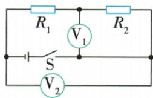
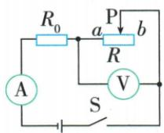
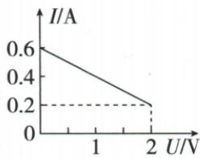

## 讲解

### 判据

两电压表之比、同时间电功比或最大最小功率比。

### 流程

1. 找每表两节点明确局部或总。2. 串联用总减局部还原另局部，电流共同。3. 相同时间电功比等于功率比；用同流或同压选比例式。4. 定阻不同状态最大最小P比用电流平方比，R可约去。

## 例题

### 局部与总电压比推出功率比

> 来源ID Q18-04；第十八章电功率；151-200/full.md 第3921–3938行。原答案与解析定位：151-200/full.md 第3940–3942行。

例3 如图所示电路,电源电压不变,闭合开关 S,电压表 $V_{1}$ 、 $V_{2}$ 的示数之比为 2:3。则下列说法正确的是 ()

A.通过电阻为 $R_{1}, R_{2}$ 的电阻器的电流之比 $I_{1}: I_{2} = 1: 2$   
B.电阻为 $R_{1}, R_{2}$ 的电阻器两端的电压之比 $U_{1}: U_{2} = 2: 1$   
C. 相同时间电阻为 $R_{1}$ 、 $R_{2}$ 的电阻器消耗电功之比 $W_{1}:W_{2}=1:2$   
D.电阻为 $R_{1}, R_{2}$ 的电阻器的电功率之比 $P_{1}: P_{2} = 2: 1$

**原资料答案与解析：**

解析 由图可知,闭合开关后,两电阻器串联,电压表 $V_{2}$ 测电源电压,电压表 $V_{1}$ 测电阻为 $R_{2}$ 的电阻器两端的电压;串联电路中电流处处相等,因此 $I_{1}:I_{2}=1:1$ ,故 A 错误;电压表 $V_{1},V_{2}$ 示数之比为 2:3,根据串联电路电压规律知, $U_{2}:(U_{1}+U_{2})=2:3,U_{1}:U_{2}=1:2$ ,故 B 错误;根据串联电路的电流处处相等,结合 $W=UIt$ 知,相同时间两电阻器消耗电功之比等于电压之比,即 $W_{1}:W_{2}=U_{1}:U_{2}=1:2$ ,故 C 正确;根据 $P=UI$ 知,串联电路中,用电器的电功率之比等于电压之比, $P_{1}:P_{2}=U_{1}:U_{2}=1:2$ ,故 D 错误。

答案 C

**展开解析（依据原详解补足理由与步骤）：**

V1实际跨R2，V2跨总电源。$U_2:U=2:3$，用共同份数令U2为2份总3份，R1为1份；$U_1:U_2=1:2$。串联同流$I_1:I_2=1:1$，A错；B给2:1与实际反，错。相同t时$W_1/W_2=U_1It/(U_2It)=1/2$，C对。$P_1/P_2=U_1I/(U_2I)=1/2$，D给2:1错。仪表下标不能代替实际测量对象。

### 跨页动态电路最大最小功率

> 来源ID Q18-06；第十八章电功率；151-200/full.md 第3990–3990；另接201-233/full.md 第1–18行行。原答案与解析定位：151-200/full.md 第3961–3966行；201-233/full.md 第40–46行。

例2 (2024 山东烟台中考)如图甲所示,电源电压恒定,定值电阻的阻值为 $R_{0}$ 。闭合开关,将滑动变阻器的滑片 P 从 a 端移到 b 端的过程中,其电流 I 与电压 U 的关系图像如图乙所示,则电源电压为 \_\_\_\_ V,滑动变阻器的最大阻值为 \_\_\_\_ Ω,定值电阻消耗的最大功率和最

小功率之比为\_\_\_\_。

  
甲

乙

**原资料答案与解析：**

原详解：b端最大接入阻，I最小0.2 A、变阻两端2 V，故$Rmax=10$ Ω，$U=0.2$ $A\times R0+2$ V；a端只有定阻工作，I最大0.6 A，$U=0.6$ $A\times R0$；解得$R0=5$ Ω、$U=3$ V；定阻最大最小功率比9:1。原答案：3，10，9:1。

**展开解析（依据原详解补足理由与步骤）：**

滑片从a到b有效阻增大，电压表跨变阻器。a端阻零时，图给共同流0.6 A，源压$U=0.6R_0$；b端流0.2 A、变阻压2 V，$U=0.2R_0+2$。相等后$0.4R_0=2$，$R_0=5\,\Omega$，源压$U=0.6\times5=3\,\mathrm V$。变阻最大值$R_\text{max}=2/0.2=10\,\Omega$。定阻功率是$I^2R_0$，同R0约去后比$P_\text{max}:P_\text{min}=0.6^2:0.2^2=9:1$，不是电流3:1。

## 易错

平方关系不能误抄为一次；时间条件不同时不可约t。
