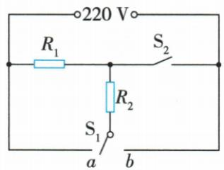

## 讲解

### 判据

多开关、多加热丝，问各挡功率、阻值、热量或时间。

### 流程

1. 每状态画实际有效电路。2. 根据恒压纯电阻总阻排序定挡。3. 用已知功率和U反求阻，新增并联支路用总减原支功率。4. 换压时用稳定R重算P和流。5. 水质量由ρV，温差终温减初温，再$Q=cm\Delta T$；按效率关系和该挡实际P求t。

## 例题

### 消毒柜两功能并联电功率

> 来源ID Q18-05；第十八章电功率；151-200/full.md 第3970–3986行。原答案与解析定位：151-200/full.md 第3956–3959行。

例1 (2024 广东中考) 某消毒柜具有高温消毒和紫外线杀菌功能, 其简化电路如图所示。发热电阻的阻值 $R = 110 \Omega$ , 紫外线灯 L 规格为 “220 V 50 W”。闭合开关 $S_{1}$ 和 $S_{2}$ , 消毒柜正常工作, 求:

(1)通过发热电阻的电流；  
(2)发热电阻的电功率;   
(3)L工作100 s消耗的电能。

**原资料答案与解析：**

例1 解析（1）通过发热电阻的电流 $I_{R}=\frac{U}{R}=\frac{220\ V}{110\ \Omega}=2\ A$ ;

(2) 发热电阻的电功率 $P_{R} = UI_{R} =$ 220 $V\times 2$ $A=440$ W;  
(3) 紫外线灯正常工作时两端电压 $U_{L}=220\ V$ ，功率 $P_{L}=50\ W$ ，工作 100 s 消耗的电能 $W_{L}=P_{L}t=50\ W\times100\ s=5\times10^{3}\ J$ 。

**展开解析（依据原详解补足理由与步骤）：**

合S1、S2，两支路各承受220 V。(1)发热阻$I_R=220/110=2\,\mathrm A$。(2)$P_R=220\times2=440\,\mathrm W$。(3)紫外灯正常工作，可用额定50 W，$W_L=P_Lt=50\times100=5000\,\mathrm J$。110 Ω只属于发热支路，不能代入紫外灯；两个功率不同不是串联分压，源压未被二者均分。

### 三挡热水壶阻值与烧水时间

> 来源ID Q18-08；第十八章电功率；201-233/full.md 第172–184行。原答案与解析定位：201-233/full.md 第186–188行。

例 小明家里买了一台有高、中、低三个挡位的热水壶,铭牌上标有“高温挡 $400 \mathrm{~W}$ , 中温挡 $200 \mathrm{~W}$ ”字样。热水壶的工作原理如图所示,则 $R_{2} =$ \_\_\_\_, 此壶在高温挡工作 \_\_\_\_ min 可使初温为 $20^{\circ} \mathrm{C}$ 、体积为 $2 \times 10^{-3} \mathrm{~m}^{3}$ 的水烧开。(假设电阻丝产生的热量全部被水吸收,电阻丝的阻值不随温度变化,大气压为标准大气压,电源电压保持不变) $[c_{\text {水}} = 4.2 \times 10^{3} \mathrm{~J} / (\mathrm{kg} \cdot {}^{\circ} \mathrm{C}), \rho_{\text {水}} = 1.0 \times 10^{3} \mathrm{~kg} / \mathrm{m}^{3}]$

**原资料答案与解析：**

解析 由电路图可知,开关 $S_{1}$ 接 $b$ 、 $S_{2}$ 断开时,电阻分别为 $R_{1}$ 、 $R_{2}$ 的电阻丝串联,电路总电阻最大,电功率最小,处于低温挡;开关 $S_{1}$ 接 $a$ 、 $S_{2}$ 闭合时,电阻分别为 $R_{1}$ 、 $R_{2}$ 的电阻丝并联,电路总电阻最小,电功率最大,处于高温挡;开关 $S_{1}$ 断开或接 $b$ 、 $S_{2}$ 闭合时,只有电阻为 $R_{1}$ 的电阻丝接入电路,处于中温挡。所以中温挡的电功率 $P_{\text{中温}} = \frac{U^{2}}{R_{1}}$ ,高温挡的电功率 $P_{\text{高温}} = \frac{U^{2}}{R_{1}} + \frac{U^{2}}{R_{2}}$ ,因此处于高温挡时,电阻为 $R_{2}$ 的电阻丝的功率 $P = P_{\text{高温}} - P_{\text{中温}} = 400 \text{ W} - 200 \text{ W} = 200 \text{ W}, R_{2} = \frac{U^{2}}{P} = \frac{(220 \text{ V})^{2}}{200 \text{ W}} = 242 \Omega$ ; 由 $\rho = \frac{m}{V}$ 可得,水的质量 $m = \rho_{\text{水}} V = 1.0 \times 10^{3} \text{ kg/m}^{3} \times 2 \times 10^{-3} \text{ m}^{3} = 2 \text{ kg}$ ,将水烧开水需要吸收的热量 $Q = c_{\text{水}} m \Delta t = 4.2 \times 10^{3} \mathrm{J/(kg\cdot{}^\circ C)} \times 2 \text{ kg} \times (100^\circ\text{C}-20^\circ\text{C}) = 6.72 \times 10^{5} \text{ J}$ ,若电阻丝产生的热量全部被水吸收,则热水壶消耗的电能 $W = Q$ ,由 $P = \frac{W}{t}$ 可得,加热时间 $t = \frac{W}{P_{\text{高温}}} = \frac{Q}{P_{\text{高温}}} = \frac{6.72 \times 10^{5} \text{ J}}{400 \text{ W}} = 1680 \text{ s} = 28 \text{ min}$ 。

答案 $242\Omega$ 28

**展开解析（依据原详解补足理由与步骤）：**

按图S1接a且S2合时两丝并联，高挡400 W；S1断开或接b且S2合时只R1，中挡200 W；S1接b且S2断时两丝串联，低挡。高挡R1仍承受220 V且功率200 W，故新增R2功率$400-200=200\,\mathrm W$；$R_2=220^2/200=242\,\Omega$。水质量$m=\rho V=1000\times0.002=2\,\mathrm{kg}$。标准大气压水从20升至100°C，温差80°C；$Q=cm\Delta T=4200\times2\times80=672000\,\mathrm J$。全被吸收给$W=Q$，高挡$P=400\,\mathrm W$，$t=Q/P=1680\,\mathrm s=28\,\mathrm{min}$。到开始沸腾为止，不再计算汽化热。

### 防寒服换电源后的电热

> 来源ID Q18-10；第十八章电功率；201-233/full.md 第254–270行。原答案与解析定位：201-233/full.md 第198–223行。

例2（2024 湖南长沙中考）小明为爷爷设计了一款有“速热”和“保温”两挡的防寒服，内部电路简化如图所示。电源两端电压为 6 V，电热丝的阻值分别为 $R_{1}$ 、 $R_{2}$ 且恒定， $R_{1}=4\ \Omega$ 。

(1) 只闭合开关 $S_{1}$ 时, 通过阻值为 $R_{1}$ 的电热丝的电流是多大?  
(2) 只闭合开关 $S_{1}$ 时, 阻值为 $R_{1}$ 的电热丝的电功率是多少?  
(3)电源两端电压为6 V时,“速热”挡的电功率为36 W。若更换成电压为5 V的电源,则使用“速热”挡通电10 s产生的热量是多少?

**原资料答案与解析：**

原详解：$(1)I1=6$ V/4 $Ω=1.5$ A；$(2)P1=6$ $V\times 1.5$ $A=9$ W；(3)速热6 V总流36 W/6 $V=6$ A，$I2=6-1.5=4.5$ A，$R2=6$ V/4.5 $A=\frac{4}{3}$ Ω；换5 V总流为5 V/4 Ω+5 V/(4/3 Ω)=5 A，10 s热量$Q=W=5$ $V\times 5$ $A\times 10$ $s=250$ J。

**展开解析（依据原详解补足理由与步骤）：**

(1)只合S1，仅4 Ω的R1接6 V，$I_1=6/4=1.5\,\mathrm A$。(2)$P_1=6\times1.5=9\,\mathrm W$。(3)6 V速热两丝并联，总P36 W故$I=36/6=6\,\mathrm A$；R2支流$I_2=6-1.5=4.5\,\mathrm A$，$R_2=6/4.5=4/3\,\Omega$。换5 V，题设丝阻恒定，$I_{1新}=5/4=1.25\,\mathrm A$，$I_{2新}=5/(4/3)=3.75\,\mathrm A$，总5 A；10 s热$Q=W=U_新 I_新 t=5\times5\times10=250\,\mathrm J$。36 W只适用原6 V状态，不能换压后继续拿$36\times 10$。

## 易错

水吸热、电阻热、输入电能只有题设全吸收时相等。
