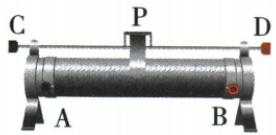

## 错法

省掉端子位置，单记滑片右移增阻。

## 正解

右移远离左丝端才增，靠近右丝端则减。原选择图BC、BD减阻，AD增阻，AB恒值；画有效丝段后再判断。

## 例题

### 向右移增阻应选哪两端

> 来源ID Q16-14；第十六章电压电阻；151-200/full.md 第2586–2596行。原答案与解析定位：151-200/full.md 第2600–2602行。

例（2024 四川自贡中考）如图所示是滑动变阻器的结构示意图, 当滑片 P 向右移动时, 要使连入电路中的电阻变大, 应选择的接线柱为 ( )

A.A 和 B

B.B 和 C

C.B 和 D

D.A 和 D

**原资料答案与解析：**

例 解析 根据题意可知,当滑片P向右移动时,要使连入电路中的电阻变大,则电阻丝的左半部分接入电路中,即需要接A接线柱,上面的两个接线柱可任意选择,所以应选择的接线柱为A、C或A、D。故D正确。

答案D

**展开解析（依据原详解补足理由与步骤）：**

原图A左下、B右下为电阻丝两端，C、D为金属杆两端。向右滑而增阻需接左下A，使A到滑片的长度增加，再选C或D任一上端。D选AD符合。A选AB接整条电阻丝，移动不变；B选BC及C选BD均接右半段，右移长度缩短，阻值减小。
