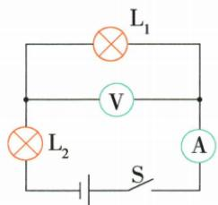

## 错法

认为有电压就是有电流，灯丝断了表也一定零。

## 正解

电压表跨断口且经其他完好元件接电源两极时仍有电压；高内阻使电流极小，串联灯均不亮，主电流表近零。原例恰是L1断，保留全部现象联合检验。

## 例题

### 两灯灭电流零电压有偏转

> 来源ID Q16-06；第十六章电压电阻；151-200/full.md 第2217–2237行。原答案与解析定位：151-200/full.md 第2239–2241行。

例1 如图所示的电路,闭合开关,两个灯泡都不发光,电流表没有示数,电压表指针有明显偏转。则故障可能是 ( )

A.灯泡 $\mathbf{L}_1$ 的灯丝断了

B.电流表内部出现断路

C.灯泡 $\mathrm{L}_2$ 的灯丝断了

D.电源接线处接触不良

**原资料答案与解析：**

解析 两灯泡串联,电压表测量灯泡 $L_{1}$ 两端的电压,电流表测量电路中的电流,闭合开关,两个灯泡都不发光,电流表没有示数,电压表指针有明显偏转,说明电流表中几乎没有电流通过,发生断路现象,且电压表的两端与电源连接完好,则可能是灯泡 $L_{1}$ 的灯丝断了。

# 答案 A

**展开解析（依据原详解补足理由与步骤）：**

表跨L1，L2与电流表在共同通路。A L1断路时主路无流两灯灭，电压表经完好L2、电流表和开关接到电源，能偏转，对。B电流表断路会切断电压表通向电源一极的路径，不能有该偏转。C L2断路同样切断这一路径。D电源接触不良若形成题设的断路，也不能给表建立驱动电压。B、C、D均与表有偏转冲突。
