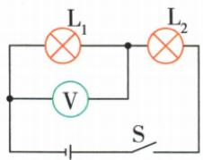

## 错法

只记表跨L1时L1短路表零，见零就唯一判短路。

## 正解

还需看供电路径。L2断路使表不能接通电源两极，也为零。原单故障多选中A、D都可，不可删D。加入电流和灯亮灭才进一步区分。

## 例题

### 电压表零示数多选单故障

> 来源ID Q16-05；第十六章电压电阻；151-200/full.md 第2049–2068行。原答案与解析定位：151-200/full.md 第2074–2076行。

例（2024 山东烟台中考）(多选)如图所示,电源电压保持不变,闭合开关后发现电压表无示数,假设电路中只有一个元器件发生故障,则故障的原因可能是()

A. 灯泡 $\mathrm{L}_{1}$ 短路

B.灯泡 $\mathrm{L}_2$ 短路

C.灯泡 $\mathrm{L}_1$ 断路

D.灯泡 $\mathrm{L}_2$ 断路

**原资料答案与解析：**

例 解析 根据题意可知,电压表无示数,故障原因可能是与电压表并联部分短路,即灯泡 $L_{1}$ 短路,也可能是电压表两接线柱到电源两极中间某处断路,即灯泡 $L_{2}$ 断路,A、D 正确,B、C 错误。

答案 AD

**展开解析（依据原详解补足理由与步骤）：**

图中表跨L1。A L1短路：跨同一近似等电势导线，示数零，对。B L2短路：L1直接承受电源电压，表非零，错。C L1断路：表经完好L2接到电源两极，可读接近电源电压，错。D L2断路：表所在部分与电源的连接路径被切断，不能建立相应两端电压，示数零，对。选AD；题设只有一个元器件故障，不增加表坏、电源坏等选项。
