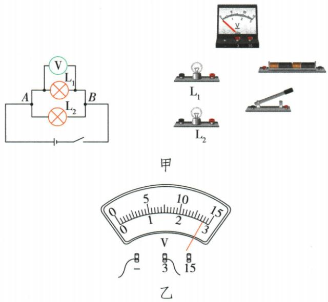
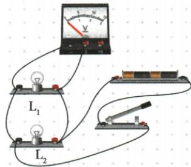
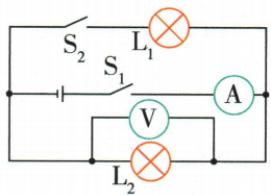

## 讲解

### 是什么

串联各部分电压之和等于总电压：$U=U_1+U_2+\cdots$；同一对公共节点间并联各支路电压相等：$U=U_1=U_2=\cdots$。

### 怎么来的

串联是沿整条路径依次经过各部分，比较两端时跨过的电压段相加；并联各支路端点是同一对节点，因此比较的两点相同。不同规格灯的实验检验一般性。

### 什么时候能用

仅把实际串联部分相加；只在真正连接同一对节点时用并联等压。电压相等不能反推并联，相同灯串联也可分到相同电压。电池并联须同电压同极性，原拓展不是随意并联不同电池的操作要求。

## 例题

### 并联电压实验接线及普遍性

> 来源ID Q16-08；第十六章电压电阻；151-200/full.md 第2284–2307；2338–2341行。原答案与解析定位：151-200/full.md 第2313–2332行。

例1（2024山东东营中考）某小组在“探究并联电路中电压的特点”实验中：

(1) 如图甲, 根据电路图, 用笔画线表示导线, 将实物连接起来。

(2) 连接电路时, 开关处于状态。  
(3) 正确连接好电路后,闭合开关,电压表的示数如图乙所示,为 V。  
(4)测得灯泡 $L_{1}$ 两端电压后,再测得灯泡 $L_{2}$ 两端电压和 A、B 两端电压,记录数据。改变两个小灯泡的规格,重复以上操作,其目的是 \_\_\_\_。  
(5)评估交流环节,有同学提出:实验中连接完电路,闭合开关,发现电压表指针反向偏转,原因是\_\_\_\_。

**原资料答案与解析：**

例1 解析（2）为保护电路，连接电路时，开关应处于断开状态。

(3)由图乙可知,电压表的测量范围为0\~3 V,分度值为0.1 V,示数为2.8 V。  
(4)探究并联电路中电压的特点,多次实验的目的是多次测量,以得到普遍的规律。  
(5)闭合开关,电压表指针反向偏转,说明电流从负接线柱流入、从正接线柱流出,原因是电压表正、负接线柱接反。

答案 (1) 如图所示

(2) 断开   
(3)2.8   
(4)使结论具有普遍性  
(5)电压表“+”“-”接线柱接反了

**展开解析（依据原详解补足理由与步骤）：**

按图甲把L1与L2的对应两端分别接公共节点A、B，开关和电源串联到供电干路；电压表正端接高电势侧、负端接低电势侧，跨L1。原连线答案图已保留。(2)接线先断开开关。(3)图乙接3 V端，分度0.1 V，指针为2.8 V。(4)更换不同规格两灯，是检验电压关系是否适用于不同组合，使结论具有普遍性，不是用重复平均减少读数误差。(5)通电后反向偏转才说明正负接线柱反接；与使用前未调零区别。

### 并联支路增加两表示数变化

> 来源ID Q16-09；第十六章电压电阻；151-200/full.md 第2345–2363行。原答案与解析定位：151-200/full.md 第2334–2336行。

例2 (2024 重庆中考)如图所示电路,电源电压保持不变, $L_{1}$ 和 $L_{2}$ 是两个相同的小灯泡。先闭合开关 $S_{1}$ , 记录两电表示数; 再闭合开关 $S_{2}$ , 电流表和电压表的示数变化情况是 ()

A.电流表示数减小,电压表示数减小  
B.电流表示数增大,电压表示数减小  
C.电流表示数增大,电压表示数不变  
D.电流表示数不变,电压表示数不变

**原资料答案与解析：**

例2 解析 由题图可知,先闭合开关 $S_{1}$ , 电路中只有灯 $L_{2}$ 工作,电流表测电路中的电流,电压表测电源电压;再闭合开关 $S_{2}$ , 灯 $L_{1}$ 、 $L_{2}$ 并联,电流表测干路电流,电压表仍然测电源电压,则闭合开关 $S_{2}$ 后,电压表示数不变,电流表示数增大,C 正确。

答案 C

**展开解析（依据原详解补足理由与步骤）：**

只合S1，L2成通路，表V跨L2，也跨供电节点，A读L2电流。再合S2，L1作为新增并联支路，L2仍跨同一电源；题设电源电压不变，所以电压表示数不变。原L2电流维持，新增L1电流汇入干路，A示数增大，C对。A、B均说电压下降，违背条件；D把干路表错看成只测原支路。

## 易错

串联电压不必均分；变支路后电源是否保持恒压必须读题。
